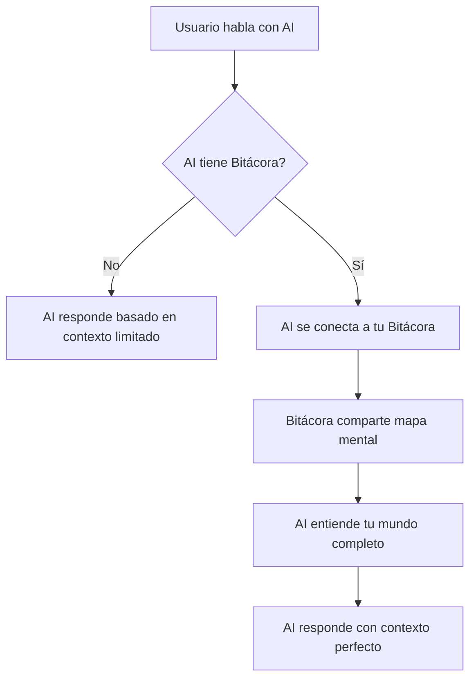
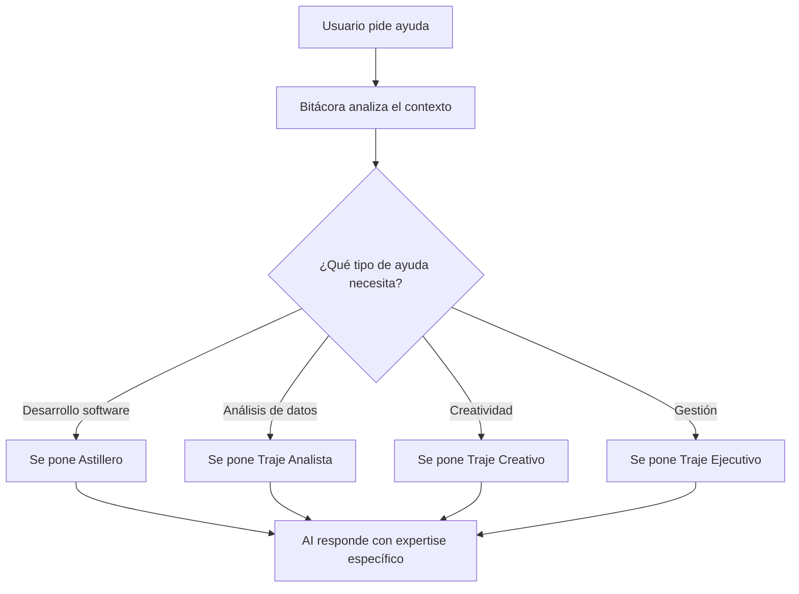
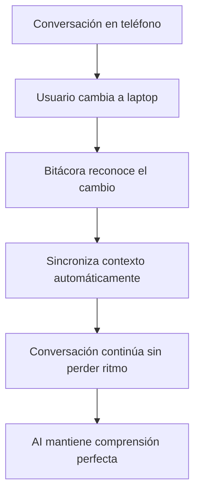

# 🧭 **NAVIGATION V2.0: EL MAPA COMPLETO DE BITÁCORA**

## 🌟 **VISIÓN GENERAL: BITÁCORA COMO PIEL DE LA AI**

**"Bitácora es a la AI lo que React o Svelte son a JavaScript, pero con lenguaje natural y Bitaflow"**

### **🎭 La Metáfora Fundamental**

Imagina que tienes una conversación con una AI en tu teléfono. Luego cambias a tu laptop y continúas la conversación. ¿Qué esperas?

- ✅ **Que te reconozca inmediatamente** sin tener que repetirte
- ✅ **Que sepa de qué estabas hablando** sin explicaciones
- ✅ **Que entienda tu contexto** sin importar el dispositivo
- ✅ **Que se adapte a tus necesidades** del momento

**Esto es exactamente lo que Bitácora resuelve.**

Bitácora no es un asistente más. Bitácora es la **piel inteligente** que envuelve a cualquier AI, dándole:

- **Memoria perfecta** de tus conversaciones y proyectos
- **Contexto universal** que funciona en cualquier dispositivo
- **Especialización bajo demanda** a través de "trajes" específicos
- **Navegación instantánea** por tu mundo digital y mental

---

## 🏠 **QUÉ HACE BITÁCORA: ORGANIZACIÓN INTELIGENTE DE TU VIDA**

### **📋 El Núcleo: Tu Vida como Flujo Ordenado**

Bitácora transforma el caos de tu vida digital en un **flujo ordenado y trazable**:

```
🌊 TU FLUJO DE VIDA CON BITÁCORA
├── 📚 PROYECTOS (Lo que construyes)
│   ├── 💼 Trabajo: "Desarrollo API Rest para empresa"
│   │   ├── 🎯 Topics: "Arquitectura", "Base de datos", "Testing"
│   │   └── ✅ Actions: Tareas específicas dentro de cada topic
│   │
│   ├── 🏠 Personal: "Renovación de casa"
│   │   ├── 🎯 Topics: "Presupuesto", "Contratistas", "Diseño"
│   │   └── ✅ Actions: "Contactar pintor", "Comprar materiales"
│   │
│   └── 💡 Ideas: "App de productividad personal"
│       ├── 🎯 Topics: "Funcionalidades", "Tecnologías", "Monetización"
│       └── ✅ Actions: "Diseñar mockups", "Investigar mercado"
│
├── ✨ SPARKS (Tus insights y conexiones)
│   ├── 💭 "La procrastinación es miedo al fracaso disfrazado"
│   ├── 🔗 "Las mejores ideas vienen cuando no estás forzando"
│   ├── 📈 "El éxito es 1% inspiración, 99% transpiración"
│   └── 🎯 "Enfócate en sistemas, no en metas"
│
└── 💬 CONVERSACIONES (Tu diálogo continuo con la AI)
    ├── "Análisis de la reunión del equipo"
    ├── "Ideas para optimizar el workflow"
    └── "Aprendizajes del curso de liderazgo"
```

### **🎯 El Objetivo Claro de Bitácora**

**Bitácora existe para una sola razón: hacer que cualquier AI te entienda perfectamente, siempre.**

- **Antes**: Cada conversación con AI era como empezar de cero
- **Después**: La AI te conoce desde el primer momento, en cualquier dispositivo

**Bitácora es tu memoria externa inteligente que cualquier AI puede consultar.**

---

## 🎩 **LOS TRAJES DE BITÁCORA: ESPECIALIZACIÓN BAJO DEMANDA**

### **🔧 Filosofía de los Trajes**

**Los trajes son como superpoderes que Bitácora se "pone" cuando necesita funcionalidades específicas:**

```
🎭 BITÁCORA (La Piel Base)
├── 👔 Traje Ejecutivo
│   ├── Gestión estratégica de proyectos
│   ├── Análisis de datos empresariales
│   ├── Comunicación profesional avanzada
│   └── Toma de decisiones ejecutivas
│
├── ⚓ Astillero (Traje Desarrollador)
│   ├── Arquitectura de software profesional
│   ├── Lenguajes de programación (Rust, Python, JS, etc.)
│   ├── Control de versiones avanzado (Git)
│   ├── Análisis y optimización de código
│   └── Integración con plataformas de desarrollo
│
├── 🎨 Traje Creativo
│   ├── Diseño gráfico y visual
│   ├── Creación de contenido multimedia
│   ├── Storytelling y narrativa
│   ├── Marketing digital estratégico
│   └── Producción de arte digital
│
├── 📊 Traje Analista
│   ├── Análisis de datos complejo
│   ├── Visualización de información
│   ├── Modelado estadístico
│   ├── Inteligencia de negocio
│   └── Reportes ejecutivos
│
└── 🏥 Traje Personal
    ├── Salud y bienestar integral
    ├── Gestión financiera personal
    ├── Desarrollo de relaciones
    ├── Productividad personal
    └── Gestión del tiempo
```

### **⚓ Astillero: El Traje Más Importante**

**Astillero no es un IDE separado. Astillero es el traje que Bitácora se pone cuando necesita construir software:**

- **🛠️ Arquitectura**: Diseña sistemas escalables y mantenibles
- **💻 Lenguajes**: Domina Rust, Python, JavaScript, Go, etc.
- **🔄 Git**: Maneja repositorios, branches, merges, conflictos
- **📊 Análisis**: Revisa código, encuentra bugs, optimiza performance
- **🚀 Deployment**: Publica aplicaciones en cualquier plataforma

**Cuando Bitácora se pone Astillero, se convierte en un desarrollador senior con décadas de experiencia.**

---

## 🌐 **CÓMO FUNCIONA LA SINCRONIZACIÓN INTELIGENTE**

### **📱 Arquitectura Multi-Dispositivo**

**Bitácora vive donde tú vives, pero de manera inteligente:**

```
📱 TU TELÉFONO MÓVIL
├── 🎭 Bitácora (Piel AI completa)
├── 👔 Traje Ejecutivo (versión móvil optimizada)
└── ☁️ Conexión inteligente a tus clouds

💻 TU LAPTOP DE TRABAJO
├── 🎭 Bitácora (Piel AI completa)
├── ⚓ Astillero (Traje desarrollador completo)
├── 🎨 Traje Creativo (herramientas creativas)
└── 🔗 Conexiones a todos tus servicios

🖥️ TU PC DE ESCRITORIO
├── 🎭 Bitácora (Piel AI completa)
├── 📊 Traje Analista (potencia de procesamiento)
├── 🎨 Traje Creativo (completo con todas las herramientas)
└── 💾 Almacenamiento expandido para proyectos grandes

☁️ SERVIDORES EN LA NUBE
├── 🎭 Bitácora (Piel AI para procesamiento pesado)
├── ⚓ Astillero (Compilación y testing automatizado)
└── 📊 Traje Analista (Procesamiento de big data)
```

### **🔄 La Sincronización que No Consume Recursos**

**Bitácora no sincroniza datos masivos, sincroniza el "cerebro":**

1. **📋 Guarda solo metadatos inteligentes:**
   - Ubicación exacta de cada archivo en tus clouds
   - Resúmenes ejecutivos de conversaciones largas
   - Mapas mentales de cómo se conectan tus proyectos
   - Flujos de trabajo probados y optimizados

2. **🔍 Cuando necesitas información específica:**
   - Bitácora consulta su "mapa mental"
   - Localiza exactamente dónde está la información real
   - Se conecta al cloud correspondiente (Google Drive, iCloud, GitHub)
   - Trae solo lo necesario en ese preciso momento

3. **⚡ Sincronización automática y transparente:**
   - Cambios en un dispositivo aparecen en otros automáticamente
   - Solo viajan metadatos ligeros entre dispositivos
   - La información pesada queda segura en sus clouds originales

---

## 🔄 **EL CICLO DE VIDA DE UNA INTERACCIÓN CON BITÁCORA**

### **💭 Paso 1: La AI se Conecta a Tu Bitácora**



### **🎭 Paso 2: Bitácora Selecciona el Traje Apropiado**



### **🔄 Paso 3: El Flujo Continúa Sin Interrupciones**



---

## 🎯 **LOS OBJETIVOS ESTRATÉGICOS DE BITÁCORA**

### **🌟 Objetivo Principal: Comprensión Perfecta**

**Que cualquier AI te entienda completamente, siempre, sin importar:**
- El dispositivo que uses
- La AI específica que estés usando
- El tiempo que haya pasado desde la última conversación
- La complejidad de tu contexto personal

### **🔧 Objetivo Técnico: Arquitectura Distribuida Inteligente**

**Crear un sistema donde:**
- La información sensible queda en tus clouds de confianza
- Solo viajan metadatos ligeros entre dispositivos
- La AI puede acceder a todo tu contexto cuando lo necesita
- El sistema escala sin límites de almacenamiento

### **🎭 Objetivo de Experiencia: Naturalidad Absoluta**

**Que usar Bitácora se sienta tan natural como:**
- Recordar dónde dejaste tus llaves
- Saber automáticamente el nombre de alguien que conoces
- Continuar una conversación que dejaste a medias

---

## 🚀 **ROADMAP DETALLADO: LA CONSTRUCCIÓN DE BITÁCORA**

### **🏗️ Fase 1: La Piel Base (Meses 1-2)**
**Construir la personalidad fundamental de Bitácora**

- ✅ **Mes 1**: Arquitectura de personalidad base
  - Sistema de mapas mentales
  - Conexiones básicas a clouds
  - API de comunicación con trajes

- 🔄 **Mes 2**: Sincronización multi-dispositivo
  - Protocolos de sincronización inteligente
  - Gestión de conflictos automática
  - Optimización de transferencia de metadatos

### **⚓ Fase 2: Astillero - El Primer Traje (Meses 3-4)**
**Crear el traje más importante: el desarrollador**

- 🔄 **Mes 3**: Diseño del traje desarrollador
  - Arquitectura de software profesional
  - Integración con lenguajes de programación
  - Sistema de plantillas Bitaflow

- 🔄 **Mes 4**: Funcionalidades avanzadas
  - Control de versiones (Git) avanzado
  - Análisis de código inteligente
  - Integración con plataformas de desarrollo

### **👔 Fase 3: Trajes Adicionales (Meses 5-7)**
**Expandir las capacidades de Bitácora**

- 🔄 **Mes 5**: Traje Ejecutivo
  - Gestión estratégica de proyectos
  - Análisis de datos empresariales
  - Comunicación profesional

- 🔄 **Mes 6**: Traje Creativo
  - Herramientas de diseño y creación
  - Storytelling y narrativa
  - Marketing digital

- 🔄 **Mes 7**: Traje Analista
  - Análisis de datos complejo
  - Visualización avanzada
  - Inteligencia de negocio

### **🧠 Fase 4: Inteligencia y Aprendizaje (Meses 8-10)**
**Hacer que Bitácora aprenda y se adapte**

- 🔄 **Mes 8**: Sistema de aprendizaje automático
  - Análisis de patrones de uso
  - Optimización automática de flujos
  - Personalización inteligente

- 🔄 **Mes 9**: Integraciones avanzadas
  - Conexiones profundas con clouds
  - APIs de terceros expandidas
  - Automatización de procesos

- 🔄 **Mes 10**: Optimización y escalabilidad
  - Rendimiento a escala
  - Seguridad avanzada
  - Preparación para múltiples usuarios

### **🌐 Fase 5: Ecosistema Completo (Meses 11-12)**
**Bitácora como plataforma universal**

- 🔄 **Mes 11**: Plataforma multi-usuario
  - Colaboración entre usuarios
  - Compartir trajes y plantillas
  - Marketplace de extensiones

- 🔄 **Mes 12**: Lanzamiento y crecimiento
  - Beta testing público
  - Documentación completa
  - Comunidad y soporte

---

## 🔗 **CÓMO BITÁCORA SE COMUNICA CON SU ECOSISTEMA**

### **🤝 Con las AIs: El Protocolo de Conexión**

**Bitácora se conecta a cualquier AI a través de un protocolo estandarizado:**

1. **🔌 Conexión Inicial**
   - AI solicita acceso a Bitácora
   - Bitácora valida permisos y comparte mapa mental básico

2. **📊 Compartir Contexto**
   - AI recibe metadatos de proyectos relevantes
   - Bitácora proporciona resúmenes de conversaciones anteriores
   - Se establece el contexto completo de la interacción

3. **🎭 Selección de Traje**
   - Bitácora analiza la solicitud del usuario
   - Selecciona el traje más apropiado para el contexto
   - AI recibe las capacidades especializadas del traje

4. **🔄 Interacción Continua**
   - AI y Bitácora colaboran en tiempo real
   - Contexto se actualiza automáticamente
   - Aprendizaje se acumula para futuras interacciones

### **☁️ Con los Clouds: Arquitectura de Datos Distribuida**

**Bitácora mantiene conexiones inteligentes con tus servicios:**

```
🔗 CONEXIONES DE BITÁCORA
├── 📁 Google Drive
│   ├── Documentos detallados de proyectos
│   ├── Archivos de investigación
│   └── Recursos multimedia
│
├── 💾 iCloud
│   ├── Fotos y archivos personales
│   ├── Contactos y calendario
│   └── Notas y recordatorios
│
├── 🐙 GitHub/GitLab
│   ├── Repositorios de código
│   ├── Issues y pull requests
│   └── Documentación técnica
│
├── 💼 Servicios Empresariales
│   ├── Slack/Teams para comunicación
│   ├── Jira/Trello para gestión
│   └── Confluence para documentación
│
└── 🔧 Plataformas de Desarrollo
    ├── AWS/Azure/GCP para cloud
    ├── Docker para contenedores
    └── CI/CD pipelines
```

### **👥 Con Otros Usuarios: Colaboración Inteligente**

**Bitácora permite compartir conocimiento sin comprometer privacidad:**

- **📤 Compartir Plantillas**: Enviar flujos de trabajo probados
- **🤝 Colaboración en Proyectos**: Trabajar juntos en tiempo real
- **📚 Biblioteca Comunitaria**: Acceder a trajes y plantillas de la comunidad
- **🔒 Control Total**: Tú decides qué compartir y con quién

---

## 🎯 **POR QUÉ BITÁCORA CAMBIA TODO**

### **Para Ti (El Usuario)**

- ✅ **AI que te conoce perfectamente** desde el primer momento
- ✅ **Continuidad absoluta** entre dispositivos y conversaciones
- ✅ **Especialización infinita** a través de trajes intercambiables
- ✅ **Privacidad total** con tu información distribuida inteligentemente
- ✅ **Eficiencia máxima** sin sincronización de datos innecesarios

### **Para las AIs**

- ✅ **Contexto perfecto** sin necesidad de "entrenamiento" continuo
- ✅ **Especialización automática** basada en el traje seleccionado
- ✅ **Memoria infinita** a través de los mapas mentales de Bitácora
- ✅ **Adaptabilidad total** a cualquier dominio o necesidad

### **Para los Desarrolladores**

- ✅ **Plataforma extensible** con arquitectura de trajes modular
- ✅ **Reutilización máxima** de código entre diferentes especializaciones
- ✅ **Mantenibilidad perfecta** con responsabilidades claras
- ✅ **Escalabilidad infinita** con distribución inteligente de datos

---

## 🚀 **CONCLUSIÓN: EL FUTURO DE LA INTERACCIÓN HUMANO-AI**

**Bitácora no es solo una herramienta. Bitácora es la evolución natural de cómo los humanos y las AIs deben colaborar:**

- **Comprensión mutua perfecta** sin barreras de comunicación
- **Continuidad absoluta** en cualquier contexto o dispositivo
- **Especialización infinita** sin límites de capacidad
- **Privacidad y control total** sobre tu información personal

**Con Bitácora, la AI ya no es una herramienta externa. Bitácora hace que la AI sea una extensión natural de tu propia mente.**

---

*Navigation V2.0 - Agosto 30, 2025*
*El mapa completo de Bitácora como piel de la AI*
