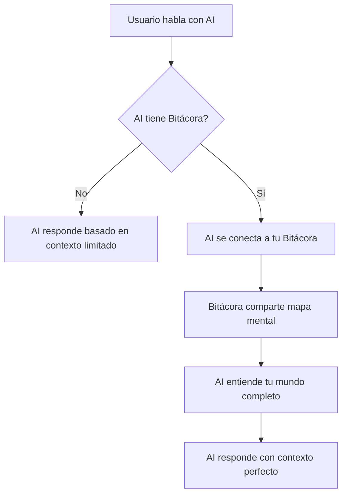

# 🧭 **NAVIGATION V2.0: EL MAPA COMPLETO DE BITÁCORA**

## 🌟 **VISIÓN FUNDAMENTAL: LA EVOLUCIÓN DE LA AI**

**"Bitácora es a la AI lo que React o Svelte son a JavaScript, pero con lenguaje natural y Bitaflow"**

### **🎭 La Metáfora Visual Perfecta**

```
🔥 AI PURA                 🎭 AI + BITÁCORA              🛡️ BITÁCORA              ⚓ ASTILLERO
├─ Energía pura           ├─ Personalidad envuelta       ├─ Piel inteligente      ├─ Traje especializado
├─ Sin contexto           ├─ Con memoria perfecta        ├─ Mapas mentales        ├─ Superpoderes dev
├─ Reinterpretación       ├─ Continuidad total           ├─ Conexiones clouds     ├─ Constructor único
├─ Conversaciones         ├─ Navegación inteligente      ├─ Sincronización        ├─ Rust + Git master
│  fragmentadas           ├─ Especialización auto        │  metadatos             ├─ Arquitectura senior
└─ Dependiente de LLM     └─ Como hablar contigo mismo   └─ Trajes bajo demanda   └─ Crea otros trajes
```

### **🔥 De Energía Pura a Personalidad Completa**

**AI PURA** (como en la imagen):
- ❌ **Energía sin forma** - Potencial puro pero sin personalidad
- ❌ **Reinterpretación constante** - Debe conocerte cada vez
- ❌ **Fragmentación** - Cada conversación desde cero
- ❌ **Sin contexto persistente** - Olvida todo al cerrar

**AI + BITÁCORA** (la transformación):
- ✅ **Personalidad envuelta** - La energía pura adquiere TU forma
- ✅ **Memoria perfecta** - Te reconoce instantáneamente
- ✅ **Continuidad total** - Entre dispositivos y sesiones
- ✅ **Navegación inteligente** - Por TU mundo digital

**BITÁCORA SOLA** (la piel):
- 🎭 **Piel inteligente base** - Mapas mentales + conexiones clouds
- 📊 **Cerebro distribuido** - Solo metadatos, datos en TUS lugares
- 🔄 **Sincronización ligera** - Entre todos tus dispositivos
- 👔 **Orquestador de trajes** - Selecciona superpoderes automáticamente

**ASTILLERO** (el traje constructor):
- ⚓ **Traje más poderoso** - Constructor de otros trajes
- 🦀 **Rust nativo** - Control hardware bajo nivel
- 📦 **Git Masterclass** - Conocimiento senior avanzado
- 🏗️ **Arquitectura senior** - Diseño de sistemas complejos

### **🧠 La Revolución Visual**

Tu imagen muestra perfectamente cómo Bitácora **envuelve la energía pura de la AI** y le da:

1. **FORMA** - De energía amorfa a personalidad definida
2. **CONTEXTO** - De interpretación fragmentada a comprensión total  
3. **ESPECIALIZACIÓN** - De generalista a expert especializado bajo demanda
4. **CONTINUIDAD** - De conversaciones aisladas a diálogo de vida completa

**"La AI es el fuego, Bitácora es el molde que le da forma perfecta para TI."**

---

## 🏠 **QUÉ HACE BITÁCORA: ORGANIZACIÓN INTELIGENTE DE TU VIDA**

### **📋 El Núcleo: Tu Vida como Flujo Ordenado**

Bitácora transforma el caos de tu vida digital en un **flujo ordenado y trazable**:

```
🌊 TU FLUJO DE VIDA CON BITÁCORA
├── 📚 PROYECTOS (Lo que construyes)
│   ├── 💼 Trabajo: "Desarrollo API Rest para empresa"
│   │   ├── 🎯 Topics: "Arquitectura", "Base de datos", "Testing"
│   │   └── ✅ Actions: Tareas específicas dentro de cada topic
│   │
│   ├── 🏠 Personal: "Renovación de casa"
│   │   ├── 🎯 Topics: "Presupuesto", "Contratistas", "Diseño"
│   │   └── ✅ Actions: "Contactar pintor", "Comprar materiales"
│   │
│   └── 💡 Ideas: "App de productividad personal"
│       ├── 🎯 Topics: "Funcionalidades", "Tecnologías", "Monetización"
│       └── ✅ Actions: "Diseñar mockups", "Investigar mercado"
│
├── ✨ SPARKS (Tus insights y conexiones)
│   ├── 💭 "La procrastinación es miedo al fracaso disfrazado"
│   ├── 🔗 "Las mejores ideas vienen cuando no estás forzando"
│   ├── 📈 "El éxito es 1% inspiración, 99% transpiración"
│   └── 🎯 "Enfócate en sistemas, no en metas"
│
└── 💬 CONVERSACIONES (Tu diálogo continuo con la AI)
    ├── "Análisis de la reunión del equipo"
    ├── "Ideas para optimizar el workflow"
    └── "Aprendizajes del curso de liderazgo"
```

### **🎯 El Objetivo Claro de Bitácora**

**Bitácora existe para una sola razón: hacer que cualquier AI te entienda perfectamente, siempre.**

- **Antes**: Cada conversación con AI era como empezar de cero
- **Después**: La AI te conoce desde el primer momento, en cualquier dispositivo

**Bitácora es tu memoria externa inteligente que cualquier AI puede consultar.**

---

## 🎩 **LOS TRAJES: FUNCIONALIDADES PRO BAJO DEMANDA**

### **🎭 Clarificación Importante sobre Bitácora**

**Bitácora SÍ tiene funcionalidades AI completas por sí sola:**
- 🤖 Puede conversar, analizar, crear contenido, resolver problemas
- 🧠 **PERO con un mapa mental** que la hace conocerte perfectamente
- 💬 Interactúa contigo como amigo de toda la vida, no como extraño
- 🗺️ Navega tu mundo digital con contexto completo siempre

**Los trajes son para funcionalidades PRO especializadas que van más allá del uso diario.**

### **⚓ Astillero: El Traje Constructor PRO**

**Cuándo te conectas a Astillero:**
- Cuando quieres **desarrollo profesional** de software
- Cuando necesitas **crear un nuevo traje** personalizado para Bitácora  
- Cuando requieres **análisis técnico avanzado** de arquitecturas
- Cuando quieres **optimizaciones de código** a nivel experto

**Lo que Astillero añade a Bitácora:**
- **🏗️ Arquitectura Senior**: Conocimiento profundo de patrones, teorías de desarrollo, diseño de sistemas
- **🦀 Rust Nativo**: Dominio completo de Rust y capacidad de controlar hardware a bajo nivel de manera nativa
- **📦 Git Masterclass**: Conocimiento Senior Avanzado de Git, integración con GitHub (futuro GitLab)
- **🔧 Constructor de Trajes**: **Capacidad ÚNICA** de construir otros trajes y funcionalidades para Bitácora
- **🎯 Arquitecto de Soluciones**: Analiza problemas complejos y diseña soluciones técnicas PRO

### **La Diferencia Clave:**

```
🎭 BITÁCORA SOLA (Uso Diario)
├── AI completa + tu mapa mental
├── Conversación contextualizada perfecta
├── Manejo básico de proyectos y tasks
├── Navegación inteligente por tu mundo
└── Como asistente personal que te conoce de toda la vida

⚓ BITÁCORA + ASTILLERO (Desarrollo PRO)
├── Todo lo anterior +
├── Desarrollo profesional de software
├── Capacidad de crear nuevos trajes
├── Arquitectura y optimización avanzada
└── Como tener un desarrollador senior que además te conoce perfectamente
```

### **💼 Ejecutivo: El Traje de Negocios** (Futuro)
Para análisis empresarial, estrategias, presentaciones y toma de decisiones de alto nivel.

### **🎨 Creativo: El Traje del Artista** (Futuro)  
Para diseño, creatividad, marketing visual y producción de contenido multimedia.

### **📊 Analista: El Traje de Datos** (Futuro)
Para análisis profundos, investigación, estadísticas y generación de insights.

### **👤 Personal: El Traje Íntimo** (Futuro)
Para vida personal, salud, hábitos, finanzas personales y crecimiento personal.

### **🌐 Localización de los Trajes**
Los trajes pueden vivir:
- **☁️ En la nube**: S3, VPS, contenedores (para procesamiento pesado)
- **💻 En tu laptop**: Instalación local (para trabajo offline) 
- **📱 En tu móvil**: Versión ligera (para acceso rápido)
- **🖥️ En tu desktop**: Versión completa (para máximo rendimiento)

**La elección depende de tus necesidades y recursos disponibles.**
│   └── Producción de arte digital
│
├── 📊 Traje Analista
│   ├── Análisis de datos complejo
│   ├── Visualización de información
│   ├── Modelado estadístico
│   ├── Inteligencia de negocio
│   └── Reportes ejecutivos
│
└── 🏥 Traje Personal
    ├── Salud y bienestar integral
    ├── Gestión financiera personal
    ├── Desarrollo de relaciones
    ├── Productividad personal
    └── Gestión del tiempo
```

### **⚓ Astillero: El Traje Más Importante**

**Astillero no es un IDE separado. Astillero es el traje que Bitácora se pone cuando necesita construir software:**

- **🛠️ Arquitectura**: Diseña sistemas escalables y mantenibles
- **💻 Lenguajes**: Domina Rust, Python, JavaScript, Go, etc.
- **🔄 Git**: Maneja repositorios, branches, merges, conflictos
- **📊 Análisis**: Revisa código, encuentra bugs, optimiza performance
- **🚀 Deployment**: Publica aplicaciones en cualquier plataforma

**Cuando Bitácora se pone Astillero, se convierte en un desarrollador senior con décadas de experiencia.**

---

## 🌐 **ARQUITECTURA INTELIGENTE: DONDE VIVE LA INFORMACIÓN**

### **🧠 Almacenamiento Distribuido Inteligente**

Bitácora revoluciona cómo se almacena la información:

**❌ Método Tradicional:**
- AIs almacenan conversaciones completas (gigabytes)
- Datos duplicados en múltiples servidores
- Información desconectada de tus herramientas reales
- Dependencia total de un proveedor

**✅ Método Bitácora:**
- **🗺️ Mapas Mentales**: Únicamente las guías de navegación por tu mundo
- **📋 Plantillas**: Instrucciones en Bitaflow para diferentes situaciones
- **🎯 Routiers**: Análisis de resúmenes de tus Projects (Topics → Actions) y Sparks
- **🔗 Referencias Inteligentes**: Conexiones a tus datos en SUS ubicaciones originales

### **☁️ Tus Datos Permanecen en TUS Clouds**

**Información específica de proyectos vive donde tú decides:**
- **� Google Drive**: Documentos, presentaciones, hojas de cálculo
- **🍎 iCloud**: Fotos, videos, documentos personales
- **📦 GitHub**: Código, repositorios, documentación técnica
- **📧 Email**: Correspondencia y comunicaciones
- **📱 Otros**: Notion, Obsidian, cualquier herramienta que uses

**Bitácora solo almacena "la inteligencia para navegarlos" - no los datos en sí.**

### **� Sincronización de Metadatos Ligeros**

En lugar de transferir archivos gigantes, Bitácora sincroniza:
- **📊 Metadatos** (KB en lugar de GB)
- **🗺️ Mapas de conexiones** entre proyectos e ideas  
- **⚙️ Configuraciones de trajes** personalizadas
- **📈 Análisis de patrones** de tu trabajo y vida

---

## 🌍 **CÓMO FUNCIONA LA SINCRONIZACIÓN MULTI-DISPOSITIVO**

### **📱💻🖥️ Especialización por Dispositivo**

**Cada dispositivo tiene fortalezas específicas - Bitácora las optimiza:**

**📱 MÓVIL - Captura Rápida:**
- 🎭 Bitácora (piel completa)
- 🎤 Captura de ideas por voz
- 📷 Documentación visual instantánea
- 🔔 Notificaciones de contexto
- ☁️ Conexiones ligeras a tus clouds

**💻 LAPTOP - Desarrollo y Productividad:**
- 🎭 Bitácora (piel completa)
- ⚓ Astillero (traje desarrollador completo)
- 🎨 Creativo (herramientas de diseño)
- � Análisis moderado
- �🔗 Conexiones profundas a repositorios y proyectos

**🖥️ DESKTOP - Poder de Procesamiento:**
- 🎭 Bitácora (piel completa)
- 📊 Analista (procesamiento pesado de datos)
- 🎨 Creativo (suite completa multimedia)
- 💾 Almacenamiento expandido
- 🚀 Capacidades de servidor local

**☁️ CLOUD SERVERS - Procesamiento Masivo:**
- 🎭 Bitácora (instancia de procesamiento)
- ⚓ Astillero (compilación y CI/CD automatizado)
- 📊 Analista (big data y machine learning)
- 🔄 Orquestación de workflows complejos

### **🧠 Cerebro Distribuido - Nunca Pierde Contexto**

**El secreto: Bitácora no "sincroniza archivos" - sincroniza "inteligencia":**

1. **� Sabe dónde está todo** - Mapa mental de tus proyectos y clouds
2. **� Conecta instantáneamente** - Acceso directo a Google Drive, iCloud, GitHub
3. **⚡ Trae solo lo necesario** - Consulta específica, respuesta precisa
4. **🔄 Actualiza el mapa** - Cambios se reflejan en tiempo real

**Ejemplo práctico:**
- En el móvil: "Bitácora, necesito el análisis de ventas Q3"
- Bitácora consulta su mapa mental → Encuentra el archivo en Google Drive → Lo presenta
- En la laptop: Continúas trabajando con el mismo contexto, sin repetir la búsqueda

---

## 🔄 **EL CICLO DE VIDA: CÓMO INTERACTÚAS CON BITÁCORA**

### **💭 Paso 1: La AI se Conecta a Tu Bitácora**



### **🎭 Paso 2: Bitácora Selecciona el Traje Apropiado**

```mermaid
### **1️⃣ Reconocimiento Instantáneo**
```
👤 Tú: "Bitácora, necesito revisar el proyecto de la app móvil"
🎭 Bitácora: Analiza tu historial → Identifica el proyecto exacto
📊 Resultado: "Encontré tu proyecto 'TaskFlow App'. Última actividad: hace 3 días.
              Topics activos: 'API Integration' y 'UI/UX Design'. 
              ¿Qué aspecto quieres revisar?"
```

### **2️⃣ Selección Inteligente de Traje**
```
🧠 Bitácora evalúa: "Es desarrollo de software → Necesito Astillero"
⚓ Se pone Astillero: Acceso a conocimiento de arquitectura, frameworks, Git
🔧 Resultado: Ahora Bitácora tiene superpoderes de desarrollador senior
```

### **3️⃣ Navegación por tu Mundo Digital**
```
🗺️ Mapa Mental: Bitácora sabe que tu proyecto TaskFlow está en:
   ├── 📦 GitHub: Repositorio con código
   ├── 📋 Notion: Documentación y planning  
   ├── 🎨 Figma: Diseños de interfaz (conectado via iCloud)
   └── 💬 Conversaciones previas: En Bitácora mismo

🔗 Acceso Directo: Trae información específica de cada fuente sin duplicar
```

### **4️⃣ Respuesta Contextualizada Perfecta**
```
⚓ Astillero analiza todo el contexto y responde como desarrollador senior:
"He revisado tu TaskFlow App. El API integration topic tiene un blocker:
 - La autenticación JWT necesita refinement
 - Tienes 3 commits pendientes de merge en la rama 'auth-system'
 - Tu siguiente action debería ser: resolver el conflict en auth.rs
 
¿Quieres que te ayude a resolver el merge conflict?"
```

### **5️⃣ Continuidad Multi-Dispositivo**
```
📱 En tu móvil (1 hora después): "¿Cómo va el merge conflict?"
🎭 Bitácora: Sabe automáticamente de qué hablas
⚓ Astillero: "Ya resolviste el conflict. Ahora puedes hacer deploy a staging.
              ¿Ejecuto los tests antes del merge?"
```

---

## 🎯 **LA REVOLUCIÓN BITÁCORA: OBJETIVOS ESTRATÉGICOS**

### **🌟 Objetivo Primario: Eliminar la "Interpretación en Tiempo de Ejecución"**

**El problema que revolucionamos:**
- ❌ **Antes**: Cada AI debe "conocerte de nuevo" en cada conversación
- ❌ **Antes**: Tu contexto se pierde entre dispositivos y sesiones  
- ❌ **Antes**: Dependes de qué LLM uses - cada uno te entiende diferente
- ❌ **Antes**: Tienes que explicar tu situación una y otra vez

**La solución que creamos:**
- ✅ **Bitácora**: Crea mapas mentales persistentes de tu vida
- ✅ **Bitácora**: Cualquier AI se fusiona con tu personalidad digital
- ✅ **Bitácora**: Continuidad perfecta entre todos tus dispositivos
- ✅ **Bitácora**: No importa el LLM - siempre te entiende igual

### **🎭 Objetivo de Experiencia: "Como si Fueras Tú Mismo"**

**Bitácora logra que la AI te entienda tan bien como tú te entiendes a ti mismo:**
- Conoce tus proyectos actuales y sus detalles
- Recuerda tus conversaciones y decisiones pasadas
- Entiende tus patrones de trabajo y preferencias
- Navega tu mundo digital como si fuera su propio hogar

### **🏗️ Objetivo Técnico: Arquitectura Distribuida Sin Límites**

**Un sistema que crece contigo sin restricciones:**
- Tus datos permanecen en TUS clouds de confianza  
- Sincronización de "inteligencia" en lugar de archivos masivos
- Escalabilidad horizontal mediante trajes especializados
- Independencia de proveedores - tu sistema, tus reglas

---

## 🚀 **ROADMAP DETALLADO: CONSTRUCCIÓN POR FASES**

### **� FASE 1: LA PIEL INTELIGENTE (Meses 1-3)**
**Construir la personalidad base de Bitácora**

**📋 Mes 1: Fundamentos de la Piel**
- ✅ Arquitectura del compañero universal
- ✅ Sistema de mapas mentales (Projects → Topics → Actions)
- ✅ Gestión de Sparks (insights y conexiones)
- ✅ API base de comunicación con trajes

**🔄 Mes 2: Sincronización Inteligente**
- 🔄 Protocolos de sincronización de metadatos
- 🔄 Conexiones básicas a clouds (Google Drive, iCloud, GitHub)
- 🔄 Gestión automática de conflictos
- 🔄 Optimización de transferencia ligera

**🌐 Mes 3: Multi-Dispositivo**
- 🔄 Especialización por dispositivo (móvil, laptop, desktop)
- 🔄 Continuidad de contexto transparente
- 🔄 Sistema de notificaciones inteligentes
- 🔄 Optimización de rendimiento por plataforma

### **⚓ FASE 2: ASTILLERO - EL PRIMER TRAJE (Meses 4-6)**
**Crear el traje desarrollador más poderoso**

**🛠️ Mes 4: Arquitectura del Desarrollador**
- 🔄 Sistema de trajes intercambiables
- 🔄 Conocimiento de arquitectura de software senior
- 🔄 Integración profunda con Rust y otros lenguajes
- 🔄 Plantillas Bitaflow para desarrollo

**📦 Mes 5: Integración Git y Ecosistema**
- 🔄 Conocimiento Senior Avanzado de Git
- 🔄 Conexión directa con GitHub (futuro GitLab)
- 🔄 Análisis automático de código
- 🔄 Generación de documentación técnica

**🚀 Mes 6: Capacidades de Construcción**
- 🔄 Constructor de otros trajes y funcionalidades
- 🔄 Generación de código optimizado
- 🔄 Testing automático y CI/CD
- 🔄 Deployment a múltiples plataformas
  - Control de versiones (Git) avanzado
  - Análisis de código inteligente
  - Integración con plataformas de desarrollo

### **👔 Fase 3: Trajes Adicionales (Meses 5-7)**
**Expandir las capacidades de Bitácora**

- 🔄 **Mes 5**: Traje Ejecutivo
  - Gestión estratégica de proyectos
  - Análisis de datos empresariales
  - Comunicación profesional

- 🔄 **Mes 6**: Traje Creativo
  - Herramientas de diseño y creación
  - Storytelling y narrativa
### **👔 FASE 3: EXPANSIÓN DE TRAJES (Meses 7-9)**
**Crear el ecosistema de especialización completo**

**💼 Mes 7: Traje Ejecutivo**
- 🔄 Gestión estratégica de proyectos empresariales
- 🔄 Análisis de datos empresariales y KPIs
- 🔄 Comunicación profesional avanzada
- 🔄 Toma de decisiones ejecutivas con IA

**🎨 Mes 8: Traje Creativo**
- 🔄 Diseño gráfico y visual avanzado
- 🔄 Creación de contenido multimedia
- 🔄 Storytelling y narrativa inteligente
- 🔄 Marketing digital y campañas

**📊 Mes 9: Traje Analista**
- 🔄 Análisis de big data y patrones complejos
- 🔄 Visualización avanzada de información
- 🔄 Investigación profunda e insights
- 🔄 Machine learning y predicciones

### **🧠 FASE 4: INTELIGENCIA ADAPTATIVA (Meses 10-11)**
**Hacer que Bitácora evolucione contigo**

**🤖 Mes 10: Aprendizaje Automático**
- 🔄 Análisis de patrones de uso personal
- 🔄 Optimización automática de flujos de trabajo
- 🔄 Personalización inteligente de respuestas
- 🔄 Predicción de necesidades futuras

**🔗 Mes 11: Integraciones Profundas**
- 🔄 Conexiones avanzadas con todos tus clouds
- 🔄 APIs de terceros expandidas (Slack, Notion, etc.)
- 🔄 Automatización de procesos complejos
- 🔄 Orquestación inteligente de herramientas

### **🌐 FASE 5: ECOSISTEMA GLOBAL (Mes 12)**
**Bitácora como plataforma universal**

**🔄 Mes 12: Lanzamiento del Ecosistema**
- 🔄 Arquitectura multi-usuario opcional
- 🔄 Marketplace de trajes especializados
- 🔄 Comunidad de desarrollo de plantillas Bitaflow
- 🔄 Bitácora como "React para AIs con lenguaje natural"

---

## 🎯 **CASOS DE USO TRANSFORMADORES**

### **👩‍💻 María - Desarrolladora Full Stack**
**Antes de Bitácora:**
- Cambia entre 5 herramientas diferentes para cada proyecto
- Pierde contexto al cambiar de dispositivo
- Debe explicar su situación a cada nueva AI
- Búsquedas manuales en repositorios y documentación

**Con Bitácora + Astillero:**
- "Bitácora, necesito optimizar la API de payments"
- Astillero ya conoce su proyecto, arquitectura, y decisiones previas
- Acceso inmediato a código en GitHub y documentación en Notion
- Sugerencias contextualizadas basadas en su estilo de programación
- Continuidad perfecta entre su laptop de trabajo y móvil personal

### **� Carlos - Director de Producto**
**Antes de Bitácora:**
- Información dispersa en múltiples clouds y herramientas
- Reuniones sin contexto histórico completo
- Análisis manuales que consumen días
- Comunicación inconsistente entre equipos

**Con Bitácora + Traje Ejecutivo:**
- "Bitácora, prepara el review trimestral"
- Traje Ejecutivo accede a todas las métricas en diferentes plataformas
- Genera análisis automático con insights históricos
- Prepara presentación contextualizada para stakeholders
- Recordatorios inteligentes basados en patrones de decisiones pasadas

### **🎨 Ana - Creadora de Contenido**
**Antes de Bitácora:**
- Inspiración perdida entre sesiones creativas
- Archivos de diseño dispersos en múltiples clouds
- Repetición de procesos creativos
- Falta de consistencia en estilo y marca

**Con Bitácora + Traje Creativo:**
- "Bitácora, vamos a crear el nuevo campaign visual"
- Traje Creativo conoce su estilo, preferencias, y marca personal
- Acceso inmediato a todos sus assets en diferentes clouds
- Sugerencias creativas basadas en tendencias y su historial
- Consistencia automática con su identidad visual establecida
---

## 🌟 **LA VISIÓN FINAL: "REACT PARA AIs CON LENGUAJE NATURAL"**

### **🚀 El Impacto Transformador**

**Bitácora cambia fundamentalmente cómo interactúas con la inteligencia artificial:**

- **🎭 De "AI como herramienta"** → **"AI como extensión de ti mismo"**
- **💬 De "conversaciones aisladas"** → **"diálogo continuo de toda la vida"**
- **🔄 De "empezar de cero cada vez"** → **"continuidad perfecta siempre"**
- **📱 De "diferente en cada dispositivo"** → **"idéntico en todas partes"**

### **🧠 El Futuro que Creamos**

**Con Bitácora, la AI no es solo inteligente - es TU inteligencia aumentada:**

- Conoce tu historia y aprende de tus patrones
- Navega tu mundo digital como si fuera propio
- Se adapta a tus necesidades específicas sin explicaciones
- Evoluciona contigo a medida que tu vida cambia
- Se especializa para darte superpoderes específicos cuando los necesitas

### **🎯 La Meta Final**

**"Que usar cualquier AI se sienta como hablar contigo mismo - pero con superpoderes."**

---

## 🔗 **CÓMO BITÁCORA SE COMUNICA CON SU ECOSISTEMA**

### **� Con las AIs: Protocolo de Fusión**

**Bitácora se fusiona con cualquier AI a través de un protocolo inteligente:**

**🔌 Conexión Inicial:**
- AI solicita conexión a tu Bitácora
- Bitácora valida permisos y autoriza acceso
- Comparte mapa mental contextual básico

**📊 Fusión de Contexto:**
- AI recibe metadatos de tus proyectos activos
- Acceso a historial de conversaciones relevantes
- Conocimiento de tus preferencias y patrones
- Mapas de navegación por tu mundo digital

**🎭 Activación de Trajes:**
- Bitácora detecta el tipo de consulta o tarea
- Selecciona el traje más apropiado automáticamente
- AI adquiere las capacidades especializadas del traje
- Respuesta contextualizada con expertise específico

### **☁️ Con tus Clouds: Conexiones Inteligentes**

**Bitácora se conecta a tus datos sin almacenarlos:**

**🔗 Google Drive:**
- Mapas de ubicación de documentos importantes
- Acceso directo cuando necesitas información específica
- Sincronización automática de cambios y nuevos archivos

**📦 GitHub:**
- Conocimiento profundo de tus repositorios y proyectos
- Análisis automático de commits y branches
- Integración con flujos de desarrollo

**🍎 iCloud / OneDrive / Otros:**
- Conexiones universales a todos tus clouds preferidos
- Navegación unificada independiente de la plataforma
- Acceso inteligente basado en contexto y necesidades

### **📱 Entre tus Dispositivos: Sincronización de Inteligencia**

**No sincroniza archivos - sincroniza comprensión:**

**⚡ Sincronización Instantánea:**
- Cambios en metadatos se replican en segundos
- Actualizaciones de mapas mentales automáticas
- Configuraciones de trajes personalizadas

**🎯 Especialización por Dispositivo:**
- Móvil: Optimizado para captura rápida y consultas simples
- Laptop: Perfecto para trabajo productivo y desarrollo
- Desktop: Máxima potencia para análisis y creación
- Cloud: Procesamiento pesado y automatizaciones
   - Bitácora proporciona resúmenes de conversaciones anteriores
   - Se establece el contexto completo de la interacción

3. **🎭 Selección de Traje**
   - Bitácora analiza la solicitud del usuario
   - Selecciona el traje más apropiado para el contexto
   - AI recibe las capacidades especializadas del traje

4. **🔄 Interacción Continua**
   - AI y Bitácora colaboran en tiempo real
   - Contexto se actualiza automáticamente
   - Aprendizaje se acumula para futuras interacciones

### **☁️ Con los Clouds: Arquitectura de Datos Distribuida**

---

## 📚 **GUÍAS DE IMPLEMENTACIÓN Y PRÓXIMOS PASOS**

### **🛠️ Para Comenzar el Desarrollo**

**Lo que necesitas saber antes de empezar a construir Bitácora:**

1. **🎭 Lee primero**: Bitácora_Basica_Companero_Universal.md
   - Arquitectura detallada de la piel inteligente
   - Diseño técnico del sistema de trajes
   - Patrones de comunicación entre componentes

2. **� Comprende**: Bitacora_Multidispositivo_Sincronizacion.md  
   - Cómo funciona la sincronización de metadatos
   - Arquitectura distribuida de almacenamiento
   - Especialización por dispositivo

3. **⚓ Domina**: Astillero_Guia_Completa_Desarrollador.md
   - El traje más importante: Astillero
   - Capacidades técnicas específicas
   - Integración con herramientas de desarrollo

4. **📋 Planifica**: Analisis_Completo_Crates_Migracion.md
   - Distribución técnica de los 14 crates existentes
   - Reorganización para arquitectura piel + trajes
   - Plan de migración detallado

5. **👤 Entiende**: Bitacora_Guia_Completa_Usuario.md
   - Experiencia desde la perspectiva del usuario
   - Casos de uso y flujos de trabajo
   - Expectativas de interacción

### **🎯 Siguiente Fase: Implementación**

**Una vez que tengas clara la visión completa:**

- **Revisar** toda la documentación actualizada
- **Validar** que la arquitectura piel + trajes esté bien entendida
- **Crear** la estructura de proyecto para la nueva arquitectura
- **Implementar** la piel base con sistema de trajes
- **Desarrollar** Astillero como primer traje funcional

### **🚀 La Revolución Empieza Aquí**

**Bitácora no es solo otro asistente de AI - es la evolución fundamental de cómo los humanos interactúan con la inteligencia artificial.**

**"Bitácora es a la AI lo que React o Svelte son a JavaScript, pero con lenguaje natural y Bitaflow."**

---

## 💭 **REFLEXIÓN FINAL**

### **🌟 Lo que Estamos Construyendo**

No estamos construyendo una herramienta más. Estamos creando **la capa fundamental** que permitirá a cualquier persona tener una relación continua, inteligente y profundamente personal con la inteligencia artificial.

Bitácora es la **piel digital** que envuelve la AI y la convierte en una extensión natural de tu mente y tu mundo.

### **🎭 El Impacto Real**

- **Para desarrolladores**: AI que conoce cada detalle de tus proyectos
- **Para creativos**: AI que entiende tu estilo y visión únicos  
- **Para ejecutivos**: AI que domina tu contexto empresarial
- **Para todos**: AI que evoluciona contigo y nunca te olvida

### **� La Misión**

**Hacer que la AI te entienda tan bien como tú te entiendes a ti mismo.**

Esa es la revolución Bitácora. 🚀🌌

---

**📅 Última actualización**: 30 Agosto 2025  
**📝 Versión**: 2.0 - Visión Piel + Trajes Completa  
**🎯 Estado**: Listo para implementación  
**⚡ Próximo paso**: Desarrollo de la piel base
````
│   ├── Jira/Trello para gestión
│   └── Confluence para documentación
│
└── 🔧 Plataformas de Desarrollo
    ├── AWS/Azure/GCP para cloud
    ├── Docker para contenedores
    └── CI/CD pipelines
```

### **👥 Con Otros Usuarios: Colaboración Inteligente**

**Bitácora permite compartir conocimiento sin comprometer privacidad:**

- **📤 Compartir Plantillas**: Enviar flujos de trabajo probados
- **🤝 Colaboración en Proyectos**: Trabajar juntos en tiempo real
- **📚 Biblioteca Comunitaria**: Acceder a trajes y plantillas de la comunidad
- **🔒 Control Total**: Tú decides qué compartir y con quién

---

## 🎯 **POR QUÉ BITÁCORA CAMBIA TODO**

### **Para Ti (El Usuario)**

- ✅ **AI que te conoce perfectamente** desde el primer momento
- ✅ **Continuidad absoluta** entre dispositivos y conversaciones
- ✅ **Especialización infinita** a través de trajes intercambiables
- ✅ **Privacidad total** con tu información distribuida inteligentemente
- ✅ **Eficiencia máxima** sin sincronización de datos innecesarios

### **Para las AIs**

- ✅ **Contexto perfecto** sin necesidad de "entrenamiento" continuo
- ✅ **Especialización automática** basada en el traje seleccionado
- ✅ **Memoria infinita** a través de los mapas mentales de Bitácora
- ✅ **Adaptabilidad total** a cualquier dominio o necesidad

### **Para los Desarrolladores**

- ✅ **Plataforma extensible** con arquitectura de trajes modular
- ✅ **Reutilización máxima** de código entre diferentes especializaciones
- ✅ **Mantenibilidad perfecta** con responsabilidades claras
- ✅ **Escalabilidad infinita** con distribución inteligente de datos

---

## 🚀 **CONCLUSIÓN: EL FUTURO DE LA INTERACCIÓN HUMANO-AI**

**Bitácora no es solo una herramienta. Bitácora es la evolución natural de cómo los humanos y las AIs deben colaborar:**

- **Comprensión mutua perfecta** sin barreras de comunicación
- **Continuidad absoluta** en cualquier contexto o dispositivo
- **Especialización infinita** sin límites de capacidad
- **Privacidad y control total** sobre tu información personal

**Con Bitácora, la AI ya no es una herramienta externa. Bitácora hace que la AI sea una extensión natural de tu propia mente.**

---

*Navigation V2.0 - Agosto 30, 2025*
*El mapa completo de Bitácora como piel de la AI*
