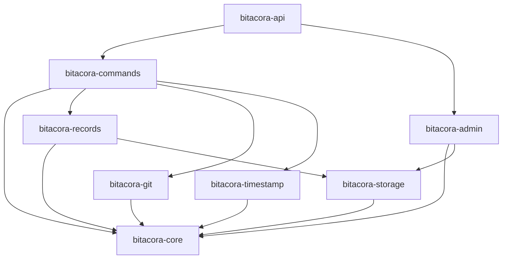

# Estructura de Crates Modulares - Bitacora V1.0

## 🎯 Filosofía de Modularidad

La arquitectura de Bitacora V1.0 se basa en **crates independientes** que siguen el principio de **Single Responsibility** y permiten **reutilización**, **testing independiente** y **evolución controlada** de cada componente.

## 🏗️ Workspace Structure

```
bitacora-rust/
├── Cargo.toml                 # Workspace definition
├── Cargo.lock                 # Dependency lock file
├── .env.example               # Environment template
├── docker-compose.yml         # Development environment
├── README.md                  # Project documentation
├── scripts/
│   ├── setup.sh              # Development setup
│   ├── test.sh               # Testing utilities
│   └── migrate.sh            # Database migrations
├── docs/                     # Generated documentation
├── tests/                    # Integration tests
├── benchmarks/               # Performance benchmarks
└── crates/
    ├── bitacora-core/        # Domain models & traits
    ├── bitacora-timestamp/   # Timestamp management
    ├── bitacora-records/     # Session & action management
    ├── bitacora-git/         # Git operations
    ├── bitacora-api/         # HTTP API (Axum)
    ├── bitacora-commands/    # Command processing
    ├── bitacora-storage/     # Data persistence
    ├── bitacora-admin/       # Administration system
    └── bitacora-cli/         # CLI interface (optional)
```

## 📦 Detailed Crate Specifications

### 1. `bitacora-core` - Domain Foundation

**Purpose**: Define core domain types, traits, and business logic abstractions

**Responsibilities**:
- Domain models (Session, Action, Project, Topic, Spark)
- Service traits (interfaces)
- Error types and handling
- Common utilities and helpers
- Business logic validation

**Key Components**:
```
bitacora-core/
├── Cargo.toml
├── src/
│   ├── lib.rs                # Crate root
│   ├── models/               # Domain models
│   │   ├── mod.rs
│   │   ├── session.rs        # Session entity
│   │   ├── action.rs         # Action entity  
│   │   ├── project.rs        # Project entity
│   │   ├── topic.rs          # Topic entity
│   │   ├── spark.rs          # Spark entity
│   │   ├── user.rs           # User entity
│   │   └── timestamp.rs      # Timestamp value object
│   ├── traits/               # Service interfaces
│   │   ├── mod.rs
│   │   ├── session_service.rs
│   │   ├── timestamp_service.rs
│   │   ├── git_service.rs
│   │   ├── record_repository.rs
│   │   └── configuration.rs
│   ├── errors/               # Error definitions
│   │   ├── mod.rs
│   │   ├── domain_errors.rs
│   │   ├── validation_errors.rs
│   │   └── infrastructure_errors.rs
│   ├── validators/           # Business validation
│   │   ├── mod.rs
│   │   ├── session_validator.rs
│   │   └── action_validator.rs
│   └── utils/                # Common utilities
│       ├── mod.rs
│       ├── slugify.rs
│       ├── time_helpers.rs
│       └── string_helpers.rs
└── tests/                    # Unit tests
    ├── models_test.rs
    └── validators_test.rs
```

**Dependencies**:
```toml
[dependencies]
serde = { version = "1.0", features = ["derive"] }
thiserror = "1.0"
chrono = { version = "0.4", features = ["serde"] }
uuid = { version = "1.0", features = ["v4", "serde"] }
regex = "1.0"
async-trait = "0.1"
```

**Example Domain Model**:
```rust
// Ejemplo conceptual - NO código funcional
#[derive(Debug, Clone, Serialize, Deserialize)]
pub struct Session {
    pub id: SessionId,
    pub project_id: ProjectId, 
    pub user_id: UserId,
    pub branch_name: String,
    pub description: String,
    pub status: SessionStatus,
    pub created_at: DateTime<Utc>,
    pub started_at: Option<DateTime<Utc>>,
    pub ended_at: Option<DateTime<Utc>>,
    pub checklist: Vec<ChecklistItem>,
    pub time_tracking: TimeTracking,
}
```

---

### 2. `bitacora-timestamp` - Timestamp Management

**Purpose**: Handle timestamp daemon and time-related operations

**Responsibilities**:
- Timestamp daemon management (start/stop/health)
- Time formatting and parsing
- Daemon process lifecycle
- System time synchronization

**Key Components**:
```
bitacora-timestamp/
├── Cargo.toml  
├── src/
│   ├── lib.rs                # Public API
│   ├── daemon/               # Daemon implementation
│   │   ├── mod.rs
│   │   ├── manager.rs        # Daemon lifecycle
│   │   ├── process.rs        # Process management
│   │   └── health_check.rs   # Daemon health monitoring
│   ├── service/              # Timestamp service
│   │   ├── mod.rs
│   │   ├── timestamp_service_impl.rs
│   │   └── format_parser.rs  # Time format handling
│   ├── storage/              # Timestamp persistence
│   │   ├── mod.rs
│   │   ├── file_storage.rs   # File-based storage
│   │   └── db_storage.rs     # Database storage
│   └── config/               # Configuration
│       ├── mod.rs
│       └── daemon_config.rs
└── tests/
    ├── daemon_test.rs
    └── service_test.rs
```

**Dependencies**:
```toml
[dependencies] 
bitacora-core = { path = "../bitacora-core" }
tokio = { version = "1.0", features = ["full"] }
serde = { version = "1.0", features = ["derive"] }
tracing = "0.1"
nix = "0.28"  # Unix process management
sysinfo = "0.30"  # System information
```

---

### 3. `bitacora-records` - Session & Action Management

**Purpose**: Core business logic for sessions, actions, and workflows

**Responsibilities**:
- Session lifecycle management
- Action tracking and validation  
- Checklist management
- Time tracking and telemetry
- Business rule enforcement

**Key Components**:
```
bitacora-records/
├── Cargo.toml
├── src/
│   ├── lib.rs
│   ├── session/              # Session management
│   │   ├── mod.rs
│   │   ├── session_manager.rs
│   │   ├── lifecycle.rs      # Session lifecycle
│   │   └── validation.rs     # Session validation
│   ├── action/               # Action management
│   │   ├── mod.rs
│   │   ├── action_service.rs
│   │   ├── action_validator.rs
│   │   └── telemetry.rs      # Action telemetry
│   ├── checklist/            # Checklist functionality
│   │   ├── mod.rs
│   │   ├── checklist_manager.rs
│   │   └── completion_tracker.rs
│   ├── workflow/             # Workflow orchestration
│   │   ├── mod.rs
│   │   ├── session_workflow.rs
│   │   └── action_workflow.rs
│   └── metrics/              # Telemetry collection
│       ├── mod.rs
│       ├── time_tracker.rs
│       └── productivity_metrics.rs
└── tests/
    ├── session_test.rs
    ├── action_test.rs
    └── workflow_test.rs
```

**Dependencies**:
```toml
[dependencies]
bitacora-core = { path = "../bitacora-core" }
tokio = { version = "1.0", features = ["full"] }
async-trait = "0.1"
tracing = "0.1"
uuid = { version = "1.0", features = ["v4"] }
```

---

### 4. `bitacora-git` - Git Operations

**Purpose**: Git integration and repository management

**Responsibilities**:
- Git command execution (async)
- Branch operations and validation
- Auto-commit functionality with push counter
- Git status and repository information
- Integration with external Git APIs

**Key Components**:
```
bitacora-git/
├── Cargo.toml
├── src/
│   ├── lib.rs
│   ├── service/              # Git service implementation
│   │   ├── mod.rs
│   │   ├── git_service_impl.rs
│   │   └── command_executor.rs # Async git commands
│   ├── branch/               # Branch operations
│   │   ├── mod.rs
│   │   ├── branch_manager.rs
│   │   ├── naming_strategy.rs # Timestamp-based naming
│   │   └── validation.rs     # Branch validation
│   ├── commit/               # Commit operations  
│   │   ├── mod.rs
│   │   ├── auto_commit.rs    # Auto-commit logic
│   │   ├── push_counter.rs   # Push threshold management
│   │   └── message_builder.rs # Commit message generation
│   ├── repository/           # Repository operations
│   │   ├── mod.rs
│   │   ├── repo_manager.rs   # Repository management
│   │   └── status_checker.rs # Repository status
│   └── config/               # Git configuration
│       ├── mod.rs
│       └── git_config.rs
└── tests/
    ├── git_service_test.rs
    ├── branch_test.rs
    └── commit_test.rs
```

**Dependencies**:
```toml
[dependencies]
bitacora-core = { path = "../bitacora-core" }
tokio = { version = "1.0", features = ["process"] }
async-trait = "0.1"
tracing = "0.1"
regex = "1.0"
tempfile = "3.0"  # For testing
```

---

### 5. `bitacora-storage` - Data Persistence

**Purpose**: Data access layer with multiple database support

**Responsibilities**:
- Repository pattern implementation
- Database connection management
- Query building and execution
- Multiple database connector support
- Migration and schema management

**Key Components**:
```
bitacora-storage/
├── Cargo.toml
├── src/
│   ├── lib.rs
│   ├── repository/           # Repository implementations
│   │   ├── mod.rs
│   │   ├── session_repository.rs
│   │   ├── action_repository.rs
│   │   ├── project_repository.rs
│   │   ├── topic_repository.rs
│   │   └── spark_repository.rs
│   ├── connectors/           # Database connectors
│   │   ├── mod.rs
│   │   ├── mongodb_connector.rs
│   │   ├── sqlite_connector.rs
│   │   └── connector_manager.rs # Dynamic connector switching
│   ├── query/                # Query builders
│   │   ├── mod.rs
│   │   ├── mongodb_query.rs
│   │   └── sql_query.rs      # For SQL databases
│   ├── migration/            # Database migrations
│   │   ├── mod.rs
│   │   ├── migration_runner.rs
│   │   └── migrations/       # Migration scripts
│   └── config/               # Storage configuration
│       ├── mod.rs
│       └── database_config.rs
└── tests/
    ├── repository_test.rs
    ├── connector_test.rs
    └── migration_test.rs
```

**Dependencies**:
```toml
[dependencies]
bitacora-core = { path = "../bitacora-core" }
mongodb = "2.8"
sqlx = { version = "0.7", features = ["runtime-tokio-rustls", "sqlite", "postgres"] }
serde_json = "1.0"
async-trait = "0.1"
tracing = "0.1"
tokio = { version = "1.0", features = ["full"] }
```

---

### 6. `bitacora-commands` - Command Processing

**Purpose**: Command parsing, validation, and execution orchestration

**Responsibilities**:
- Command parsing from HTTP requests
- Parameter validation and transformation
- Command execution orchestration
- Error handling and response formatting
- Command registry and plugin system

**Key Components**:
```
bitacora-commands/
├── Cargo.toml
├── src/
│   ├── lib.rs
│   ├── handler/              # Command handlers
│   │   ├── mod.rs
│   │   ├── command_handler.rs # Main command handler
│   │   ├── start_handler.rs
│   │   ├── action_handler.rs
│   │   ├── branch_handler.rs
│   │   ├── status_handler.rs
│   │   └── end_handler.rs
│   ├── parser/               # Command parsing
│   │   ├── mod.rs
│   │   ├── command_parser.rs
│   │   └── parameter_parser.rs
│   ├── validator/            # Command validation
│   │   ├── mod.rs
│   │   ├── command_validator.rs
│   │   └── parameter_validator.rs
│   ├── registry/             # Command registry
│   │   ├── mod.rs
│   │   ├── command_registry.rs
│   │   └── dynamic_loader.rs # For database-stored commands
│   └── execution/            # Execution context
│       ├── mod.rs
│       ├── execution_context.rs
│       └── result_builder.rs
└── tests/
    ├── handler_test.rs
    ├── parser_test.rs
    └── registry_test.rs
```

**Dependencies**:
```toml
[dependencies]
bitacora-core = { path = "../bitacora-core" }
bitacora-records = { path = "../bitacora-records" }
bitacora-git = { path = "../bitacora-git" }
bitacora-timestamp = { path = "../bitacora-timestamp" }
tokio = { version = "1.0", features = ["full"] }
async-trait = "0.1"
serde = { version = "1.0", features = ["derive"] }
regex = "1.0"
tracing = "0.1"
```

---

### 7. `bitacora-api` - HTTP API Server

**Purpose**: Axum-based HTTP API for external integration

**Responsibilities**:
- HTTP server setup and configuration
- Route definition and handler mapping
- Middleware stack (logging, CORS, auth, etc.)
- Request/response serialization
- API documentation generation

**Key Components**:
```
bitacora-api/
├── Cargo.toml
├── src/
│   ├── lib.rs
│   ├── server/               # Server setup
│   │   ├── mod.rs
│   │   ├── app.rs           # Application setup
│   │   ├── router.rs        # Route configuration
│   │   └── config.rs        # Server configuration
│   ├── handlers/             # HTTP handlers
│   │   ├── mod.rs
│   │   ├── command_handlers.rs
│   │   ├── admin_handlers.rs
│   │   ├── health_handlers.rs
│   │   └── status_handlers.rs
│   ├── middleware/           # HTTP middleware
│   │   ├── mod.rs
│   │   ├── logging.rs       # Request logging
│   │   ├── cors.rs          # CORS handling
│   │   ├── rate_limit.rs    # Rate limiting
│   │   └── error_handler.rs # Error handling
│   ├── dto/                  # Data transfer objects
│   │   ├── mod.rs
│   │   ├── request_dto.rs   # Request DTOs
│   │   ├── response_dto.rs  # Response DTOs
│   │   └── admin_dto.rs     # Admin DTOs
│   └── documentation/        # API documentation
│       ├── mod.rs
│       └── openapi.rs       # OpenAPI spec generation
└── tests/
    ├── handlers_test.rs
    ├── middleware_test.rs
    └── integration_test.rs
```

**Dependencies**:
```toml
[dependencies]
bitacora-core = { path = "../bitacora-core" }
bitacora-commands = { path = "../bitacora-commands" }
bitacora-admin = { path = "../bitacora-admin" }
axum = "0.7"
tokio = { version = "1.0", features = ["full"] }
tower = "0.4"
tower-http = { version = "0.5", features = ["cors", "trace", "limit"] }
serde = { version = "1.0", features = ["derive"] }
serde_json = "1.0"
tracing = "0.1"
tracing-subscriber = "0.3"
utoipa = "4.0"  # OpenAPI documentation
```

---

### 8. `bitacora-admin` - Administration System

**Purpose**: System administration and configuration management

**Responsibilities**:
- CRUD operations for commands and instructions
- System configuration management  
- Database connector management
- Health check configuration
- User and permission management

**Key Components**:
```
bitacora-admin/
├── Cargo.toml
├── src/
│   ├── lib.rs
│   ├── commands/             # Command administration
│   │   ├── mod.rs
│   │   ├── command_admin.rs
│   │   └── instruction_admin.rs
│   ├── config/               # Configuration management
│   │   ├── mod.rs
│   │   ├── config_manager.rs
│   │   └── validation.rs    # Config validation
│   ├── database/             # Database admin
│   │   ├── mod.rs
│   │   ├── connector_admin.rs
│   │   └── migration_admin.rs
│   ├── health/               # Health monitoring admin
│   │   ├── mod.rs
│   │   ├── endpoint_admin.rs
│   │   └── monitoring.rs    # Health monitoring
│   ├── users/                # User management
│   │   ├── mod.rs
│   │   ├── user_admin.rs
│   │   └── permission_admin.rs
│   └── audit/                # Audit logging
│       ├── mod.rs
│       └── audit_logger.rs
└── tests/
    ├── command_admin_test.rs
    ├── config_admin_test.rs
    └── health_admin_test.rs
```

**Dependencies**:
```toml
[dependencies]
bitacora-core = { path = "../bitacora-core" }
bitacora-storage = { path = "../bitacora-storage" }
tokio = { version = "1.0", features = ["full"] }
async-trait = "0.1"
serde = { version = "1.0", features = ["derive"] }
jsonschema = "0.17"  # Config validation
tracing = "0.1"
```

---

## 🔗 Inter-Crate Dependencies



## 🧪 Testing Strategy per Crate

### Unit Tests
- Each crate has comprehensive unit tests
- Mock implementations of traits for testing
- Test utilities shared across crates

### Integration Tests
- Cross-crate integration testing
- Database integration tests with test containers
- API endpoint testing with test server

### Benchmark Tests
- Performance benchmarks for critical paths
- Database operation benchmarks
- API response time benchmarks

## 📦 Build and Deployment

### Development Build
```bash
cargo build --workspace
cargo test --workspace
cargo clippy --workspace
```

### Production Build
```bash
cargo build --workspace --release
cargo test --workspace --release
```

### Docker Build
```dockerfile
# Multi-stage build for optimal image size
FROM rust:1.75 as builder
# Build workspace
FROM debian:bookworm-slim as runtime
# Copy binaries and runtime dependencies
```

---

**Próximo documento**: `03_solid_principles.md` - Implementación detallada de principios SOLID
