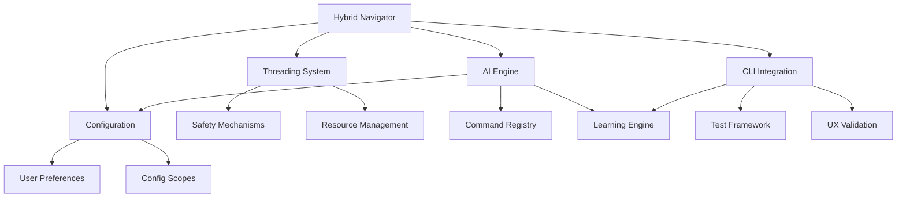

# 📚 Índice de Documentación del Sistema Híbrido de Navegación

## 📋 **OVERVIEW**

Esta página sirve como **índice principal** de toda la documentación del Sistema Híbrido de Navegación, organizando los documentos en orden lógico de lectura para facilitar el entendimiento completo del sistema.

---

## 🎯 **ORDEN DE LECTURA RECOMENDADO**

### **1. Comprensión General**
Empieza aquí para entender el concepto y origen del sistema:

📖 **[01_HYBRID_NAVIGATOR_SYSTEM.md](01_HYBRID_NAVIGATOR_SYSTEM.md)**
- **Propósito:** Comprensión general del sistema híbrido
- **Contenido:** Origen de la propuesta, arquitectura conceptual, threading strategy del usuario
- **Audiencia:** Todos los stakeholders
- **Tiempo estimado:** 15-20 minutos

### **2. Arquitectura Técnica**
Profundiza en los mecanismos técnicos del sistema:

🧵 **[02_THREADING_SAFETY_MECHANISMS.md](02_THREADING_SAFETY_MECHANISMS.md)**
- **Propósito:** Implementación técnica de threading y safety
- **Contenido:** Niveles de threading, safety controllers, conflict detection
- **Audiencia:** Desarrolladores, arquitectos técnicos
- **Tiempo estimado:** 25-30 minutos

### **3. Inteligencia Artificial**  
Entiende cómo funciona la toma de decisiones AI:

🤖 **[03_AI_DECISION_ENGINE.md](03_AI_DECISION_ENGINE.md)**
- **Propósito:** Motor de decisiones AI y comportamiento configurable
- **Contenido:** Command registry, learning engine, context-specific behaviors
- **Audiencia:** Desarrolladores AI, product managers
- **Tiempo estimado:** 30-35 minutos

### **4. Sistema de Configuración**
Aprende sobre la configuración completa del sistema:

⚙️ **[04_CONFIGURATION_SYSTEM.md](04_CONFIGURATION_SYSTEM.md)**  
- **Propósito:** Sistema de configuración multi-scope con learning
- **Contenido:** Configuration hierarchy, user preferences, learning integration
- **Audiencia:** Todos los usuarios, desarrolladores
- **Tiempo estimado:** 20-25 minutos

### **5. Integración CLI**
Comprende la estrategia de testing + learning:

🔗 **[05_CLI_INTEGRATION_STRATEGY.md](05_CLI_INTEGRATION_STRATEGY.md)**
- **Propósito:** Testing simultáneo con configuration learning
- **Contenido:** CLI testing framework, UX optimization, learning cycles
- **Audiencia:** Testers, UX designers, end users
- **Tiempo estimado:** 25-30 minutos

---

## 🔍 **GUÍAS DE LECTURA POR PERFIL**

### **Para el Desarrollador Implementador**
**Ruta rápida para quien va a escribir el código:**

1. **[01_HYBRID_NAVIGATOR_SYSTEM.md](01_HYBRID_NAVIGATOR_SYSTEM.md)** → Visión general y arquitectura
2. **[02_THREADING_SAFETY_MECHANISMS.md](02_THREADING_SAFETY_MECHANISMS.md)** → Detalles técnicos de implementación  
3. **[03_AI_DECISION_ENGINE.md](03_AI_DECISION_ENGINE.md)** → Lógica de AI y command registry
4. **[04_CONFIGURATION_SYSTEM.md](04_CONFIGURATION_SYSTEM.md)** → Sistema de configuración
5. **[05_CLI_INTEGRATION_STRATEGY.md](05_CLI_INTEGRATION_STRATEGY.md)** → Testing e integración

### **Para el Product Manager**
**Ruta enfocada en funcionalidad y user experience:**

1. **[01_HYBRID_NAVIGATOR_SYSTEM.md](01_HYBRID_NAVIGATOR_SYSTEM.md)** → Problema resuelto y valor
2. **[03_AI_DECISION_ENGINE.md](03_AI_DECISION_ENGINE.md)** → Capabilities de AI y user control
3. **[05_CLI_INTEGRATION_STRATEGY.md](05_CLI_INTEGRATION_STRATEGY.md)** → User experience y testing
4. **[04_CONFIGURATION_SYSTEM.md](04_CONFIGURATION_SYSTEM.md)** → Configurabilidad y personalización

### **Para el Usuario Final**
**Ruta enfocada en uso y configuración:**

1. **[01_HYBRID_NAVIGATOR_SYSTEM.md](01_HYBRID_NAVIGATOR_SYSTEM.md)** → ¿Qué es y cómo me beneficia?
2. **[05_CLI_INTEGRATION_STRATEGY.md](05_CLI_INTEGRATION_STRATEGY.md)** → Cómo usar el CLI y testing
3. **[04_CONFIGURATION_SYSTEM.md](04_CONFIGURATION_SYSTEM.md)** → Cómo configurar el sistema
4. **[03_AI_DECISION_ENGINE.md](03_AI_DECISION_ENGINE.md)** → Cómo controlar el comportamiento AI

### **Para el Tester/QA**
**Ruta enfocada en testing y validación:**

1. **[05_CLI_INTEGRATION_STRATEGY.md](05_CLI_INTEGRATION_STRATEGY.md)** → Framework de testing completo
2. **[01_HYBRID_NAVIGATOR_SYSTEM.md](01_HYBRID_NAVIGATOR_SYSTEM.md)** → Entender qué se está testando
3. **[03_AI_DECISION_ENGINE.md](03_AI_DECISION_ENGINE.md)** → Validar comportamiento AI
4. **[02_THREADING_SAFETY_MECHANISMS.md](02_THREADING_SAFETY_MECHANISMS.md)** → Test cases de threading

---

## 📊 **MATRIZ DE CONTENIDO POR DOCUMENTO**

| Documento | Arquitectura | Implementación | Testing | Configuración | AI/ML |
|-----------|:------------:|:--------------:|:-------:|:-------------:|:-----:|
| 01_HYBRID_NAVIGATOR | ⭐⭐⭐ | ⭐⭐ | ⭐ | ⭐⭐ | ⭐⭐ |
| 02_THREADING_SAFETY | ⭐⭐ | ⭐⭐⭐ | ⭐⭐ | ⭐ | ⭐ |
| 03_AI_DECISION | ⭐⭐ | ⭐⭐ | ⭐⭐ | ⭐⭐⭐ | ⭐⭐⭐ |
| 04_CONFIGURATION | ⭐ | ⭐⭐ | ⭐ | ⭐⭐⭐ | ⭐⭐ |
| 05_CLI_INTEGRATION | ⭐ | ⭐⭐ | ⭐⭐⭐ | ⭐⭐ | ⭐⭐ |

**Leyenda:** ⭐ = Contenido relevante, ⭐⭐ = Contenido importante, ⭐⭐⭐ = Contenido principal

---

## 🔎 **BÚSQUEDA RÁPIDA POR TEMA**

### **Threading & Concurrencia**
- **Niveles de Threading:** `02_THREADING_SAFETY_MECHANISMS.md` → Sección "Niveles de Threading"
- **Thread Safety:** `02_THREADING_SAFETY_MECHANISMS.md` → Sección "Safety Mechanisms"
- **Conflict Detection:** `02_THREADING_SAFETY_MECHANISMS.md` → Sección "Conflict Detection"

### **Inteligencia Artificial**
- **Decision Logic:** `03_AI_DECISION_ENGINE.md` → Sección "AI Decision Logic"
- **Learning Engine:** `03_AI_DECISION_ENGINE.md` → Sección "AI Learning Engine"
- **Command Registry:** `03_AI_DECISION_ENGINE.md` → Sección "Command Registry"

### **Configuración**
- **User Preferences:** `04_CONFIGURATION_SYSTEM.md` → Sección "User Preferences"  
- **Config Scopes:** `04_CONFIGURATION_SYSTEM.md` → Sección "Configuration Scopes"
- **Learning Integration:** `04_CONFIGURATION_SYSTEM.md` → Sección "Learning & Adaptation"

### **CLI & Testing**
- **Test Scenarios:** `05_CLI_INTEGRATION_STRATEGY.md` → Sección "CLI Testing Framework"
- **UX Validation:** `05_CLI_INTEGRATION_STRATEGY.md` → Sección "User Experience Optimization"
- **Integration Testing:** `05_CLI_INTEGRATION_STRATEGY.md` → Sección "Simultaneous Testing + Learning"

---

## 🛠️ **IMPLEMENTACIÓN INCREMENTAL**

### **Fase 1: Core System** *(Weeks 1-2)*
**Documentos clave:** 01, 02  
**Objetivo:** Sistema básico funcionando con threading core

- [ ] Basic HybridNavigator implementation
- [ ] Thread pools para Sparks y Projects
- [ ] Safety mechanisms básicos
- [ ] Configuration loading/saving

### **Fase 2: AI Integration** *(Weeks 3-4)*
**Documentos clave:** 03, 04  
**Objetivo:** AI decision engine básico con configuración

- [ ] CommandRegistry implementation
- [ ] Basic AI decision logic
- [ ] User preferences system
- [ ] Configuration scope resolution

### **Fase 3: CLI Testing** *(Weeks 5-6)*
**Documentos clave:** 05  
**Objetivo:** CLI testing framework con learning

- [ ] Test scenario execution
- [ ] Interactive configuration
- [ ] UX validation framework  
- [ ] Learning data collection

### **Fase 4: Advanced Features** *(Weeks 7-8)*
**Documentos clave:** Todos  
**Objetivo:** Sistema completo y optimizado

- [ ] Advanced threading safety
- [ ] Sophisticated AI learning
- [ ] Adaptive CLI behavior
- [ ] Production optimization

---

## 📚 **REFERENCIAS CRUZADAS**

### **Conceptos Interconnectados**

### **Dependencias entre Documentos**

1. **01_HYBRID_NAVIGATOR** es prerequisito para todos los demás
2. **02_THREADING_SAFETY** debe leerse antes de implementar 03 y 04
3. **03_AI_DECISION** y **04_CONFIGURATION** son interdependientes  
4. **05_CLI_INTEGRATION** requiere understanding de todos los anteriores

---

## 🎯 **OBJETIVOS DE ESTA DOCUMENTACIÓN**

### **Completitud del Diseño**
- ✅ **Arquitectura completa:** Sistema híbrido con threading especializado
- ✅ **AI configurable:** Completamente configurable por usuario según especificación  
- ✅ **Testing + Learning:** CLI testing simultáneo con configuration learning
- ✅ **Implementation roadmap:** Fases incrementales definidas

### **Trazabilidad de Decisiones**
- ✅ **Origen documentado:** Desde pregunta inicial hasta propuesta final
- ✅ **User requirements:** Todas las especificaciones del usuario incorporadas
- ✅ **Technical rationale:** Justificación técnica para cada decisión
- ✅ **Evolution path:** Cómo el diseño evolucionó durante discusión

### **Implementability**
- ✅ **Code examples:** Rust code examples para guiar implementación
- ✅ **Configuration examples:** TOML configs listos para usar  
- ✅ **Test strategies:** Framework de testing completo definido
- ✅ **Deployment guidance:** Fases de implementación incremental

---

## 📝 **MANTENIMIENTO DE DOCUMENTACIÓN**

### **Versioning Strategy**
- **Major versions:** Cambios arquitectónicos significativos
- **Minor versions:** Nuevas features o improvements  
- **Patch versions:** Corrections y clarificaciones

### **Update Triggers**
- Implementation findings que requieren design changes
- User feedback que sugiere architectural improvements  
- Performance insights que afectan threading o AI decisions
- New requirements que expanden el scope

### **Review Schedule**
- **Weekly:** Durante implementation phases
- **Bi-weekly:** Durante testing phases  
- **Monthly:** Durante maintenance phases
- **Ad-hoc:** Para critical issues o major changes

---

## 🚀 **PRÓXIMOS PASOS**

### **Documentación Adicional Planeada**
- [ ] **Implementation Guide** - Paso a paso para desarrolladores
- [ ] **User Manual** - Guía completa para usuarios finales  
- [ ] **API Reference** - Documentación completa de APIs
- [ ] **Troubleshooting Guide** - Solución de problemas comunes

### **Integration con Existing Documentation**
- [ ] Links bidireccionales con documentos existentes de Bitacora
- [ ] Updates a NAVIGATION.md para incluir nuevos documentos
- [ ] Integration con PROGRESS_UPDATE documents  
- [ ] Cross-references con CLI_TESTING_PROPOSAL.md

---

## 📞 **CONTACTO Y FEEDBACK**

Para preguntas, clarifications o sugerencias sobre esta documentación:

- **Implementation questions:** Consultar documentos técnicos específicos
- **Architecture discussions:** Reference 01_HYBRID_NAVIGATOR_SYSTEM.md
- **User experience feedback:** Focus en 05_CLI_INTEGRATION_STRATEGY.md
- **Configuration help:** Reference 04_CONFIGURATION_SYSTEM.md

---

*Sistema Híbrido de Navegación - Índice de Documentación*  
*Documentado el 27 de Agosto, 2025*  
*Parte del proyecto Bitacora V1.0*

**Total reading time:** ~2-3 horas para comprensión completa  
**Minimum viable understanding:** ~45 minutos (documentos 01, 03, 05)  
**Implementation-ready understanding:** ~1.5 horas (todos los documentos)
