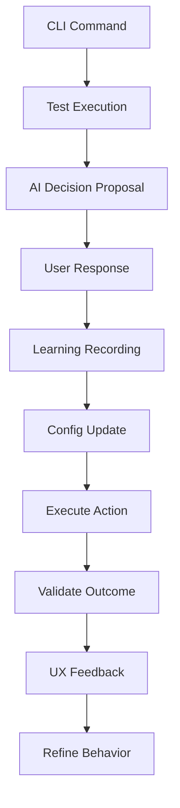

# 🔗 CLI Integration Strategy - Implementación y Testing

## 📋 **OVERVIEW**

La **CLI Integration Strategy** define cómo el Sistema Híbrido de Navegación se integra con la interfaz CLI para proporcionar testing y configuración simultáneos, según especificación del usuario: *"esto también nos servirá cuando implementemos el CLI para poder probar y configurar al mismo tiempo que vamos aprendiendo las configuraciones correctas"*.

---

## 🎯 **OBJETIVO DE INTEGRACIÓN CLI**

### **Dual Purpose Design**

```rust
pub struct CLINavigatorIntegration {
    // Testing Components
    pub test_executor: TestExecutor,
    pub scenario_runner: ScenarioRunner,
    pub user_experience_validator: UXValidator,
    
    // Configuration Learning Components  
    pub config_learner: ConfigLearningEngine,
    pub preference_recorder: PreferenceRecorder,
    pub behavior_tuner: BehaviorTuner,
    
    // Integration Components
    pub hybrid_navigator: HybridNavigator,
    pub ai_engine: AIDecisionEngine,
    pub config_manager: ConfigurationManager,
}
```

### **Simultaneous Testing + Learning Flow**



---

## 🧪 **CLI TESTING FRAMEWORK**

### **Test Scenario Architecture**

```rust
pub struct TestScenario {
    pub id: ScenarioId,
    pub name: String,
    pub description: String,
    pub test_type: TestType,
    pub learning_objective: LearningObjective,
    pub success_criteria: Vec<SuccessCriterion>,
}

pub enum TestType {
    UserExperience {
        workflow: WorkflowType,
        expected_interactions: u32,
        max_acceptable_time: Duration,
    },
    AIBehavior {
        context: AIContext,
        decision_scenarios: Vec<DecisionScenario>,
    },
    ConfigLearning {
        preference_categories: Vec<PreferenceCategory>,
        learning_iterations: u32,
    },
    Integration {
        components: Vec<IntegrationComponent>,
        interaction_patterns: Vec<InteractionPattern>,
    },
}

pub enum LearningObjective {
    OptimizeExecutionMode,
    CalibrarRiskTolerance, 
    RefineCommandPreferences,
    ImproveContextDetection,
    EnhanceUserSatisfaction,
}
```

### **CLI Test Commands**

```bash
# Main CLI testing interface
bitacora test --interactive                    # Full interactive testing session
bitacora test --scenario <scenario_name>      # Run specific test scenario  
bitacora test --learn-config                  # Focus on configuration learning
bitacora test --validate-ux                   # User experience validation

# Specific test categories
bitacora test nav --mode core                  # Test core navigation mode
bitacora test nav --mode threads               # Test threaded navigation
bitacora test ai --context development         # Test AI in development context
bitacora test ai --execution-mode auto         # Test auto execution mode

# Learning and configuration
bitacora learn config --interactive            # Interactive config learning
bitacora learn preferences --from-usage        # Learn from real usage patterns
bitacora config apply-learned                  # Apply learned configuration
bitacora config review-suggestions             # Review AI suggestions

# Integration testing
bitacora test integration --full-workflow      # Complete workflow testing
bitacora test integration --ai-cli-sync        # Test AI-CLI synchronization
```

---

## 🔄 **SIMULTANEOUS TESTING + LEARNING**

### **Integrated Test-Learn Cycle**

```rust
pub struct TestLearnCycle {
    current_test: Option<TestScenario>,
    learning_session: LearningSession,
    config_tracker: ConfigTracker,
    ux_metrics: UXMetrics,
}

impl TestLearnCycle {
    pub async fn execute_test_with_learning(
        &mut self,
        scenario: TestScenario
    ) -> Result<TestLearnResult, TestError> {
        
        println!("🧪 Test Scenario: {}", scenario.name);
        println!("🎯 Learning Objective: {:?}", scenario.learning_objective);
        println!("📚 This will help configure AI behavior for similar situations\n");
        
        // 1. Setup test environment
        let test_context = self.setup_test_context(&scenario).await?;
        
        // 2. Execute scenario with learning
        let mut step_results = Vec::new();
        
        for (i, step) in scenario.steps.iter().enumerate() {
            println!("📝 Step {}: {}", i + 1, step.description);
            
            // Execute test step
            let step_result = self.execute_test_step(step, &test_context).await?;
            
            // Record learning data from user interactions
            if let Some(user_decision) = step_result.user_decision {
                self.learning_session.record_decision(
                    step.clone(),
                    step_result.ai_suggestion.clone(),
                    user_decision
                ).await?;
                
                println!("   ✓ Preference recorded for future AI decisions");
            }
            
            // Validate UX for this step
            let ux_feedback = self.collect_ux_feedback(step, &step_result).await?;
            self.ux_metrics.record_step_feedback(ux_feedback);
            
            step_results.push(step_result);
        }
        
        // 3. Analyze overall test results
        let test_result = self.analyze_test_results(&step_results).await?;
        
        // 4. Generate configuration suggestions
        let config_suggestions = self.learning_session
            .generate_configuration_suggestions().await?;
            
        // 5. Apply learned preferences if user approves
        if !config_suggestions.is_empty() {
            self.present_config_suggestions(&config_suggestions).await?;
        }
        
        Ok(TestLearnResult {
            scenario_id: scenario.id,
            test_result,
            learned_preferences: self.learning_session.extract_preferences().await?,
            ux_improvements: self.ux_metrics.suggest_improvements(),
            config_suggestions,
        })
    }
}
```

### **Real-Time Configuration Learning**

```rust
pub struct RealTimeConfigLearner {
    decision_buffer: Vec<ConfigDecision>,
    pattern_detector: PatternDetector,
    preference_updater: PreferenceUpdater,
}

impl RealTimeConfigLearner {
    pub async fn process_user_interaction(
        &mut self,
        interaction: UserInteraction
    ) -> Option<ConfigurationUpdate> {
        
        // Buffer the decision
        let decision = ConfigDecision::from_interaction(interaction);
        self.decision_buffer.push(decision);
        
        // Check if we can detect a pattern (every 5 decisions)
        if self.decision_buffer.len() % 5 == 0 {
            if let Some(pattern) = self.pattern_detector
                .analyze_recent_decisions(&self.decision_buffer).await {
                    
                // Generate configuration update
                let config_update = self.preference_updater
                    .generate_update_from_pattern(pattern).await;
                    
                // Show learning to user
                self.display_learning_insight(&config_update).await;
                    
                return Some(config_update);
            }
        }
        
        None
    }
    
    async fn display_learning_insight(&self, update: &ConfigurationUpdate) {
        println!("🧠 AI Learning Insight:");
        match &update.update_type {
            ConfigUpdateType::ExecutionMode(mode) => {
                println!("   You seem to prefer {:?} mode for {} commands", 
                         mode, update.command_category);
                println!("   Should I update your preferences automatically? (y/n)");
            },
            ConfigUpdateType::RiskTolerance(level) => {
                println!("   Your risk tolerance for {} appears to be {:?}", 
                         update.command_category, level);
                println!("   Should I adjust AI decision-making accordingly? (y/n)");
            },
            // ... other update types
        }
    }
}
```

---

## 👤 **USER EXPERIENCE OPTIMIZATION**

### **UX Validation During Testing**

```rust
pub struct UXValidator {
    interaction_tracker: InteractionTracker,
    satisfaction_collector: SatisfactionCollector,
    efficiency_analyzer: EfficiencyAnalyzer,
}

impl UXValidator {
    pub async fn validate_command_experience(
        &mut self,
        command: &str,
        execution_path: &ExecutionPath,
        outcome: &CommandOutcome
    ) -> UXValidationResult {
        
        // Track interaction metrics
        let interaction_metrics = InteractionMetrics {
            command_length: command.len(),
            steps_to_completion: execution_path.steps.len(),
            time_to_completion: execution_path.duration,
            user_interruptions: execution_path.interruptions.len(),
            ai_suggestions_used: execution_path.ai_suggestions_accepted,
        };
        
        // Collect user satisfaction
        let satisfaction = self.collect_satisfaction_feedback(
            "How satisfied are you with this command experience? (1-10)"
        ).await?;
        
        // Analyze efficiency
        let efficiency_score = self.efficiency_analyzer
            .calculate_efficiency(&interaction_metrics).await;
        
        // Generate UX improvement suggestions
        let improvements = self.generate_ux_improvements(
            &interaction_metrics,
            satisfaction,
            efficiency_score
        ).await;
        
        UXValidationResult {
            satisfaction_score: satisfaction,
            efficiency_score,
            interaction_metrics,
            suggested_improvements: improvements,
        }
    }
    
    async fn collect_satisfaction_feedback(&self, prompt: &str) -> Result<f32, UXError> {
        println!("\n📊 Quick UX Feedback:");
        println!("{}", prompt);
        
        // In real implementation, this would be a proper CLI input
        // For now, simulate user input
        let input = self.get_user_input().await?;
        let score = input.parse::<f32>().unwrap_or(5.0);
        
        // Optional detailed feedback for low scores
        if score <= 3.0 {
            println!("What could be improved? (optional)");
            let feedback = self.get_optional_feedback().await?;
            // Record detailed feedback
        }
        
        Ok(score)
    }
}
```

### **Adaptive CLI Behavior**

```rust
pub struct AdaptiveCLI {
    user_expertise_level: ExpertiseLevel,
    preferred_interaction_style: InteractionStyle,
    learned_shortcuts: Vec<LearnedShortcut>,
    customized_help: CustomizedHelp,
}

impl AdaptiveCLI {
    pub async fn adapt_interface_based_on_usage(
        &mut self,
        usage_patterns: &UsagePatterns
    ) -> CLIAdaptations {
        
        let mut adaptations = CLIAdaptations::new();
        
        // Adapt verbosity based on user expertise
        if usage_patterns.average_help_requests < 0.1 {
            self.user_expertise_level = ExpertiseLevel::Expert;
            adaptations.reduce_verbosity = true;
            adaptations.enable_advanced_shortcuts = true;
        }
        
        // Learn commonly used command patterns
        for pattern in usage_patterns.frequent_command_sequences.iter() {
            if pattern.frequency > 10 && pattern.sequence.len() > 2 {
                let shortcut = LearnedShortcut {
                    trigger: format!("{}+", pattern.sequence[0]),
                    expansion: pattern.sequence.clone(),
                    confidence: pattern.frequency as f32 / usage_patterns.total_commands as f32,
                };
                
                if shortcut.confidence > 0.3 {
                    self.learned_shortcuts.push(shortcut);
                    adaptations.new_shortcuts_available = true;
                }
            }
        }
        
        // Customize help based on most used features
        self.customized_help.prioritize_features(
            &usage_patterns.most_used_features
        );
        
        adaptations
    }
}
```

---

## 🔧 **CLI COMMAND ARCHITECTURE**

### **Hybrid Navigator CLI Commands**

```rust
pub struct NavigatorCLI {
    navigator: HybridNavigator,
    test_framework: TestFramework,
    config_learner: ConfigLearningEngine,
}

impl NavigatorCLI {
    // Main navigation commands
    pub async fn cmd_nav_mode(&self, mode: NavigatorMode) -> Result<(), CLIError> {
        println!("🧭 Switching to {} navigation mode", mode);
        
        // Test the mode switch
        let test_result = self.test_mode_switch(mode).await?;
        
        // Learn from user experience
        if let Some(user_feedback) = self.collect_mode_feedback().await? {
            self.config_learner.record_mode_preference(mode, user_feedback).await?;
        }
        
        self.navigator.set_mode(mode).await
    }
    
    pub async fn cmd_ai_config(&self, config: AIConfigCommand) -> Result<(), CLIError> {
        match config {
            AIConfigCommand::Interactive => {
                self.run_interactive_ai_config().await
            },
            AIConfigCommand::TestScenario(scenario) => {
                self.run_ai_test_scenario(scenario).await
            },
            AIConfigCommand::ApplyLearned => {
                self.apply_learned_ai_config().await
            },
        }
    }
    
    async fn run_interactive_ai_config(&self) -> Result<(), CLIError> {
        println!("🤖 Interactive AI Configuration & Testing");
        println!("This will configure AI behavior while testing different scenarios\n");
        
        let scenarios = vec![
            TestScenario::new("project_creation", "Test AI project creation suggestions"),
            TestScenario::new("topic_switching", "Test AI topic switching automation"), 
            TestScenario::new("action_logging", "Test AI action logging behavior"),
            TestScenario::new("risk_assessment", "Test AI risk assessment accuracy"),
        ];
        
        for scenario in scenarios {
            println!("📋 Testing: {}", scenario.name);
            
            // Run scenario with learning
            let result = self.test_framework
                .execute_with_learning(scenario.clone()).await?;
                
            // Show what was learned
            self.display_learning_summary(&result.learned_preferences).await?;
            
            // Ask if user wants to apply changes
            if self.confirm_config_changes(&result.config_suggestions).await? {
                self.apply_config_changes(result.config_suggestions).await?;
            }
            
            println!("   ✓ Scenario completed\n");
        }
        
        println!("🎯 AI Configuration & Testing Complete!");
        println!("Your AI assistant is now better tuned to your preferences.");
        
        Ok(())
    }
}
```

### **Command Integration Examples**

```bash
# Example CLI session combining testing + learning
$ bitacora test nav --interactive

🧭 Interactive Navigation Testing & Configuration
This will test navigation features while learning your preferences.

📋 Test 1: Project Creation Flow
   > bitacora project create "test-project"
   🤖 AI suggests: Create project structure with initial topic 'Setup'
   
   Should AI auto-create initial topics? 
   1) Always create setup topic
   2) Ask before creating  
   3) Never auto-create topics
   Choice (1-3): 2
   
   ✓ Preference recorded: Ask before auto-creating topics
   ✓ Test completed successfully

📋 Test 2: Topic Switching
   > bitacora topic switch "authentication"
   🤖 AI suggests: Create new topic 'authentication' in current project
   
   Auto-creating topic 'authentication'... (based on your preference)
   ✓ Topic created and activated
   
   How satisfied with this interaction? (1-10): 8
   ✓ Satisfaction recorded

📋 Test 3: Action Logging
   > Completed: "Fixed login bug"
   🤖 AI suggests: Log action in topic 'authentication'?
   
   [y/n] y
   ✓ Action logged
   
   Should AI auto-log similar actions? (y/n): y
   ✓ Preference updated: Auto-log development actions

🧠 Learning Summary:
   - Topic creation: Ask first (confidence: 85%)
   - Action logging: Auto-log development actions (confidence: 92%) 
   - Risk tolerance: Medium (based on choices)

Apply these learned preferences? (y/n): y
✓ Configuration updated with learned preferences
✓ AI will now behave according to your demonstrated preferences

🎯 Testing & Configuration Complete!
```

---

## 📊 **METRICS & FEEDBACK COLLECTION**

### **Testing Metrics**

```rust
pub struct TestingMetrics {
    pub scenarios_completed: u32,
    pub preferences_learned: u32,
    pub user_satisfaction_avg: f32,
    pub config_accuracy_improvement: f32,
    pub time_to_optimal_config: Duration,
}

pub struct FeedbackCollector {
    satisfaction_scores: Vec<f32>,
    improvement_suggestions: Vec<String>,
    feature_usage_patterns: HashMap<String, u32>,
}

impl FeedbackCollector {
    pub async fn collect_comprehensive_feedback(
        &mut self,
        test_session: &TestSession
    ) -> ComprehensiveFeedback {
        
        println!("\n📊 Session Feedback Collection");
        
        // Overall satisfaction
        let overall_satisfaction = self.ask_scaled_question(
            "Overall, how satisfied are you with this testing experience?",
            1, 10
        ).await?;
        
        // Specific feature feedback  
        let feature_feedback = self.collect_feature_feedback(test_session).await?;
        
        // Learning effectiveness
        let learning_effectiveness = self.ask_scaled_question(
            "How well do you think the AI learned your preferences?", 
            1, 10
        ).await?;
        
        // Configuration accuracy
        let config_accuracy = self.ask_scaled_question(
            "How accurate do the learned AI preferences seem?",
            1, 10
        ).await?;
        
        // Improvement suggestions
        let improvements = self.collect_open_feedback(
            "What could be improved in the testing/learning process?"
        ).await?;
        
        ComprehensiveFeedback {
            overall_satisfaction,
            feature_feedback,
            learning_effectiveness,
            config_accuracy, 
            improvement_suggestions: improvements,
            session_duration: test_session.duration,
            scenarios_completed: test_session.scenarios_completed,
        }
    }
}
```

---

## 🚀 **IMPLEMENTATION PHASES**

### **Phase 1: Basic CLI Integration**
```rust
// Core CLI command structure
- NavigatorCLI basic implementation
- Simple test scenario execution
- Basic configuration learning
- Manual feedback collection
```

### **Phase 2: Interactive Testing Framework**
```rust
// Advanced testing capabilities  
- TestFramework with scenario management
- Real-time configuration learning
- UX validation and feedback collection
- Adaptive CLI behavior basics
```

### **Phase 3: Advanced Learning Integration**
```rust
// Sophisticated learning systems
- Pattern detection and preference generation
- Comprehensive feedback analysis
- Automatic configuration optimization
- Advanced UX adaptation
```

### **Phase 4: Production Polish**
```rust
// Production-ready CLI testing
- Comprehensive metrics and analytics
- Advanced help and documentation
- Error handling and recovery
- Performance optimization
```

---

## 📝 **CONFIGURATION FILES FOR CLI**

### **CLI Testing Configuration (cli-testing.toml)**

```toml
[testing]
interactive_mode = true
auto_learn_preferences = true
collect_ux_feedback = true
session_timeout_minutes = 30

[scenarios]
enabled = [
    "project_creation",
    "topic_switching", 
    "action_logging",
    "ai_decision_making",
    "risk_assessment"
]

[learning]
min_decisions_for_pattern = 3
confidence_threshold = 0.7
auto_apply_high_confidence = true
ask_before_applying = true

[feedback]
satisfaction_collection = true
detailed_feedback_threshold = 3.0  # Ask for details if satisfaction <= 3.0
metrics_collection = true
```

### **User Experience Configuration (ux-config.toml)**

```toml
[interface]
verbosity_level = "adaptive"      # minimal, standard, verbose, adaptive
show_learning_insights = true
confirmation_style = "concise"    # minimal, concise, detailed

[adaptation]
expertise_detection = true
shortcut_learning = true
help_customization = true
command_suggestion = true

[satisfaction]
feedback_frequency = "per_scenario" # never, per_session, per_scenario, always
improvement_tracking = true
```

---

## 🎯 **SUCCESS CRITERIA**

### **CLI Integration Success Metrics**

1. **Testing Effectiveness**
   - 95% of test scenarios complete successfully
   - Average user satisfaction ≥ 7.5/10
   - ≤ 3 user interruptions per test session

2. **Configuration Learning**
   - AI accuracy improves by ≥ 25% after learning session
   - 90% of learned preferences validated as correct by user
   - Configuration converges to optimal within 3 test sessions

3. **User Experience**
   - Average time to complete test session ≤ 15 minutes
   - User reports increased confidence in AI behavior
   - Willingness to use AI features increases post-testing

4. **Integration Quality**
   - Seamless transition between testing and real usage
   - No configuration conflicts or inconsistencies
   - Learned preferences persist correctly across sessions

---

*CLI Integration Strategy - Bitacora V1.0 Hybrid Navigator*  
*Documentado el 27 de Agosto, 2025*
