# 🎭 **BITÁCORA: GUÍA COMPLETA DE TU PIEL AI**

## � **INTRODUCCIÓN: TU PIEL INTELIGENTE**

Bienvenido a la evolución de la interacción humano-AI. Bitácora no es una aplicación más, es **tu piel inteligente** que envuelve cualquier AI, dándole memoria perfecta, contexto universal y especialización bajo demanda.

### **🎭 ¿Qué es Bitácora? (La Metáfora de la Piel)**

**"Bitácora es a la AI lo que React o Svelte son a JavaScript, pero con lenguaje natural y Bitaflow"**

Imagina que tienes una piel inteligente que:
- **Te conoce perfectamente** desde el primer momento
- **Se adapta a cualquier situación** poniéndose diferentes "trajes"
- **Sabe dónde está todo** sin almacenar datos masivos
- **Funciona en cualquier dispositivo** manteniendo tu contexto completo
- **Se especializa automáticamente** según lo que necesites hacer

**Bitácora es la piel que hace que cualquier AI te entienda completamente.**

---

## 🧠 **CÓMO BITÁCORA ORGANIZA TU MUNDO**

### **📚 Tu Vida como Flujo Ordenado**

Bitácora transforma el caos de tu vida digital en un **flujo trazable y organizado**:

```
🌊 TU FLUJO DE VIDA CON BITÁCORA
├── 📋 PROYECTOS (Topics → Actions)
│   ├── 💼 Trabajo: "Desarrollo API Rest"
│   │   ├── 🎯 Topics: Arquitectura, Base de datos, Testing
│   │   └── ✅ Actions: Tareas específicas dentro de cada topic
│   │
│   ├── 🏠 Personal: "Renovación de casa"
│   │   ├── 🎯 Topics: Presupuesto, Contratistas, Diseño
│   │   └── ✅ Actions: "Contactar pintor", "Comprar materiales"
│   │
│   └── 💡 Ideas: "App de productividad"
│       ├── 🎯 Topics: Funcionalidades, Tecnologías, Monetización
│       └── ✅ Actions: "Diseñar mockups", "Investigar mercado"
│
├── ✨ SPARKS (Tus insights y conexiones)
│   ├── "La procrastinación es miedo al fracaso disfrazado"
│   ├── "Las mejores ideas vienen en la ducha"
│   └── "El éxito es 1% inspiración, 99% transpiración"
│
└── 💬 CONVERSACIONES (Tu diálogo continuo con la AI)
    ├── "Análisis de la reunión del equipo"
    ├── "Ideas para optimizar el workflow"
---

## 📱 **DISPOSITIVOS Y TRAJES: ESPECIALIZACIÓN INTELIGENTE**

### **🧠 Cada Dispositivo Optimizado para sus Fortalezas**

**Bitácora se adapta automáticamente a cada dispositivo, optimizando la experiencia:**

```
📱 MÓVIL - Captura y Navegación Rápida
� Bitácora (piel completa) + 🎤 Captura por voz
├── 💭 Ideas rápidas: "Bitácora, apunta esta idea..."
├── 📍 Contexto instantáneo: "¿Dónde quedamos con el proyecto?"
├── 🔔 Recordatorios inteligentes: "Te recuerdo revisar el código"
├── 📷 Documentación visual: Fotos que se conectan con proyectos
└── ⚡ Consultas express: "¿Qué tengo pendiente hoy?"

💻 LAPTOP - Productividad y Desarrollo
🎭 Bitácora (piel completa) + ⚓ Astillero (cuando desarrollas)
├── 🛠️ Desarrollo profundo: "Bitácora, optimicemos esta API"
├── 📋 Gestión de proyectos: Organización avanzada de tasks
├── 🔄 Sincronización productiva: Continuidad perfecta desde móvil
├── 📊 Análisis contextual: "Cómo va el progreso del sprint?"
└── 🎯 Focus mode: Elimina distracciones irrelevantes

🖥️ DESKTOP - Análisis y Creación Profunda
🎭 Bitácora (piel completa) + 📊 Analista + 🎨 Creativo [Futuros]
├── 📈 Análisis complejo: Procesamiento de grandes volúmenes
├── 🎨 Creación multimedia: Diseño, video, contenido
├── 📊 Visualización avanzada: Dashboards y reportes
├── 💾 Almacenamiento expandido: Para proyectos masivos
└── 🌐 Servidor personal: Procesamiento en background

☁️ CLOUD SERVERS - Automatización y Escalabilidad
🎭 Bitácora (instancia de procesamiento) + Todos los trajes
├── 🔄 Automatización de workflows: CI/CD, backups, monitoreo
├── 🚀 Procesamiento pesado: Machine learning, big data
├── 🌍 Acceso global: Desde cualquier dispositivo del mundo
├── ⚡ Escalabilidad infinita: Crece con tus necesidades
└── 🛡️ Seguridad avanzada: Encriptación y acceso controlado
```

### **🎭 Trajes que se Activan Automáticamente**

**Bitácora detecta el contexto y se pone el traje apropiado:**

```
⚓ ASTILLERO (Desarrollador)
├── 🛠️ Se activa cuando: Hablas de código, git, arquitectura
├── 💡 Te da: Conocimiento senior de Rust, Git masterclass, GitHub integration
├── 📱 En móvil: "¿Cómo resuelvo este merge conflict?"
├── 💻 En laptop: Code review completo y sugerencias de arquitectura
└── 🖥️ En desktop: Análisis de rendimiento y optimización automática

� EJECUTIVO (Empresarial) [Futuro]
├── � Se activa cuando: Hablas de KPIs, estrategia, decisiones
├── 📊 Te da: Análisis empresarial, presentaciones, toma de decisiones
├── 📱 En móvil: "¿Cómo van las métricas de este mes?"
└── 💻 En laptop: Reportes ejecutivos y análisis de tendencias

🎨 CREATIVO (Artístico) [Futuro]
├── 🎭 Se activa cuando: Hablas de diseño, contenido, creatividad
├── 🎬 Te da: Diseño gráfico, storytelling, marketing visual
├── 📱 En móvil: Inspiración creativa e ideas rápidas
└── 🖥️ En desktop: Suite completa de herramientas creativas

📊 ANALISTA (Datos) [Futuro]
├── 🔍 Se activa cuando: Hablas de datos, investigación, insights
├── 📈 Te da: Análisis profundo, visualización, machine learning
└── 🖥️ En desktop: Procesamiento de big data y modelos predictivos

👤 PERSONAL (Íntimo) [Futuro]
├── 🏃 Se activa cuando: Hablas de salud, finanzas, relaciones
├── 💝 Te da: Coaching personal, gestión financiera, bienestar
└── 📱 En móvil: Compañía íntima y consejos personalizados
```

🖥️ PC DE ESCRITORIO
🎭 Bitácora + 🎨 Traje Creativo + 📊 Analista
├── Escritura creativa profunda
├── Análisis de datos complejo
├── Diseño gráfico avanzado
└── Procesamiento de multimedia
```

### **Sincronización Inteligente**

**Bitácora no sincroniza datos masivos, sincroniza el "cerebro":**
- ✅ **Metadatos ligeros** viajan entre dispositivos
- ✅ **Contenido real** queda en tus clouds de confianza
- ✅ **Acceso bajo demanda** cuando necesitas el detalle
- ✅ **Sin duplicación** innecesaria de archivos

---

## 🎩 **LOS TRAJES DE BITÁCORA: SUPERPOWERS BAJO DEMANDA**

### **⚓ Astillero: El Traje del Desarrollador**

**Cuando Bitácora se pone Astillero, se convierte en un desarrollador senior:**

```bash
# Bitácora detecta que estás trabajando en código
bitacora wear astillero

# Ahora tienes acceso a:
# - Arquitectura de software profesional
# - Lenguajes de programación (Rust, Python, JS)
# - Control de versiones avanzado (Git)
# - Análisis y optimización de código
# - Integración con plataformas de desarrollo
```

### **👔 Traje Ejecutivo: Gestión Profesional**

**Para proyectos de negocio y consultoría:**

```bash
bitacora wear executive

# Capacidades activadas:
# - Gestión estratégica de proyectos
# - Análisis de datos empresariales
# - Comunicación profesional
# - Toma de decisiones ejecutivas
```

### **🎨 Traje Creativo: Producción de Contenido**

**Para diseño, escritura y creación:**

```bash
bitacora wear creative

# Habilidades disponibles:
# - Diseño gráfico y visual
# - Storytelling y narrativa
# - Marketing digital estratégico
# - Producción de arte digital
```

---

## 🚀 **PRIMEROS PASOS CON TU PIEL AI**

### **Paso 1: Instalar Bitácora**

```bash
# En cualquier dispositivo
curl -fsSL https://install.bitacora.dev | bash
bitacora setup
```

### **Paso 2: Conectar tus Servicios**

```bash
# Bitácora se conecta a tus clouds de confianza
bitacora connect google-drive
bitacora connect icloud
bitacora connect github

# Solo metadatos se sincronizan, tus datos quedan seguros
```

### **Paso 3: Primer Proyecto**

```bash
# Crear proyecto con detección automática de tipo
bitacora create-project "Mi App Móvil" --auto-detect

# Bitácora analiza el contexto y selecciona el traje apropiado
# Para desarrollo: automáticamente se pone Astillero
```

### **Paso 4: Empezar a Trabajar**

```bash
# Bitácora fluye con tu trabajo
bitacora start-session "Desarrollo feature principal"

# Todo se registra automáticamente:
# - Ideas y decisiones
# - Código y cambios
# - Progreso y obstáculos
# - Aprendizajes y insights
```

---

## � **TIPOS DE PROYECTOS Y SUS TRAJES**

### **💻 Desarrollo de Software**

**Traje recomendado: Astillero**

```bash
bitacora create-project "API Rest E-commerce" --type development
```

**Flujo típico:**
1. **Planificación**: Arquitectura y diseño con Astillero
2. **Desarrollo**: Coding con herramientas especializadas
3. **Testing**: Análisis automático de código
4. **Deployment**: Integración con plataformas cloud

### **📖 Escritura y Contenido**

**Traje recomendado: Creativo**

```bash
bitacora create-project "Novela Ciencia Ficción" --type writing
```

**Flujo típico:**
1. **Ideación**: Captura de conceptos e inspiración
2. **Escritura**: Flujo creativo asistido
3. **Edición**: Análisis y mejora de contenido
4. **Publicación**: Preparación para diferentes formatos

### **💼 Consultoría y Negocios**

**Traje recomendado: Ejecutivo**

```bash
bitacora create-project "Transformación Digital Cliente" --type business
```

**Flujo típico:**
1. **Análisis**: Evaluación de situación actual
2. **Estrategia**: Desarrollo de roadmap y plan
3. **Implementación**: Seguimiento de acciones
4. **Reporting**: Comunicación de resultados

### **🔬 Investigación y Academia**

**Traje recomendado: Analista + Creativo**

```bash
bitacora create-project "Tesis Machine Learning" --type research
```

**Flujo típico:**
1. **Revisión**: Análisis de literatura existente
2. **Metodología**: Diseño experimental
3. **Experimentación**: Ejecución y medición
4. **Documentación**: Redacción de findings

---

## 🔄 **CÓMO FUNCIONA EL FLUJO DE TRABAJO**

### **Sesiones Inteligentes**

**Bitácora maneja automáticamente el contexto:**

```bash
# Iniciar sesión de trabajo
bitacora start-session "Desarrollo feature login"

# Bitácora automáticamente:
# - Carga el contexto del proyecto
# - Selecciona el traje apropiado (Astillero)
# - Prepara herramientas necesarias
# - Recuerda dónde dejaste el trabajo anterior
```

### **Captura Continua de Insights**

**Cada interacción genera valor:**

```bash
# Durante el desarrollo
"Este patrón de autenticación es más seguro"
"Considerar usar JWT en lugar de sessions"
"La base de datos responde mejor con índices compuestos"

# Bitácora automáticamente:
# - Registra como Sparks (insights)
# - Conecta con proyectos relevantes
# - Sugiere aplicaciones futuras
# - Enriquecer el mapa mental
```

### **Sincronización Transparente**

**Cambias de dispositivo sin perder el ritmo:**

```bash
# En teléfono: Idea rápida durante reunión
bitacora note "El cliente prefiere UX minimalista"

# En laptop: Continúas desarrollando
# La nota aparece automáticamente en el contexto
# Bitácora sugiere: "Aplicar esto al diseño actual"
```

---

## 📊 **MÉTRICAS Y SEGUIMIENTO DE PROGRESO**

### **Dashboard Personalizado**

```bash
bitacora dashboard

# Resultado:
🎭 Tu Piel AI - Dashboard Semanal
├── 📈 Productividad: +23% vs semana anterior
├── 🎯 Proyectos activos: 4
├── ⚡ Sesiones completadas: 12
├── 💡 Sparks generados: 28
├── 🎨 Traje más usado: Astillero (60% del tiempo)
└── 📊 Eficiencia: 89% de objetivos cumplidos
```

### **Análisis de Patrones**

```bash
bitacora analytics patterns

# Resultado:
🧠 Patrones de Trabajo Detectados
├── 🕐 Horas más productivas: 9:00-11:00 AM
├── 📱 Dispositivo preferido: Laptop para desarrollo
├── 🎯 Tipos de proyectos: 70% desarrollo, 30% creativo
├── ⚡ Duración óptima de sesiones: 90 minutos
└── 💪 Fortalezas: Arquitectura, debugging, documentación
```

---

## 🔧 **CONFIGURACIÓN AVANZADA**

### **Personalizar tu Piel AI**

```bash
# Configurar preferencias de sincronización
bitacora config sync --real-time --smart-conflict-resolution

# Personalizar trajes disponibles
bitacora config suits --enable astillero executive creative

# Configurar notificaciones inteligentes
bitacora config notifications --context-aware --quiet-hours 22:00-08:00
```

### **Integraciones con tus Herramientas**

```bash
# Conectar con tus servicios favoritos
bitacora integrations add github --token $GITHUB_TOKEN
bitacora integrations add slack --webhook $SLACK_WEBHOOK
bitacora integrations add notion --api-key $NOTION_KEY

# Configurar automatizaciones
bitacora automations add "commit-daily" --schedule "18:00"
bitacora automations add "backup-weekly" --schedule "sunday-23:00"
```

---

## 🆘 **SOLUCIÓN DE PROBLEMAS**

### **Problemas Comunes y Soluciones**

**"Bitácora no se sincroniza entre dispositivos"**
```bash
# Verificar estado de sincronización
bitacora sync status

# Forzar sincronización manual
bitacora sync force

# Verificar conexiones a clouds
bitacora clouds test
```

**"El traje no se activa automáticamente"**
```bash
# Verificar configuración de trajes
bitacora suits list

# Activar traje manualmente
bitacora wear astillero

# Resetear detección automática
bitacora config auto-detection reset
```

**"No encuentro un proyecto anterior"**
```bash
# Buscar en todos los dispositivos
bitacora search "nombre del proyecto" --all-devices

# Verificar en clouds conectados
bitacora clouds search "proyecto"

# Restaurar desde backup
bitacora restore from-backup --project-id $ID
```

---

## 🎯 **CONCLUSIÓN: TU PIEL AI EVOLUCIONA CONTIGO**

**Bitácora no es una herramienta estática. Tu piel AI aprende de ti, se adapta a tus necesidades y crece en capacidades con el tiempo.**

- **Primeros días**: Ayuda básica con organización
- **Primer mes**: Comprensión profunda de tus patrones
- **Primer año**: Anticipación de tus necesidades
- **A lo largo del tiempo**: Evolución continua basada en tu crecimiento

**Tu piel AI se convierte en la extensión perfecta de tu mente, disponible en cualquier momento, en cualquier lugar, con cualquier AI.**

---

*Guía Completa del Usuario - Agosto 30, 2025*
*Tu piel AI inteligente*
├─ Inversiones y ahorros
├─ Objetivos a corto/largo plazo
├─ Gastos e ingresos
└─ Análisis y proyecciones
```

---

## 🚀 **FLUJO BÁSICO: DE CERO A PRODUCTIVO**

### **📋 Paso 1: Instalación (2 minutos)**

**Opción A: Instalación Automática**
```bash
curl -sSf install.bitacora.dev | sh
bitacora setup
```

**Opción B: Descarga Manual**
- Ve a [bitacora.dev/download](https://bitacora.dev/download)
- Descarga para tu sistema operativo
- Sigue el instalador gráfico

### **👤 Paso 2: Primera Configuración (3 minutos)**

```
🎯 Setup Inicial:
¿Eres nuevo en Bitácora? [Y/n]: Y
Nombre: Ana García
Email: ana@ejemplo.com
Contraseña: [segura]

¿Qué tipo de proyectos planeas manejar?
[ ] Escritura/Blogs
[ ] Investigación/Estudios  
[x] Negocios/Consultoría
[ ] Proyectos Creativos
[x] Objetivos Personales
[ ] Todos los anteriores

¿Tienes otros dispositivos donde quieres usar Bitácora? [Y/n]: Y
Perfecto! Te enviaremos instrucciones a tu email.

🎉 ¡Bitácora está lista!
```

### **📝 Paso 3: Tu Primer Proyecto (5 minutos)**

```bash
# Crear proyecto
bitacora new "Mi Blog Personal" --type writing

# Agregar tu primera idea
bitacora add-note "Escribir sobre productividad personal"

# Ver tu progreso
bitacora status
```

**Lo que verás:**
```
📊 Resumen de Proyectos:
┌─────────────────────────────────────────────┐
│ 📖 Mi Blog Personal                         │
│ ├─ Creado: Hoy, 2:30 PM                    │
│ ├─ Notas: 1                                │  
│ ├─ Progreso: 5% (recién empezando)         │
│ └─ Próximo: Definir estructura del blog    │
└─────────────────────────────────────────────┘

💡 Sugerencias:
• Agrega más ideas con: bitacora add-note "tu idea"
• Define objetivos con: bitacora set-goal "Publicar 2 posts por semana"
• Ve tu progreso con: bitacora progress
```

---

## 🔄 **FLUJOS DE TRABAJO POR TIPO DE USUARIO**

### **📖 Flujo del Escritor:**

```mermaid
graph TD
    A[💡 Idea en teléfono] --> B[📱 Bitácora captura]
    B --> C[☁️ Sincroniza automáticamente]
    C --> D[💻 Desarrolla en laptop]
    D --> E[🖥️ Edita en PC casa]
    E --> F[📊 Ve progreso en teléfono]
    F --> G[🎉 Celebra logro]
```



**Día típico de Ana (Escritora):**
```
07:00 📱 Desayuno: "Idea para capítulo 5" → Bitácora
08:30 🚗 Camino trabajo: Lee progreso de ayer
14:00 💻 Almuerzo: Desarrolla idea en 2 párrafos  
19:00 🖥️ Casa: Convierte párrafos en capítulo completo
22:00 📱 Cama: Ve estadísticas del día, se motiva
```

### **💼 Flujo del Consultor:**

```mermaid
graph TD
    A[📅 Reunión cliente] --> B[📝 Toma notas en tablet]
    B --> C[🚗 En el carro: graba ideas]
    C --> D[🏢 Oficina: desarrolla propuesta]
    D --> E[📧 Envía a cliente desde teléfono]
    E --> F[📊 Hace seguimiento]
```



### **🎓 Flujo del Estudiante:**

```mermaid
graph TD
    A[📚 Clase: apuntes en tablet] --> B[☁️ Sincroniza]
    B --> C[🏠 Casa: revisa en PC]
    C --> D[📖 Biblioteca: estudia en laptop]
    D --> E[📱 Camino: repasa en teléfono]
    E --> F[✅ Examen: está preparado]
```



---

## ⚙️ **FUNCIONALIDADES PRINCIPALES**

### **📋 Gestión de Proyectos Universal**

**Crear Proyecto:**
```bash
bitacora new "Nombre Proyecto" --type [writing|research|creative|business|personal|health|finance]
```

**Gestionar Contenido:**
```bash
bitacora add-note "Tu nota"
bitacora set-goal "Tu objetivo"
bitacora track-progress "Descripción del avance"
bitacora add-deadline "Fecha límite" --date 2025-12-31
```

**Ver Estado:**
```bash
bitacora status              # Resumen general
bitacora progress            # Progreso detallado
bitacora timeline            # Línea temporal
bitacora stats               # Estadísticas personales
```

### **🔄 Sincronización Multi-Dispositivo**

**Manual (cuando quieras):**
```bash
bitacora sync                # Sincroniza todo
bitacora sync --device phone # Solo con teléfono
bitacora sync --check        # Verifica estado
```

**Automática (configuración):**
```bash
bitacora config sync --mode auto     # Siempre automático
bitacora config sync --mode wifi     # Solo en WiFi
bitacora config sync --mode manual   # Solo manual
```

### **📊 Análisis y Reportes**

**Productividad Personal:**
```bash
bitacora report daily        # Resumen del día
bitacora report weekly       # Resumen semanal  
bitacora report project "Mi Proyecto"  # Específico
```

**Lo que verás:**
```
📊 Reporte Semanal (22-28 Agosto):
┌─────────────────────────────────────────────┐
│ 🎯 Productividad:                           │
│ ├─ Proyectos activos: 3                     │
│ ├─ Notas capturadas: 47                     │
│ ├─ Objetivos completados: 8/12              │
│ └─ Tiempo total invertido: 18.5 horas       │
│                                             │
│ 🏆 Logros destacados:                       │
│ ├─ ✅ Completaste "Propuesta Cliente X"      │
│ ├─ ✅ Escribiste 5,200 palabras             │
│ └─ ✅ Mantuviste racha de 7 días            │
│                                             │
│ 💡 Para la próxima semana:                  │
│ └─ Enfócate en "Tesis Capítulo 3"          │
└─────────────────────────────────────────────┘
```

---

## 🎨 **INTERFAZ ADAPTATIVA**

### **📱 En Teléfono (Captura Rápida)**

```
┌─────────────────────────┐
│ ⚡ Bitácora             │
├─────────────────────────┤
│ 🎯 Agregar Rápido:      │
│ ┌─────────────────────┐ │
│ │ "Tu idea aquí..."   │ │
│ └─────────────────────┘ │
│ [💾 Guardar]            │
├─────────────────────────┤
│ 📊 Hoy:                │
│ • Mi Novela: +500 pal.  │
│ • Cliente ABC: Reunión  │
│ • Gym: ✅ Completado    │
├─────────────────────────┤
│ [📝 Proyectos]          │
│ [📊 Progreso]           │
│ [⚙️ Config]            │
└─────────────────────────┘
```

### **💻 En Laptop (Trabajo Enfocado)**

```
┌──────────────────────────────────────────────────────┐
│ Bitácora - Mi Novela                          [⚙️][❌] │
├──────────────────────────────────────────────────────┤
│ [📝 Capítulos] [📊 Progreso] [🎯 Objetivos] [📅 Plan] │
├──────────────────────────────────────────────────────┤
│                                                      │
│ 📖 Capítulo 5: El Despertar                         │
│ ┌──────────────────────────────────────────────────┐ │
│ │ La mañana llegó con una luz extraña...          │ │
│ │                                                  │ │
│ │ [Tu escritura aquí - 1,247 palabras]            │ │
│ │                                                  │ │
│ └──────────────────────────────────────────────────┘ │
│                                                      │
│ 💡 Ideas para desarrollo:                            │
│ • El personaje debe descubrir su poder              │
│ • Introducir el antagonista                         │
│                                                      │
└──────────────────────────────────────────────────────┘
```

### **🖥️ En PC (Vista Completa)**

```
┌────────────────────────────────────────────────────────────────────┐
│ Bitácora - Dashboard Completo                              [⚙️][❌] │
├────────────────────────────────────────────────────────────────────┤
│ [📊 Dashboard] [📝 Proyectos] [🎯 Objetivos] [📅 Timeline] [⚙️ Config] │
├─────────────────────┬──────────────────────┬───────────────────────┤
│ 📊 Resumen Hoy      │ 📈 Progreso Semanal  │ 🎯 Próximos Objetivos │
│ ┌─────────────────┐ │ ┌──────────────────┐ │ ┌───────────────────┐ │
│ │ • 3 proj. activ.│ │ │ [████████░░] 80%  │ │ │ ⏰ Reunión 3pm     │ │
│ │ • 8 notas nueva.│ │ │ Mi Novela        │ │ │ ✍️ Escribir cap. 6 │ │
│ │ • 2h 30m trabaj.│ │ │                  │ │ │ 📧 Email cliente   │ │
│ │ • 5 obj. complet│ │ │ [████████████] ✅ │ │ │                   │ │
│ └─────────────────┘ │ │ Cliente ABC      │ │ └───────────────────┘ │
├─────────────────────┼──────────────────────┼───────────────────────┤
│ 📝 Actividad Recent │ 🔄 Estado Sincroniz. │ 💡 Sugerencias IA     │
│ • 14:30 Nota: "..." │ 📱 Teléfono: ✅     │ • Agregar más detalle │
│ • 13:45 Goal: "..." │ 💻 Laptop: ✅       │   al personaje sec.   │
│ • 12:30 Progress    │ 🖥️ PC: ✅           │ • Revisar estructura  │
│ • 11:15 Meeting     │ ☁️ Cloud: ✅        │   del capítulo 4      │
└─────────────────────┴──────────────────────┴───────────────────────┘
```

---

## 🔧 **CONFIGURACIÓN Y PERSONALIZACIÓN**

### **⚙️ Configuraciones Básicas**

```bash
# Perfil personal
bitacora config set name "Tu Nombre"
bitacora config set email "tu@email.com"
bitacora config set timezone "America/Mexico_City"

# Preferencias de trabajo
bitacora config set work-hours "9:00-18:00"
bitacora config set language "es"
bitacora config set date-format "dd/mm/yyyy"

# Sincronización
bitacora config sync --mode intelligent  # Se adapta a tu uso
bitacora config sync --bandwidth high    # Usa toda la conexión
bitacora config privacy --level high     # Máxima privacidad
```

### **🎨 Personalización de Interfaz**

```bash
# Temas visuales
bitacora theme set dark              # Tema oscuro
bitacora theme set light             # Tema claro  
bitacora theme set auto              # Automático según hora

# Dispositivos específicos
bitacora config device phone --ui minimal     # Teléfono: mínimo
bitacora config device laptop --ui standard   # Laptop: estándar
bitacora config device desktop --ui full      # PC: completo
```

### **🔔 Notificaciones Inteligentes**

```bash
# Configurar recordatorios
bitacora remind daily --time "09:00" --message "Revisar objetivos"
bitacora remind weekly --day monday --message "Planificar semana"

# Notificaciones de sincronización
bitacora notify sync --level minimal   # Solo errores
bitacora notify progress --enabled     # Cuando completes objetivos
bitacora notify achievements --enabled # Cuando logres hitos
```

---

## 📊 **MÉTRICAS Y ANÁLISIS PERSONAL**

### **🎯 Dashboard de Productividad**

Bitácora automáticamente rastrea tu productividad sin ser intrusivo:

**Métricas que registra:**
- **Tiempo invertido** por proyecto y tipo de actividad
- **Objetivos completados** vs planificados
- **Patrones de trabajo** (cuándo eres más productivo)
- **Racha de constancia** (días consecutivos trabajando)
- **Crecimiento personal** (evolución a lo largo del tiempo)

**Reportes disponibles:**
```bash
bitacora analytics personal          # Tu productividad personal
bitacora analytics projects          # Comparación entre proyectos  
bitacora analytics habits            # Patrones de trabajo
bitacora analytics predictions       # Predicciones basadas en datos
```

### **📈 Ejemplo de Reporte Personal**

```
🎯 Análisis Personal - Últimos 30 días:

PRODUCTIVIDAD GENERAL:
├─ Días activos: 24/30 (80%)
├─ Tiempo total: 67 horas
├─ Promedio diario: 2.8 horas
└─ Racha más larga: 12 días

PROYECTOS MÁS PRODUCTIVOS:
1. 📖 Mi Novela: 28h (42%)
2. 💼 Cliente ABC: 19h (28%)  
3. 🎓 Curso Online: 12h (18%)
4. 🏃 Maratón 2025: 8h (12%)

TU HORARIO ÓPTIMO:
├─ Más productivo: 9:00-11:00 AM
├─ Segundo pico: 7:00-9:00 PM
└─ Menos productivo: 2:00-4:00 PM

DISPOSITIVOS PREFERIDOS:
├─ Teléfono: Ideas y captura (45%)
├─ PC: Trabajo profundo (35%)
└─ Laptop: Reuniones y edición (20%)

💡 SUGERENCIAS PERSONALIZADAS:
• Programa tareas importantes entre 9-11 AM
• Usa las tardes para tareas menores
• Tu racha de escritura es los martes, ¡aprovéchala!
• Considerar bloquear tiempo para "Cliente ABC"
```

---

## 🤝 **COLABORACIÓN Y COMPARTIR**

### **👥 Trabajo en Equipo**

Aunque Bitácora es principalmente personal, puedes colaborar:

```bash
# Compartir proyecto específico
bitacora share "Mi Proyecto" --with usuario@email.com --permission read

# Colaboración en tiempo real
bitacora collaborate "Proyecto Equipo" --members @team-alpha

# Exportar progreso
bitacora export "Mi Proyecto" --format pdf --destination ~/Desktop/
```

### **📤 Integración con Otras Herramientas**

```bash
# Exportar a diferentes formatos
bitacora export --format markdown     # Para blogs/wikis
bitacora export --format excel        # Para análisis
bitacora export --format calendar     # Para Google Calendar
bitacora export --format json         # Para otras apps

# Importar desde otras herramientas
bitacora import --from notion          # Desde Notion
bitacora import --from todoist         # Desde Todoist
bitacora import --from evernote        # Desde Evernote
```

---

## 🚨 **RESOLUCIÓN DE PROBLEMAS COMUNES**

### **🔄 Problemas de Sincronización**

**Síntoma:** "Mis cambios no aparecen en otros dispositivos"

**Soluciones:**
```bash
# 1. Verificar estado
bitacora sync --status

# 2. Forzar sincronización
bitacora sync --force

# 3. Reiniciar servicio sync
bitacora restart sync-service

# 4. Verificar conectividad
bitacora doctor connectivity
```

### **⚡ Rendimiento Lento**

**Síntoma:** "Bitácora va lento en mi dispositivo"

**Soluciones:**
```bash
# 1. Limpiar caché
bitacora cache clear

# 2. Optimizar base de datos
bitacora optimize database

# 3. Reducir funcionalidades en dispositivos lentos
bitacora config performance --mode battery-saver

# 4. Diagnóstico completo
bitacora doctor performance
```

### **🔒 Problemas de Acceso**

**Síntoma:** "No puedo acceder a mis datos"

**Soluciones:**
```bash
# 1. Verificar credenciales
bitacora auth status

# 2. Re-autenticar
bitacora auth login

# 3. Recuperar desde backup
bitacora restore --from-backup --date "2025-08-28"

# 4. Recuperación de emergencia
bitacora emergency-access --device phone
```

---

## 🎓 **CASOS DE ESTUDIO REALES**

### **📖 Caso 1: María, Escritora Freelance**

**Situación inicial:**
- 3 novelas simultáneas
- Ideas perdidas entre dispositivos
- Desorganización total

**Después de 6 meses con Bitácora:**
```
📊 Resultados de María:
├─ 📈 Productividad: +180%
├─ ✍️ Palabras escritas: +50,000/mes
├─ 📚 Novelas completadas: 2/3 en progreso avanzado
├─ 💡 Ideas perdidas: 0 (captura 100%)
└─ ⏰ Tiempo perdido organizando: -80%

💬 "Bitácora cambió mi vida profesional. Ahora mis ideas fluyen 
    desde cualquier dispositivo sin perder ni una sola."
```

### **🎓 Caso 2: Carlos, Estudiante de Doctorado**

**Situación inicial:**
- Tesis de 200+ páginas
- Referencias desperdigadas
- Sin control de progreso

**Después de 1 año con Bitácora:**
```
📊 Resultados de Carlos:
├─ 📚 Tesis completada en tiempo record
├─ 📄 Referencias organizadas: 500+
├─ 📈 Progreso diario visible y motivador
├─ ⏰ Tiempo de escritura optimizado
└─ 🎯 Objetivos semanales siempre cumplidos

💬 "La sincronización multi-dispositivo me permitió trabajar 
    en la biblioteca, casa y universidad sin perder el hilo."
```

### **💼 Caso 3: Ana, Consultora Independiente**

**Situación inicial:**
- 5 clientes simultáneos
- Información mezclada
- Facturación desorganizada

**Después de 8 meses con Bitácora:**
```
📊 Resultados de Ana:
├─ 👥 Clientes organizados por proyecto
├─ 📈 Ingresos: +40% (mejor control de tiempo)
├─ ⏰ Tiempo administrativo: -60%
├─ 😌 Estrés por desorganización: -90%
└─ 🎯 Satisfacción cliente: Máxima

💬 "Bitácora me convirtió de consultora desorganizada 
    a profesional ultra-eficiente."
```

---

## 🔮 **FUTURO Y ROADMAP**

### **🚀 Próximas Funcionalidades (2025)**

**Q3 2025:**
- 🤖 Asistente AI integrado
- 📊 Análisis predictivo de productividad
- 🌐 Colaboración en tiempo real mejorada

**Q4 2025:**
- 🎙️ Comandos de voz naturales
- 📸 Reconocimiento automático de texto en imágenes
- 🔗 Integración nativa con 50+ herramientas populares

**2026:**
- 🧠 IA que aprende tu estilo de trabajo
- 🌍 Funcionalidad offline avanzada
- 🏢 Versión empresarial con compliance

### **💡 Visión a Largo Plazo**

Bitácora evolucionará hacia **el compañero digital definitivo**:

- **Anticipación inteligente**: Sabrá qué necesitas antes de que lo sepas
- **Integración universal**: Funcionará con cualquier herramienta
- **Adaptación personal**: Se moldeará completamente a tu estilo único
- **Ecosistema abierto**: Desarrolladores terceros podrán crear extensiones

---

## 📞 **SOPORTE Y COMUNIDAD**

### **🆘 Obtener Ayuda**

```bash
# Ayuda integrada
bitacora help                    # Comando general
bitacora help sync              # Ayuda específica
bitacora doctor                 # Diagnóstico automático

# Documentación
bitacora docs                   # Abrir documentación
bitacora docs --offline        # Documentación offline
bitacora tutorial              # Tutorial interactivo
```

### **🌐 Recursos Online**

- **Documentación oficial**: [docs.bitacora.dev](https://docs.bitacora.dev)
- **Comunidad**: [community.bitacora.dev](https://community.bitacora.dev)  
- **Soporte**: [support@bitacora.dev](mailto:support@bitacora.dev)
- **GitHub**: [github.com/bitacora-dev](https://github.com/bitacora-dev)

### **💬 Comunidad Activa**

- **Discord**: Chat en tiempo real con otros usuarios
- **Reddit**: r/BitacoraApp para discusiones y consejos
- **Twitter**: @BitacoraApp para actualizaciones
- **YouTube**: Tutoriales y casos de uso reales

---

## 🎉 **CONCLUSIÓN: TU NUEVA VIDA ORGANIZADA**

Bitácora no es solo una herramienta más. Es **la transformación digital de tu productividad personal**. Con sincronización automática, soporte universal de proyectos e inteligencia adaptativa, se convierte en la extensión natural de tu mente creativa.

### **🎯 Los Próximos Pasos**

1. **Instala Bitácora** en tu dispositivo principal (5 minutos)
2. **Crea tu primer proyecto** siguiendo esta guía (10 minutos)
3. **Configura la sincronización** en tus otros dispositivos (15 minutos)
4. **Úsala durante una semana** y observa el cambio
5. **Comparte tu experiencia** con la comunidad

### **💫 Tu Vida Después de Bitácora**

- ✅ **Nunca más ideas perdidas**
- ✅ **Progreso visible y motivador**
- ✅ **Organización automática**
- ✅ **Trabajo fluido entre dispositivos**
- ✅ **Más tiempo para lo que importa**

**¡Bienvenido a tu nueva vida organizada!** 🎉

---

*Guía completa actualizada: August 29, 2025*
*Para usuarios de todos los niveles que quieren maximizar su productividad*
