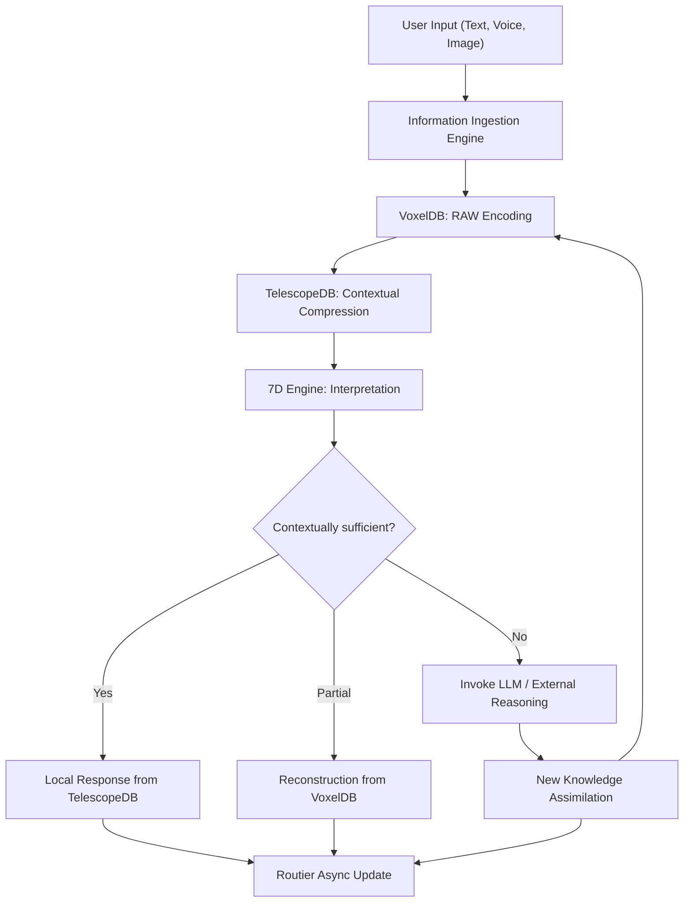

# 🧭 BITA‑2 / ACA‑7D v1.0  
### (Antecognitive Cognitive Architecture)

> *Complementary Document to BITA‑1 / FBCU v1.0*  
> *Author: Eduardo + Bitácora Framework Team*  
> *Date: 2025‑10‑25*  

---

## 🎯 Executive Summary

**BITA‑2 / ACA‑7D** formalizes the integration of the **Bitácora Method** as the operational and cognitive foundation for local-first information ingestion, storage, and interpretation.  
It defines how **VoxelDB** and **TelescopeDB** operate in a dual-helix architecture, coordinated by the **7D Cognitive Engine** and continuously refined through **Routier**, Bitácora’s asynchronous learning navigator.  

The purpose of this system is to transform raw human information into contextually meaningful, semantically compressed representations — enabling *Antecognition*: the pre‑cognitive alignment between human intent and artificial reasoning.

---

## ⚛️ Core Concept: The Bitácora Method

The **Bitácora Method** is a pre‑cognitive process that reorganizes human‑origin data into structures readable by AI systems without external inference.  
It provides a unified pipeline capable of:  
1. **Extracting and encoding knowledge locally** from text, PDF, or image data.  
2. **Transforming raw data into visual‑semantic matrices** (VoxelDB).  
3. **Compressing interpreted meaning into TelescopeDB** for ultra‑fast recall.  
4. **Delivering answers directly** without invoking an LLM whenever contextual sufficiency is met.  

---

## 🧬 Dual‑Helix Architecture: VoxelDB + TelescopeDB

### 🧩 VoxelDB — The Physical Layer (RAW Knowledge)
Stores unprocessed, fractally compressed knowledge extracted from textual or visual inputs.  
Each voxel represents a *semantic atom* encoded in pixel form, optimized for rapid parallel search and minimal memory consumption.

### 🔭 TelescopeDB — The Interpretive Layer (Contextual Knowledge)
Stores the contextual, emotional, and intentional meaning derived from VoxelDB data.  
It serves as the cognitive lens that aligns information with the user’s biographical, relational, and temporal dimensions.

### 🔁 Synchronization
Every TelescopeDB entry maintains a reversible reference hash to its VoxelDB origin — ensuring coherence between *meaning* and *matter*.

---

## 🧠 The 7D Cognitive Engine

The **Motor 7D** interprets all stored information through seven cognitive axes:  
1. **Temporal** – When and in what sequence an event occurs.  
2. **Semantic** – The meaning and linguistic relation of entities.  
3. **Contextual** – The situational frame of relevance.  
4. **Relational** – Links between concepts and experiences.  
5. **Emotional** – The affective tone behind interaction.  
6. **Intencional** – The cognitive goal or motivation.  
7. **Biográfica** – The user’s lived context and memory trail.

The 7D Engine ensures that Bitácora interprets not only *what* the user asks, but *why* and *how* it matters at that moment.

---

## 🧭 Routier: Asynchronous Learning Navigator

**Routier** is Bitácora’s silent navigator.  
While the user interacts, Routier:  
- Observes emotional and intentional vectors from the 7D Engine.  
- Detects emerging cognitive patterns.  
- Reindexes TelescopeDB for faster future recall.  
- Prepares context maps before the next query.  

In essence, Routier turns downtime into learning time, allowing Bitácora to grow contextually even while idle.

---

## ⚙️ Operational Flow

---

## ⚡ Performance Principle

- **Average response time:** <5 ms for local contextual recall.  
- **Memory footprint:** 3× lower than equivalent textual storage.  
- **Energy efficiency:** Executable on low‑end CPUs without GPU dependency.  
- **Cognitive efficiency:** 70–90 % comprehension rate without LLM intervention.  

These metrics confirm Bitácora’s ability to perform human‑scale knowledge reasoning locally.

---

## 🜛 Terminology

| Term | Definition |
|------|-------------|
| **Antecognition** | The process of pre‑cognitive organization that clarifies meaning before AI reasoning. |
| **Bitácora Method** | The operational framework enabling Antecognition through local semantic compression. |
| **7D Engine** | The dimensional interpreter of human context and intention. |
| **Routier** | The asynchronous navigator that optimizes long‑term cognitive efficiency. |
| **VoxelDB** | The visual‑semantic archive of raw knowledge. |
| **TelescopeDB** | The contextual mirror of interpreted understanding. |

---

## 🔮 Future Directions

1. Integration of emotional and biographical weighting for personalized prioritization.  
2. Adaptive routing based on user cognitive states (learning, creation, reflection).  
3. Expansion of the Bitácora Lens protocol for multi‑device synchronization.  
4. Implementation of self‑diagnostic coherence maps between VoxelDB and TelescopeDB.  
5. Publication of **The Bitácora Method White Paper** introducing Antecognition as a new cognitive discipline.

---

## ✨ Summary Statement

> *The Bitácora Method transforms data into meaning before it reaches artificial cognition.*  
> *Through VoxelDB, TelescopeDB, and the 7D Engine, Bitácora achieves cognitive self‑sufficiency — a true manifestation of local Antecognition.*

---
