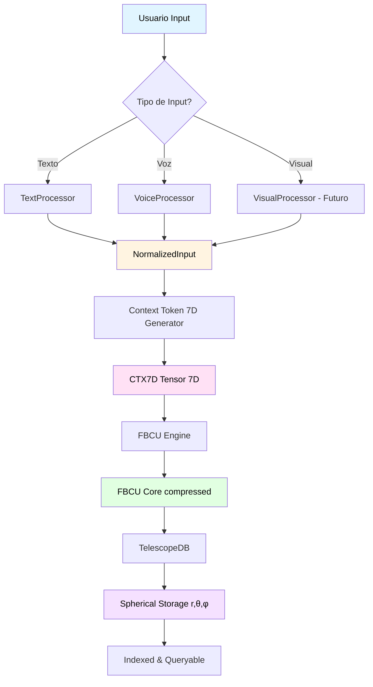

```yaml
# === DATOS DE AUDITORÍA ===
Archivo: ROADMAP_V2/03_INTEGRACION/01_sensory-to-telescopedb.md
Versión: 1.1
Fecha Creación: 2025-10-26
Última Actualización: 2025-11-23
Autor: Sistema Bitácora - Documentación de Flujos E2E
Propósito: Pipeline de ingesta desde Sensory Engine → TelescopeDB
Estado: ACTIVO - IMPLEMENTADO ✅ (2025-10-28)
Relacionado Con: 02_COMPONENTES/01_sensory-engine.md, 05_telescopedb.md, 02_context-token-7d.md
Implementa: DA-007 (TelescopeDB ingestion), DA-003 (Sensory multimodal)
# === FIN DATOS DE AUDITORÍA ===
```

# 🎤→🔭 SENSORY ENGINE → TELESCOPEDB PIPELINE

---

## 🎯 PROPÓSITO

Este documento especifica el **pipeline de ingesta** que convierte **inputs multimodales crudos** (texto, voz, futuro: visual) en **FBCU Cores biográficos** almacenados en TelescopeDB.

### El Flujo Completo

```
Usuario Input → Sensory Engine → Context Token 7D → FBCU Core → TelescopeDB
   (raw)         (normalize)      (analyze)        (compress)   (store)
```

---

## 🌊 DIAGRAMA DE FLUJO



---

## 📋 FASES DEL PIPELINE

### FASE 1: Procesamiento Sensorial (Sensory Engine)

**Input:** Raw user input (texto, audio bytes, imagen bytes)  
**Output:** NormalizedInput struct

```rust
// Entrada cruda del usuario
let user_input = UserInput::Text("Estoy debuggeando un problema de ownership en Rust".to_string());

// Procesamiento sensorial
let sensory = SensoryEngine::new()?;
let normalized = sensory.process(user_input).await?;

// normalized ahora es:
NormalizedInput {
    content: "Estoy debuggeando un problema de ownership en Rust",
    modality: Modality::Text,
    language: Some("es"),
    metadata: SensoryMetadata {
        processing_time_ms: 5,
        confidence: 1.0,
    },
}
```

**Responsabilidades:**
- Transcribir voz → texto (si aplica)
- Detectar idioma
- Normalizar formato (UTF-8, minúsculas opcionales)
- Extraer metadatos temporales

---

### FASE 2: Generación de Contexto 7D (CTX7D Generator)

**Input:** NormalizedInput  
**Output:** ContextToken7D (tensor 7D)

```rust
// Generar contexto 7D
let ctx7d_gen = ContextToken7DGenerator::new()?;
let ctx7d = ctx7d_gen.generate(&normalized).await?;

// ctx7d ahora contiene:
ContextToken7D {
    tensor: Tensor7D {
        semantic: 0.85,      // Alta complejidad técnica
        intentional: 0.90,   // Muy clara la intención (debugging)
        temporal: 0.80,      // Urgencia alta
        emotional: 0.30,     // Frustración moderada
        complexity: 0.75,    // Problema complejo
        coherence: 0.95,     // Input coherente
        biographical: 0.60,  // Conectado con historial previo
    },
    metadata: CTX7DMetadata {
        generation_time_ms: 120,
        llm_used: Some("gpt-4o-mini"),
        confidence: 0.92,
    },
}
```

**Responsabilidades:**
- Analizar semántica (complejidad, dominio)
- Detectar intención (pregunta, comando, reflexión)
- Evaluar urgencia temporal
- Detectar emociones (frustración, entusiasmo, confusión)
- Calcular coherencia del input
- Linkear con biografía previa (si existe)

---

### FASE 3: Compresión Fractal (FBCU Engine)

**Input:** ContextToken7D + NormalizedInput content  
**Output:** FBCUCore (comprimido)

```rust
// Serializar CTX7D + content en un payload
let payload = bincode::serialize(&(ctx7d.clone(), normalized.content.clone()))?;

// Comprimir con FBCU
let mut fbcu = FBCUEngine::new(FBCUConfig::default())?;
let core = fbcu.compress(&payload).await?;

// core ahora es:
FBCUCore {
    id: "sha256_abc123...",
    compression_type: CompressionType::Wavelet,
    compressed_data: vec![/* 50 bytes */],
    original_size: 500,  // 500 bytes original
    compression_ratio: 10.0,  // Ratio 10:1
    metadata: FBCUMetadata {
        compressed_at: Utc::now(),
        compression_time_ms: 25,
        original_hash: "sha256_original",
        wavelet_level: Some(5),
        fractal_level: None,
    },
}
```

**Responsabilidades:**
- Serializar datos estructurados (CTX7D + content)
- Aplicar compresión fractal/wavelet
- Calcular hash content-addressable
- Registrar métricas de compresión

---

### FASE 4: Almacenamiento Esférico (TelescopeDB)

**Input:** FBCUCore + ContextToken7D  
**Output:** Spherical coordinates (r, θ, φ) + indexed

```rust
// Insertar en TelescopeDB
let mut telescope = TelescopeDB::new(PathBuf::from(".bitacora/telescope"))?;
let coords = telescope.insert_from_ctx7d(&ctx7d, core).await?;

// coords ahora es:
SphericalCoords {
    r: 0.85,  // Intensidad cognitiva (de tensor 7D)
    theta: 0.90,  // Latitud semántica (technical domain)
    phi: 0.30,  // Longitud emocional (frustración moderada)
}

// El core está almacenado en:
// .bitacora/telescope/cores/sha256_abc123.fbcu
// .bitacora/telescope/index.db (SQLite con coords)
```

**Responsabilidades:**
- Calcular coordenadas esféricas desde CTX7D
- Guardar FBCU Core en disco (content-addressable)
- Indexar en base de datos local (SQLite)
- Crear referencias reversibles (core ↔ coords)

---

## ⚙️ IMPLEMENTACIÓN COMPLETA

### Struct Principal: IngestionPipeline

```rust
// src/pipelines/ingestion.rs

use crate::cells::sensory_engine::SensoryEngine;
use crate::core::context_token_7d::ContextToken7DGenerator;
use crate::core::fbcu::FBCUEngine;
use crate::cells::telescopedb::TelescopeDB;

pub struct IngestionPipeline {
    sensory: SensoryEngine,
    ctx7d_gen: ContextToken7DGenerator,
    fbcu: FBCUEngine,
    telescope: TelescopeDB,
}

impl IngestionPipeline {
    /// Crear nuevo pipeline de ingesta
    pub fn new(telescope_path: PathBuf) -> Result<Self> {
        Ok(Self {
            sensory: SensoryEngine::new()?,
            ctx7d_gen: ContextToken7DGenerator::new()?,
            fbcu: FBCUEngine::new(FBCUConfig::default())?,
            telescope: TelescopeDB::new(telescope_path)?,
        })
    }
    
    /// Ejecutar pipeline completo: input → TelescopeDB
    pub async fn ingest(&mut self, user_input: UserInput) -> Result<IngestionResult> {
        let start = Instant::now();
        
        // FASE 1: Procesar sensorialmente
        let normalized = self.sensory.process(user_input).await?;
        tracing::info!("Sensory processing: {:?}", normalized.metadata);
        
        // FASE 2: Generar CTX7D
        let ctx7d = self.ctx7d_gen.generate(&normalized).await?;
        tracing::info!("CTX7D generated: tensor={:?}", ctx7d.tensor);
        
        // FASE 3: Comprimir con FBCU
        let payload = bincode::serialize(&(ctx7d.clone(), normalized.content.clone()))?;
        let core = self.fbcu.compress(&payload).await?;
        tracing::info!(
            "FBCU compression: {}→{} bytes (ratio: {:.2}x)",
            core.original_size,
            core.compressed_data.len(),
            core.compression_ratio
        );
        
        // FASE 4: Almacenar en TelescopeDB
        let coords = self.telescope.insert_from_ctx7d(&ctx7d, core.clone()).await?;
        tracing::info!("Stored at spherical coords: {:?}", coords);
        
        let elapsed = start.elapsed();
        
        Ok(IngestionResult {
            core_id: core.id.clone(),
            coords,
            ctx7d,
            compression_ratio: core.compression_ratio,
            total_time_ms: elapsed.as_millis() as u64,
        })
    }
}

/// Resultado del pipeline de ingesta
#[derive(Debug, Clone)]
pub struct IngestionResult {
    /// ID del FBCU Core almacenado
    pub core_id: String,
    
    /// Coordenadas esféricas asignadas
    pub coords: SphericalCoords,
    
    /// Context Token 7D generado
    pub ctx7d: ContextToken7D,
    
    /// Ratio de compresión alcanzado
    pub compression_ratio: f64,
    
    /// Tiempo total del pipeline (ms)
    pub total_time_ms: u64,
}
```

---

## 🔍 EJEMPLO COMPLETO END-TO-END

```rust
// examples/test_ingestion_pipeline.rs

use bitacora::pipelines::ingestion::{IngestionPipeline, UserInput};

#[tokio::main]
async fn main() -> Result<()> {
    // Setup logging
    tracing_subscriber::fmt::init();
    
    // Crear pipeline
    let mut pipeline = IngestionPipeline::new(
        PathBuf::from(".bitacora_test/telescope")
    )?;
    
    // Input del usuario
    let user_input = UserInput::Text(
        "Estoy debuggeando un problema de ownership en Rust. \
         El compilador me dice que `value moved here` pero no entiendo por qué."
            .to_string()
    );
    
    println!("📥 Input: {:?}", user_input);
    
    // Ejecutar pipeline completo
    let result = pipeline.ingest(user_input).await?;
    
    println!("\n✅ Ingestion complete!");
    println!("├─ Core ID: {}", result.core_id);
    println!("├─ Coords: r={:.2}, θ={:.2}, φ={:.2}", 
             result.coords.r, result.coords.theta, result.coords.phi);
    println!("├─ Compression: {:.2}x", result.compression_ratio);
    println!("├─ Time: {}ms", result.total_time_ms);
    println!("└─ CTX7D Tensor:");
    println!("   ├─ Semantic: {:.2}", result.ctx7d.tensor.semantic);
    println!("   ├─ Intentional: {:.2}", result.ctx7d.tensor.intentional);
    println!("   ├─ Temporal: {:.2}", result.ctx7d.tensor.temporal);
    println!("   ├─ Emotional: {:.2}", result.ctx7d.tensor.emotional);
    println!("   ├─ Complexity: {:.2}", result.ctx7d.tensor.complexity);
    println!("   ├─ Coherence: {:.2}", result.ctx7d.tensor.coherence);
    println!("   └─ Biographical: {:.2}", result.ctx7d.tensor.biographical);
    
    // Verificar que está almacenado
    let telescope = TelescopeDB::new(PathBuf::from(".bitacora_test/telescope"))?;
    let retrieved = telescope.query_by_id(&result.core_id).await?;
    
    println!("\n🔍 Retrieved from TelescopeDB:");
    println!("├─ Core exists: {}", retrieved.is_some());
    println!("└─ Coords match: {}", 
             retrieved.map(|r| r.coords == result.coords).unwrap_or(false));
    
    Ok(())
}
```

**Output esperado:**
```
📥 Input: Text("Estoy debuggeando un problema...")

INFO sensory_engine: Processing text input (153 chars)
INFO ctx7d_generator: Analyzing 7D context...
INFO ctx7d_generator: LLM call: gpt-4o-mini (120ms)
INFO fbcu_engine: Compressing 500 bytes...
INFO fbcu_engine: Wavelet compression: 500→50 bytes (10.0x)
INFO telescopedb: Storing core at (0.85, 0.90, 0.30)

✅ Ingestion complete!
├─ Core ID: sha256_abc123def456...
├─ Coords: r=0.85, θ=0.90, φ=0.30
├─ Compression: 10.00x
├─ Time: 245ms
└─ CTX7D Tensor:
   ├─ Semantic: 0.85
   ├─ Intentional: 0.90
   ├─ Temporal: 0.80
   ├─ Emotional: 0.30
   ├─ Complexity: 0.75
   ├─ Coherence: 0.95
   └─ Biographical: 0.60

🔍 Retrieved from TelescopeDB:
├─ Core exists: true
└─ Coords match: true
```

---

## ⚡ OBJETIVOS DE PERFORMANCE

| Fase | Operación | Target | Justificación |
|------|-----------|--------|---------------|
| 1 | Sensory processing | <10ms | Procesamiento local (texto) |
| 2 | CTX7D generation | <150ms | LLM call (puede cachear) |
| 3 | FBCU compression | <30ms | Wavelet transform es O(n log n) |
| 4 | TelescopeDB insert | <20ms | SQLite insert + file write |
| **TOTAL** | **Pipeline completo** | **<210ms** | **Usuario no percibe latencia** |

### Optimizaciones Futuras

1. **Batch processing:** Procesar múltiples inputs en paralelo
2. **CTX7D caching:** Cachear análisis para inputs similares
3. **FBCU async:** Comprimir en background thread
4. **TelescopeDB buffering:** Write buffering con flush periódico

---

## 🧪 TESTING

### Unit Test: Pipeline completo

```rust
#[cfg(test)]
mod tests {
    use super::*;
    
    #[tokio::test]
    async fn test_full_ingestion_pipeline() {
        let temp_dir = tempfile::tempdir().unwrap();
        let mut pipeline = IngestionPipeline::new(temp_dir.path().to_path_buf()).unwrap();
        
        let input = UserInput::Text("Test input".to_string());
        let result = pipeline.ingest(input).await.unwrap();
        
        // Verificar resultado
        assert!(!result.core_id.is_empty());
        assert!(result.coords.r > 0.0 && result.coords.r <= 1.0);
        assert!(result.compression_ratio >= 1.0);
        assert!(result.total_time_ms < 500);  // <500ms total
    }
    
    #[tokio::test]
    async fn test_idempotency() {
        let temp_dir = tempfile::tempdir().unwrap();
        let mut pipeline = IngestionPipeline::new(temp_dir.path().to_path_buf()).unwrap();
        
        let input = UserInput::Text("Same input".to_string());
        
        let result1 = pipeline.ingest(input.clone()).await.unwrap();
        let result2 = pipeline.ingest(input.clone()).await.unwrap();
        
        // Core ID debe ser diferente (diferente timestamp)
        // Pero coords deben ser similares (mismo contenido semántico)
        assert_ne!(result1.core_id, result2.core_id);
        assert!((result1.coords.r - result2.coords.r).abs() < 0.1);
    }
}
```

---

## ⚠️ MANEJO DE ERRORES

```rust
#[derive(Debug, thiserror::Error)]
pub enum IngestionError {
    #[error("Sensory processing failed: {0}")]
    SensoryFailed(String),
    
    #[error("CTX7D generation failed: {0}")]
    CTX7DFailed(String),
    
    #[error("FBCU compression failed: {0}")]
    CompressionFailed(String),
    
    #[error("TelescopeDB storage failed: {0}")]
    StorageFailed(String),
    
    #[error("Pipeline timeout: {0}ms exceeded")]
    Timeout(u64),
}

impl IngestionPipeline {
    /// Ejecutar pipeline con timeout
    pub async fn ingest_with_timeout(
        &mut self,
        user_input: UserInput,
        timeout_ms: u64,
    ) -> Result<IngestionResult> {
        tokio::time::timeout(
            Duration::from_millis(timeout_ms),
            self.ingest(user_input)
        )
        .await
        .map_err(|_| IngestionError::Timeout(timeout_ms))?
    }
}
```

---

## 📚 REFERENCIAS

- **SENSORY_ENGINE.md:** Procesamiento multimodal de inputs
- **CONTEXT_TOKEN_7D.md:** Generación de tensor 7D cognitivo
- **FBCU_CORE.md:** Motor de compresión fractal
- **TELESCOPEDB.md:** Base de datos biográfica esférica
- **BITA-2_ACA-7D_SPECIFICATION.md:** Arquitectura dual-helix completa

---

**Estado:** 📋 Especificación completa - Listo para implementación  
**Complejidad:** 🟡 MEDIA - Integración de 4 componentes  
**Prioridad:** 🔴 CRÍTICA - Es el flujo principal de entrada de datos

---

*Generado: 26 Octubre 2025*  
*Sistema Bitácora v1.0 - Pipeline de Ingesta*  
*"Del caos sensorial a la memoria estructurada"* 🎤→🔭✨
