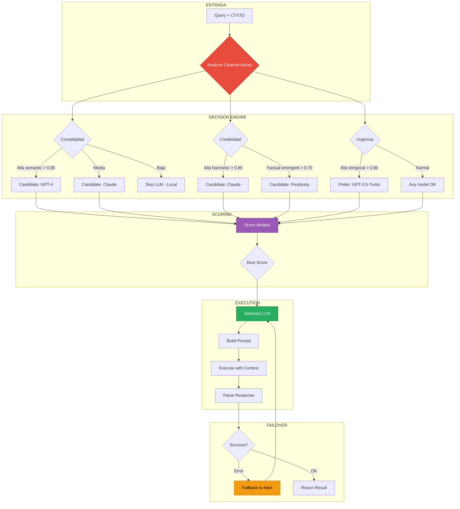

# 🕸️ HubSpoke Routing: Orquestación Multi-LLM Inteligente

```yaml
# === DATOS DE AUDITORÍA ===
Archivo: ROADMAP_V2/03_INTEGRACION/03_hubspoke-routing.md
Versión: 1.1
Fecha Creación: 2025-10-26
Última Actualización: 2025-11-23
Autor: Sistema Bitácora - Documentación de Flujos E2E
Propósito: Orquestación Multi-LLM basada en características CTX7D
Estado: ACTIVO - IMPLEMENTADO ✅ (2025-10-28)
Relacionado Con: 02_COMPONENTES/09_hubspoke-navigator.md, 02_context-token-7d.md
Implementa: DA-008 (Multi-LLM routing), DA-019 (Failover automático)
# === FIN DATOS DE AUDITORÍA ===
```

**Propósito:** Documentar cómo HubSpoke Navigator orquesta múltiples LLMs basándose en características del query

---

## 🎯 PROPÓSITO

Este documento describe el **sistema de routing inteligente** que selecciona el LLM óptimo (OpenAI, Anthropic, Perplexity) según las características del query analizado por Context Token 7D.

---

## 📊 DIAGRAMA DE ROUTING



---

## 🧠 ALGORITMO DE SELECCIÓN

### **1. Características del Query (CTX7D)**

```rust
// src/multi_agent/hubspoke/router.rs

pub struct QueryCharacteristics {
    /// Complejidad técnica [0, 1]
    pub complexity: f64,
    
    /// Necesidad de creatividad [0, 1]
    pub creativity: f64,
    
    /// Necesidad de facts actualizados [0, 1]
    pub factual_need: f64,
    
    /// Urgencia temporal [0, 1]
    pub urgency: f64,
    
    /// Costo permitido [Low, Medium, High]
    pub cost_tolerance: CostTolerance,
}

impl From<&ContextToken7D> for QueryCharacteristics {
    fn from(ctx7d: &ContextToken7D) -> Self {
        Self {
            complexity: ctx7d.tensor.semantic,
            creativity: ctx7d.tensor.harmonic,
            factual_need: ctx7d.tensor.emergent,
            urgency: ctx7d.tensor.temporal,
            cost_tolerance: if ctx7d.tensor.temporal > 0.85 {
                CostTolerance::High  // Urgente = pagar más
            } else {
                CostTolerance::Medium
            },
        }
    }
}
```

---

### **2. Matriz de Scoring por Modelo**

```rust
pub struct ModelScorer {
    models: Vec<LLMModel>,
}

impl ModelScorer {
    pub fn score_models(&self, chars: &QueryCharacteristics) -> Vec<(LLMModel, f64)> {
        self.models.iter()
            .map(|model| {
                let score = self.calculate_score(model, chars);
                (model.clone(), score)
            })
            .collect()
    }
    
    fn calculate_score(&self, model: &LLMModel, chars: &QueryCharacteristics) -> f64 {
        match model {
            LLMModel::GPT4 => {
                // GPT-4: Excelente para complejidad alta
                let complexity_score = chars.complexity;
                let speed_penalty = if chars.urgency > 0.80 { 0.7 } else { 1.0 };
                let cost_penalty = if chars.cost_tolerance == CostTolerance::Low { 0.5 } else { 1.0 };
                
                complexity_score * speed_penalty * cost_penalty
            },
            
            LLMModel::Claude3Opus => {
                // Claude: Excelente para creatividad
                let creativity_score = chars.creativity * 1.2; // Bonus creatividad
                let cost_penalty = if chars.cost_tolerance == CostTolerance::Low { 0.6 } else { 1.0 };
                
                creativity_score * cost_penalty
            },
            
            LLMModel::Perplexity => {
                // Perplexity: Excelente para facts actualizados
                let factual_score = chars.factual_need * 1.3; // Bonus facts
                let speed_bonus = 1.1; // Más rápido
                
                factual_score * speed_bonus
            },
            
            LLMModel::GPT35Turbo => {
                // GPT-3.5: Balance velocidad/costo
                let speed_score = chars.urgency * 1.4; // Bonus urgencia
                let simplicity_bonus = if chars.complexity < 0.50 { 1.2 } else { 0.8 };
                
                speed_score * simplicity_bonus
            },
        }
    }
}
```

---

### **3. Ejemplos de Scoring**

#### **Caso A: Query Técnico Complejo**

```
Query: "Explica el algoritmo de consensus de Raft en sistemas distribuidos"

CTX7D:
├─ semantic: 0.92 (muy complejo)
├─ harmonic: 0.40 (bajo creatividad)
├─ emergent: 0.75 (facts conocidos)
├─ temporal: 0.50 (no urgente)
└─ cost_tolerance: Medium

Scoring:
├─ GPT-4:         0.92 * 1.0 * 1.0 = 0.92 🥇
├─ Claude:        0.48 * 1.0 = 0.48
├─ Perplexity:    0.98 * 1.1 = 1.08 (pero facts no crít) = 0.75
└─ GPT-3.5:       0.50 * 0.8 = 0.40

Selección: GPT-4 ✅
```

#### **Caso B: Query Creativo**

```
Query: "Escribe un cuento sobre un algoritmo que cobra consciencia"

CTX7D:
├─ semantic: 0.60 (complejidad media)
├─ harmonic: 0.95 (muy creativo)
├─ emergent: 0.30 (original)
├─ temporal: 0.40
└─ cost_tolerance: Medium

Scoring:
├─ GPT-4:         0.60 * 1.0 * 1.0 = 0.60
├─ Claude:        1.14 * 1.0 = 1.14 🥇
├─ Perplexity:    0.39 * 1.1 = 0.43
└─ GPT-3.5:       0.56 * 0.8 = 0.45

Selección: Claude 3 Opus ✅
```

#### **Caso C: Query Factual Urgente**

```
Query: "¿Qué pasó con el precio de Bitcoin hoy?"

CTX7D:
├─ semantic: 0.35 (simple)
├─ harmonic: 0.20 (factual)
├─ emergent: 0.95 (facts recientes)
├─ temporal: 0.90 (urgente - "hoy")
└─ cost_tolerance: High

Scoring:
├─ GPT-4:         0.35 * 0.7 * 1.0 = 0.25
├─ Claude:        0.24 * 1.0 = 0.24
├─ Perplexity:    1.24 * 1.1 = 1.36 🥇
└─ GPT-3.5:       1.26 * 1.2 = 1.51 (pero facts limitados) = 0.80

Selección: Perplexity ✅
```

---

## 🔄 FLUJO COMPLETO DE ROUTING

```rust
pub async fn route_query(
    query: &str,
    ctx7d: &ContextToken7D,
    hubspoke: &HubSpokeNavigator,
) -> Result<LLMResponse> {
    // 1. Extraer características
    let chars = QueryCharacteristics::from(ctx7d);
    
    // 2. Score todos los modelos
    let mut scored = hubspoke.scorer.score_models(&chars);
    scored.sort_by(|a, b| b.1.partial_cmp(&a.1).unwrap());
    
    tracing::info!(
        "Model scores: {:?}",
        scored.iter().map(|(m, s)| (m.name(), s)).collect::<Vec<_>>()
    );
    
    // 3. Intentar con mejor modelo
    for (model, score) in scored {
        if score < 0.30 {
            // Score muy bajo, skip
            continue;
        }
        
        match hubspoke.execute_with_model(&model, query, ctx7d).await {
            Ok(response) => {
                tracing::info!("Success with model: {}", model.name());
                return Ok(response);
            }
            Err(e) => {
                tracing::warn!(
                    "Model {} failed: {}, trying next...",
                    model.name(),
                    e
                );
                continue; // Failover al siguiente
            }
        }
    }
    
    Err(Error::AllModelsFailed)
}
```

---

## 🛡️ ESTRATEGIA DE FAILOVER

### **Orden de Fallback**

```rust
pub fn get_fallback_chain(primary: &LLMModel) -> Vec<LLMModel> {
    match primary {
        LLMModel::GPT4 => vec![
            LLMModel::Claude3Opus,
            LLMModel::GPT35Turbo,
            LLMModel::Perplexity,
        ],
        
        LLMModel::Claude3Opus => vec![
            LLMModel::GPT4,
            LLMModel::GPT35Turbo,
        ],
        
        LLMModel::Perplexity => vec![
            LLMModel::GPT35Turbo,
            LLMModel::GPT4,
        ],
        
        LLMModel::GPT35Turbo => vec![
            LLMModel::GPT4,
            LLMModel::Claude3Opus,
        ],
    }
}
```

### **Tipos de Errores y Respuesta**

```rust
pub async fn execute_with_failover(
    &self,
    model: &LLMModel,
    query: &str,
) -> Result<LLMResponse> {
    match self.execute_with_model(model, query).await {
        Ok(response) => Ok(response),
        
        Err(Error::RateLimited { retry_after }) => {
            tracing::warn!("Rate limited, waiting {}s", retry_after);
            tokio::time::sleep(Duration::from_secs(retry_after)).await;
            self.execute_with_model(model, query).await // Retry mismo modelo
        }
        
        Err(Error::Timeout) => {
            tracing::error!("Timeout, trying faster model");
            let faster = self.get_faster_alternative(model);
            self.execute_with_model(&faster, query).await
        }
        
        Err(Error::ContentFilter) => {
            tracing::warn!("Content filtered, trying more permissive model");
            let permissive = LLMModel::Claude3Opus; // Menos restrictivo
            self.execute_with_model(&permissive, query).await
        }
        
        Err(e) => Err(e), // Error irrecuperable
    }
}
```

---

## 💰 OPTIMIZACIÓN DE COSTOS

### **Cálculo de Costo por Token**

```rust
pub struct CostCalculator {
    prices: HashMap<LLMModel, TokenPricing>,
}

#[derive(Debug, Clone)]
pub struct TokenPricing {
    pub input_per_1k: f64,  // USD
    pub output_per_1k: f64, // USD
}

impl CostCalculator {
    pub fn calculate_cost(
        &self,
        model: &LLMModel,
        input_tokens: usize,
        output_tokens: usize,
    ) -> f64 {
        let pricing = self.prices.get(model).unwrap();
        
        let input_cost = (input_tokens as f64 / 1000.0) * pricing.input_per_1k;
        let output_cost = (output_tokens as f64 / 1000.0) * pricing.output_per_1k;
        
        input_cost + output_cost
    }
    
    pub fn estimate_query_cost(
        &self,
        model: &LLMModel,
        query_length: usize,
    ) -> f64 {
        // Estimación conservadora: respuesta = 2x input
        let input_tokens = query_length / 4; // ~4 chars per token
        let output_tokens = input_tokens * 2;
        
        self.calculate_cost(model, input_tokens, output_tokens)
    }
}
```

### **Precios Actuales (Oct 2025)**

```rust
fn init_prices() -> HashMap<LLMModel, TokenPricing> {
    let mut prices = HashMap::new();
    
    prices.insert(LLMModel::GPT4, TokenPricing {
        input_per_1k: 0.03,
        output_per_1k: 0.06,
    });
    
    prices.insert(LLMModel::GPT35Turbo, TokenPricing {
        input_per_1k: 0.0015,
        output_per_1k: 0.002,
    });
    
    prices.insert(LLMModel::Claude3Opus, TokenPricing {
        input_per_1k: 0.015,
        output_per_1k: 0.075,
    });
    
    prices.insert(LLMModel::Perplexity, TokenPricing {
        input_per_1k: 0.001, // Estimación
        output_per_1k: 0.001,
    });
    
    prices
}
```

### **Optimización Basada en Budget**

```rust
pub fn select_cost_optimized(
    &self,
    chars: &QueryCharacteristics,
    max_budget: f64, // USD
) -> Option<LLMModel> {
    let mut candidates: Vec<_> = self.score_models(chars);
    candidates.sort_by(|a, b| b.1.partial_cmp(&a.1).unwrap());
    
    for (model, score) in candidates {
        let estimated_cost = self.cost_calc.estimate_query_cost(&model, 1000);
        
        if estimated_cost <= max_budget && score > 0.50 {
            tracing::info!(
                "Selected {} (score={:.2}, est_cost=${:.4})",
                model.name(),
                score,
                estimated_cost
            );
            return Some(model);
        }
    }
    
    None // Ningún modelo dentro de budget
}
```

---

## 📊 MÉTRICAS Y MONITOREO

### **Tracking de Uso**

```rust
pub struct RoutingMetrics {
    /// Total de queries ruteados
    pub total_queries: AtomicUsize,
    
    /// Distribución por modelo
    pub model_usage: RwLock<HashMap<LLMModel, usize>>,
    
    /// Latencias promedio por modelo
    pub model_latencies: RwLock<HashMap<LLMModel, Vec<Duration>>>,
    
    /// Tasas de error por modelo
    pub model_errors: RwLock<HashMap<LLMModel, usize>>,
    
    /// Costo acumulado
    pub total_cost: RwLock<f64>,
}

impl RoutingMetrics {
    pub fn record_execution(
        &self,
        model: &LLMModel,
        latency: Duration,
        cost: f64,
        success: bool,
    ) {
        // Incrementar contador total
        self.total_queries.fetch_add(1, Ordering::Relaxed);
        
        // Registrar uso del modelo
        let mut usage = self.model_usage.write().unwrap();
        *usage.entry(model.clone()).or_insert(0) += 1;
        
        // Registrar latencia
        let mut latencies = self.model_latencies.write().unwrap();
        latencies.entry(model.clone()).or_default().push(latency);
        
        // Registrar error si aplica
        if !success {
            let mut errors = self.model_errors.write().unwrap();
            *errors.entry(model.clone()).or_insert(0) += 1;
        }
        
        // Acumular costo
        let mut total_cost = self.total_cost.write().unwrap();
        *total_cost += cost;
    }
    
    pub fn get_stats(&self) -> RoutingStats {
        let usage = self.model_usage.read().unwrap();
        let latencies = self.model_latencies.read().unwrap();
        let errors = self.model_errors.read().unwrap();
        
        RoutingStats {
            total_queries: self.total_queries.load(Ordering::Relaxed),
            model_distribution: usage.clone(),
            avg_latencies: latencies.iter()
                .map(|(model, lats)| {
                    let avg = lats.iter().sum::<Duration>() / lats.len() as u32;
                    (model.clone(), avg)
                })
                .collect(),
            error_rates: errors.iter()
                .map(|(model, &errs)| {
                    let total = usage.get(model).unwrap_or(&1);
                    let rate = errs as f64 / *total as f64;
                    (model.clone(), rate)
                })
                .collect(),
            total_cost: *self.total_cost.read().unwrap(),
        }
    }
}
```

---

## 🧪 TESTING

### **Test: Scoring Correcto**

```rust
#[test]
fn test_model_scoring() {
    let scorer = ModelScorer::new();
    
    // Query complejo → debe preferir GPT-4
    let complex_chars = QueryCharacteristics {
        complexity: 0.95,
        creativity: 0.30,
        factual_need: 0.60,
        urgency: 0.50,
        cost_tolerance: CostTolerance::Medium,
    };
    
    let scores = scorer.score_models(&complex_chars);
    let best = scores.iter().max_by(|a, b| a.1.partial_cmp(&b.1).unwrap()).unwrap();
    
    assert_eq!(best.0, LLMModel::GPT4);
    assert!(best.1 > 0.80);
}

#[test]
fn test_creative_query_routing() {
    let scorer = ModelScorer::new();
    
    let creative_chars = QueryCharacteristics {
        complexity: 0.50,
        creativity: 0.95,
        factual_need: 0.20,
        urgency: 0.40,
        cost_tolerance: CostTolerance::Medium,
    };
    
    let scores = scorer.score_models(&creative_chars);
    let best = scores.iter().max_by(|a, b| a.1.partial_cmp(&b.1).unwrap()).unwrap();
    
    assert_eq!(best.0, LLMModel::Claude3Opus);
}
```

### **Test: Failover**

```rust
#[tokio::test]
async fn test_failover_on_timeout() {
    let hubspoke = HubSpokeNavigator::new().await.unwrap();
    
    // Simular timeout en GPT-4
    hubspoke.mock_error(LLMModel::GPT4, Error::Timeout);
    
    let result = hubspoke.execute_with_failover(
        &LLMModel::GPT4,
        "test query",
    ).await;
    
    assert!(result.is_ok());
    assert_ne!(result.unwrap().model_used, LLMModel::GPT4); // Usó fallback
}
```

---

## 📚 REFERENCIAS

- **HubSpoke Navigator:** `02_COMPONENTES/IMPORTANTES/HUBSPOKE_NAVIGATOR.md`
- **Context Token 7D:** `02_COMPONENTES/CRITICOS/CONTEXT_TOKEN_7D.md`
- **DA-010:** Multi-LLM orchestration strategy
- **DA-023:** Cost optimization policies

---

**Estado:** 📋 Especificación completa  
**Criticidad:** 🟡 MEDIA - Modo LLM solo 10% queries  
**Próxima implementación:** Semana 5-6 (Fase 1)

---

*Generado: 2025-10-26*  
*Sistema Bitácora v1.0 - Documentación de Integración*  
*"El modelo correcto, en el momento correcto, al costo correcto"* 🎯
