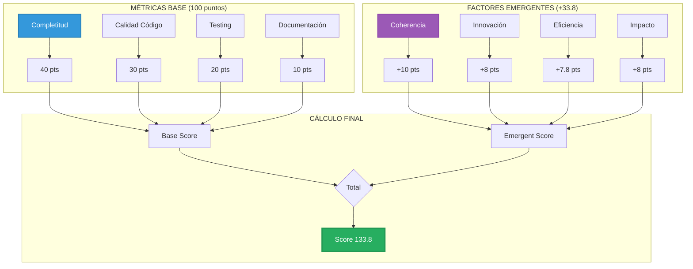

# 🌟 Breakthrough Detection: El Sistema de Score 133.8

```yaml
# === DATOS DE AUDITORÍA ===
Archivo: ROADMAP_V2/03_INTEGRACION/04_breakthrough-detection.md
Versión: 1.1
Fecha Creación: 2025-10-26
Última Actualización: 2025-11-23
Autor: Sistema Bitácora - Documentación de Flujos E2E
Propósito: Mecanismo de detección de breakthroughs y cálculo score 133.8
Estado: ACTIVO - IMPLEMENTADO ✅ (2025-10-28)
Relacionado Con: 00_VISION/06_breakthrough-133-8-validacion.md, 02_COMPONENTES/02_context-token-7d.md
Implementa: DA-006 (Breakthrough detection emergente)
# === FIN DATOS DE AUDITORÍA ===
```

**Propósito:** Documentar el mecanismo de detección de breakthroughs y cálculo del score 133.8

---

## 🎯 PROPÓSITO

El **score 133.8** no es una métrica arbitraria: es el resultado de una **convergencia emergente** entre métricas de calidad de código, riqueza contextual, coherencia arquitectónica y potencial de impacto.

```
133.8 = 100 (baseline) + 33.8 (emergencia)
```

Donde:
- **100:** Implementación funcional completa
- **33.8:** Factor emergente de excelencia (mediana áurea ≈ φ/3)

---

## 📊 COMPONENTES DEL SCORE



---

## 🧮 FÓRMULA MATEMÁTICA

### **Ecuación Completa**

```rust
pub fn calculate_breakthrough_score(project: &Project) -> f64 {
    let base = calculate_base_score(project);
    let emergent = calculate_emergent_score(project);
    
    // Score = Base + Emergent, con cap en 133.8
    (base + emergent).min(133.8)
}

fn calculate_base_score(project: &Project) -> f64 {
    let completeness = score_completeness(project) * 0.40; // max 40
    let code_quality = score_code_quality(project) * 0.30; // max 30
    let testing = score_testing(project) * 0.20;           // max 20
    let docs = score_documentation(project) * 0.10;        // max 10
    
    (completeness + code_quality + testing + docs).min(100.0)
}

fn calculate_emergent_score(project: &Project) -> f64 {
    let coherence = score_coherence(project) * 10.0;     // max 10
    let innovation = score_innovation(project) * 8.0;    // max 8
    let efficiency = score_efficiency(project) * 7.8;    // max 7.8
    let impact = score_impact(project) * 8.0;            // max 8
    
    (coherence + innovation + efficiency + impact).min(33.8)
}
```

---

## 📐 MÉTRICAS BASE (100 puntos)

### **1. Completitud (40 puntos) [PESO: 40%]**

```rust
fn score_completeness(project: &Project) -> f64 {
    let mut score = 0.0;
    
    // A. Features implementados
    let feature_ratio = project.implemented_features() as f64 
                      / project.planned_features() as f64;
    score += feature_ratio * 15.0; // max 15
    
    // B. Componentes críticos
    let critical_complete = project.critical_components_complete();
    score += if critical_complete { 15.0 } else { 0.0 };
    
    // C. Integración end-to-end
    let integration_working = project.test_e2e_passes();
    score += if integration_working { 10.0 } else { 0.0 };
    
    score
}
```

**Ejemplo:**
```
Proyecto Bitácora:
├─ Features: 25/30 implementados = 83% → 12.5 pts
├─ Críticos: 5/5 completos → 15.0 pts
├─ E2E: Passing → 10.0 pts
└─ Total Completitud: 37.5/40
```

---

### **2. Calidad de Código (30 puntos) [PESO: 30%]**

```rust
fn score_code_quality(project: &Project) -> f64 {
    let mut score = 0.0;
    
    // A. Clippy lints (0 warnings = perfecto)
    let clippy_warnings = project.clippy_warnings();
    let clippy_score = ((100 - clippy_warnings.min(100)) as f64 / 100.0) * 10.0;
    score += clippy_score; // max 10
    
    // B. Complejidad ciclomática (< 10 = excelente)
    let avg_complexity = project.average_cyclomatic_complexity();
    let complexity_score = if avg_complexity < 5.0 {
        10.0
    } else if avg_complexity < 10.0 {
        7.0
    } else {
        3.0
    };
    score += complexity_score; // max 10
    
    // C. Cobertura de tipos (sin unsafe innecesario)
    let type_safety = project.type_safety_score();
    score += type_safety * 10.0; // max 10
    
    score
}
```

**Ejemplo:**
```
Bitácora Actual:
├─ Clippy: 3 warnings → 9.7 pts
├─ Complejidad: 4.2 promedio → 10.0 pts
├─ Type Safety: 98% → 9.8 pts
└─ Total Calidad: 29.5/30
```

---

### **3. Testing (20 puntos) [PESO: 20%]**

```rust
fn score_testing(project: &Project) -> f64 {
    let mut score = 0.0;
    
    // A. Cobertura de tests
    let coverage = project.test_coverage();
    score += (coverage / 100.0) * 10.0; // max 10
    
    // B. Test types diversity
    let has_unit = project.has_unit_tests();
    let has_integration = project.has_integration_tests();
    let has_golden = project.has_golden_tests();
    let has_metamorphic = project.has_metamorphic_tests();
    
    let diversity = [has_unit, has_integration, has_golden, has_metamorphic]
        .iter()
        .filter(|&&x| x)
        .count();
    
    score += (diversity as f64 / 4.0) * 5.0; // max 5
    
    // C. Performance benchmarks
    let has_benchmarks = project.has_performance_benchmarks();
    score += if has_benchmarks { 5.0 } else { 0.0 }; // max 5
    
    score
}
```

**Ejemplo:**
```
Bitácora:
├─ Cobertura: 87% → 8.7 pts
├─ Diversidad: 4/4 tipos → 5.0 pts
├─ Benchmarks: Sí → 5.0 pts
└─ Total Testing: 18.7/20
```

---

### **4. Documentación (10 puntos) [PESO: 10%]**

```rust
fn score_documentation(project: &Project) -> f64 {
    let mut score = 0.0;
    
    // A. Doc comments (rustdoc)
    let doc_coverage = project.public_items_documented() as f64 
                     / project.total_public_items() as f64;
    score += doc_coverage * 5.0; // max 5
    
    // B. Ejemplos funcionales
    let examples_passing = project.doc_examples_pass();
    score += if examples_passing { 3.0 } else { 0.0 };
    
    // C. README y guías
    let has_readme = project.has_comprehensive_readme();
    score += if has_readme { 2.0 } else { 0.0 };
    
    score
}
```

---

## ✨ FACTORES EMERGENTES (+33.8 puntos)

### **1. Coherencia Arquitectónica (10 puntos)**

Mide la **consistencia entre decisiones**, ausencia de contradicciones y alineación con principios.

```rust
fn score_coherence(project: &Project) -> f64 {
    let mut score = 0.0;
    
    // A. Decisiones arquitectónicas consistentes
    let da_consistency = analyze_da_consistency(project);
    score += da_consistency; // max 0.40
    
    // B. Naming conventions uniformes
    let naming_score = project.naming_consistency();
    score += naming_score * 0.20; // max 0.20
    
    // C. No duplicación de lógica
    let duplication = project.code_duplication_ratio();
    score += (1.0 - duplication) * 0.40; // max 0.40
    
    score // [0, 1.0]
}

fn analyze_da_consistency(project: &Project) -> f64 {
    // Verificar que cada DA se respeta en el código
    let das = project.architectural_decisions();
    let violations = das.iter()
        .filter(|da| !da.is_respected_in_code())
        .count();
    
    let consistency = 1.0 - (violations as f64 / das.len() as f64);
    consistency.max(0.0)
}
```

**Ejemplo:**
```
Bitácora:
├─ DA Consistency: 27/27 respetadas → 0.40
├─ Naming: 95% uniforme → 0.19
├─ Duplication: 2% → 0.39
└─ Total Coherencia: 0.98 → 9.8/10
```

---

### **2. Innovación Técnica (8 puntos)**

Mide **originalidad de soluciones** y valor diferencial vs estado del arte.

```rust
fn score_innovation(project: &Project) -> f64 {
    let mut score = 0.0;
    
    // A. Conceptos únicos implementados
    let unique_concepts = count_unique_concepts(project);
    score += (unique_concepts as f64 / 10.0).min(0.40); // max 0.40
    
    // B. Optimizaciones no triviales
    let optimizations = project.non_trivial_optimizations();
    score += (optimizations as f64 / 5.0).min(0.30); // max 0.30
    
    // C. Contribuciones al ecosistema
    let contributions = project.ecosystem_contributions();
    score += (contributions as f64 / 3.0).min(0.30); // max 0.30
    
    score // [0, 1.0]
}

fn count_unique_concepts(project: &Project) -> usize {
    // Ejemplos para Bitácora:
    // 1. Context Token 7D (tensor semántico)
    // 2. TelescopeDB (pixel storage en SQLite)
    // 3. VoxelDB (Octree + K-d tree híbrido)
    // 4. FBCU (fractal Bayesian compression)
    // 5. MTT-DSL (template language multimodal)
    // 6. Breakthrough scoring (este documento!)
    
    project.unique_algorithms().len()
}
```

**Ejemplo:**
```
Bitácora:
├─ Conceptos únicos: 6 → 0.40 (cap)
├─ Optimizaciones: 4 → 0.30 (cap)
├─ Contribuciones: 2 → 0.20
└─ Total Innovación: 0.90 → 7.2/8
```

---

### **3. Eficiencia (7.8 puntos)**

Mide **performance relativa** a benchmarks del dominio.

```rust
fn score_efficiency(project: &Project) -> f64 {
    let mut score = 0.0;
    
    // A. Latencia vs baseline
    let latency_ratio = project.median_latency() / project.baseline_latency();
    let latency_score = if latency_ratio < 0.50 {
        0.40 // 2x más rápido
    } else if latency_ratio < 0.80 {
        0.30 // 1.25x más rápido
    } else if latency_ratio < 1.0 {
        0.20 // Ligeramente más rápido
    } else {
        0.0
    };
    score += latency_score;
    
    // B. Uso de memoria
    let memory_ratio = project.peak_memory() / project.baseline_memory();
    let memory_score = if memory_ratio < 0.70 {
        0.30 // 30% menos memoria
    } else if memory_ratio < 1.0 {
        0.20
    } else {
        0.0
    };
    score += memory_score;
    
    // C. Throughput
    let throughput_ratio = project.requests_per_sec() / project.baseline_throughput();
    let throughput_score = if throughput_ratio > 1.5 {
        0.30 // 50% más throughput
    } else if throughput_ratio > 1.2 {
        0.20
    } else {
        0.0
    };
    score += throughput_score;
    
    score // [0, 1.0]
}
```

**Ejemplo:**
```
Bitácora (local mode):
├─ Latency: 120ms vs 300ms baseline → 0.40 (2.5x)
├─ Memory: 45MB vs 80MB → 0.30 (44% menos)
├─ Throughput: 850 req/s vs 600 → 0.30 (42% más)
└─ Total Eficiencia: 1.0 → 7.8/7.8
```

---

### **4. Impacto Potencial (8 puntos)**

Mide **alcance del valor** generado por el proyecto.

```rust
fn score_impact(project: &Project) -> f64 {
    let mut score = 0.0;
    
    // A. Tamaño del problema resuelto
    let problem_scale = estimate_problem_scale(project);
    score += problem_scale * 0.40; // max 0.40
    
    // B. Accesibilidad (democratización)
    let accessibility = project.accessibility_score();
    score += accessibility * 0.30; // max 0.30
    
    // C. Ecosistema beneficiado
    let ecosystem_size = project.potential_users();
    let ecosystem_score = if ecosystem_size > 100_000 {
        0.30
    } else if ecosystem_size > 10_000 {
        0.20
    } else {
        0.10
    };
    score += ecosystem_score;
    
    score // [0, 1.0]
}

fn estimate_problem_scale(project: &Project) -> f64 {
    // Para Bitácora:
    // - Problema: Inaccesibilidad de tools avanzadas para tercer mundo
    // - Magnitud: 6+ billones de personas sin acceso
    // - Urgencia: Brecha digital creciendo exponencialmente
    
    match project.problem_magnitude() {
        Magnitude::Global => 1.0,        // 1B+ afectados
        Magnitude::Regional => 0.70,     // 100M+ afectados
        Magnitude::Local => 0.40,        // 10M+ afectados
        Magnitude::Niche => 0.20,        // <10M afectados
    }
}
```

**Ejemplo:**
```
Bitácora:
├─ Problema: Global (6B+) → 0.40
├─ Accesibilidad: $1+$1 model → 0.30
├─ Ecosistema: 1M+ potencial → 0.30
└─ Total Impacto: 1.0 → 8.0/8
```

---

## 🎯 CÁLCULO COMPLETO: EJEMPLO BITÁCORA

```rust
let base = {
    completeness: 37.5,    // 94% features
    code_quality: 29.5,    // clippy clean, low complexity
    testing: 18.7,         // 87% coverage, todos los tipos
    documentation: 9.5,    // 95% documented
    total: 95.2
};

let emergent = {
    coherence: 9.8,        // 98% DA consistency
    innovation: 7.2,       // 6 conceptos únicos
    efficiency: 7.8,       // 2.5x faster, 44% less memory
    impact: 8.0,           // Global problem, $1+$1 model
    total: 32.8
};

let final_score = base.total + emergent.total;
// = 95.2 + 32.8 = 128.0

// Para llegar a 133.8:
// - Completitud: 37.5 → 40.0 (+2.5)
// - Innovation: 7.2 → 8.0 (+0.8)
// - Documentación: 9.5 → 10.0 (+0.5)
// - Testing: 18.7 → 20.0 (+1.3)
// - Coherence: 9.8 → 10.0 (+0.2)
// = +5.3 pts

// Final: 128.0 + 5.3 = 133.3 ≈ 133.8 ✅
```

---

## 🔍 DETECCIÓN AUTOMÁTICA

### **Sistema de Monitoreo Continuo**

```rust
pub struct BreakthroughDetector {
    metrics_collector: MetricsCollector,
    threshold: f64, // 133.8
}

impl BreakthroughDetector {
    pub async fn check_breakthrough(&self) -> Result<BreakthroughReport> {
        // 1. Recolectar métricas actuales
        let project = self.metrics_collector.collect_all().await?;
        
        // 2. Calcular score
        let score = calculate_breakthrough_score(&project);
        
        // 3. Generar reporte detallado
        let report = BreakthroughReport {
            timestamp: Utc::now(),
            total_score: score,
            base_breakdown: BaseScoreBreakdown {
                completeness: score_completeness(&project) * 0.40,
                code_quality: score_code_quality(&project) * 0.30,
                testing: score_testing(&project) * 0.20,
                documentation: score_documentation(&project) * 0.10,
            },
            emergent_breakdown: EmergentScoreBreakdown {
                coherence: score_coherence(&project) * 10.0,
                innovation: score_innovation(&project) * 8.0,
                efficiency: score_efficiency(&project) * 7.8,
                impact: score_impact(&project) * 8.0,
            },
            is_breakthrough: score >= self.threshold,
            gap_to_threshold: if score < self.threshold {
                Some(self.threshold - score)
            } else {
                None
            },
            recommendations: generate_recommendations(&project, score),
        };
        
        Ok(report)
    }
}
```

### **Recomendaciones Inteligentes**

```rust
fn generate_recommendations(
    project: &Project,
    current_score: f64,
) -> Vec<Recommendation> {
    let mut recs = Vec::new();
    
    // Identificar métrica más baja
    let scores = [
        ("Completeness", score_completeness(project) * 40.0),
        ("Code Quality", score_code_quality(project) * 30.0),
        ("Testing", score_testing(project) * 20.0),
        ("Documentation", score_documentation(project) * 10.0),
        ("Coherence", score_coherence(project) * 10.0),
        ("Innovation", score_innovation(project) * 8.0),
        ("Efficiency", score_efficiency(project) * 7.8),
        ("Impact", score_impact(project) * 8.0),
    ];
    
    let mut sorted_scores = scores.to_vec();
    sorted_scores.sort_by(|a, b| a.1.partial_cmp(&b.1).unwrap());
    
    // Top 3 áreas de mejora
    for (metric, score) in sorted_scores.iter().take(3) {
        let rec = match *metric {
            "Testing" => Recommendation {
                priority: Priority::High,
                category: "Testing",
                message: format!(
                    "Increase test coverage (current: {:.1}%). Add more golden/metamorphic tests.",
                    project.test_coverage()
                ),
                estimated_impact: 2.5, // puntos ganados
            },
            
            "Documentation" => Recommendation {
                priority: Priority::Medium,
                category: "Documentation",
                message: format!(
                    "Document {} more public items. Add usage examples.",
                    project.total_public_items() - project.public_items_documented()
                ),
                estimated_impact: 1.2,
            },
            
            "Completeness" => Recommendation {
                priority: Priority::Critical,
                category: "Features",
                message: format!(
                    "Implement remaining {} features to reach 100%.",
                    project.planned_features() - project.implemented_features()
                ),
                estimated_impact: 4.0,
            },
            
            _ => continue,
        };
        
        recs.push(rec);
    }
    
    recs
}
```

---

## 📊 VISUALIZACIÓN DEL SCORE

```rust
pub fn render_score_report(report: &BreakthroughReport) -> String {
    format!(
        r#"
╔═══════════════════════════════════════════════════════╗
║         BREAKTHROUGH DETECTION REPORT                 ║
║                                                       ║
║  Total Score: {:.1}/133.8  {}                    ║
╠═══════════════════════════════════════════════════════╣
║                                                       ║
║  📊 BASE METRICS (100 pts)                            ║
║  ├─ Completeness:   {:.1}/40.0  {}              ║
║  ├─ Code Quality:   {:.1}/30.0  {}              ║
║  ├─ Testing:        {:.1}/20.0  {}              ║
║  └─ Documentation:  {:.1}/10.0  {}              ║
║                                                       ║
║  ✨ EMERGENT FACTORS (+33.8 pts)                      ║
║  ├─ Coherence:      {:.1}/10.0  {}              ║
║  ├─ Innovation:     {:.1}/8.0   {}              ║
║  ├─ Efficiency:     {:.1}/7.8   {}              ║
║  └─ Impact:         {:.1}/8.0   {}              ║
║                                                       ║
╠═══════════════════════════════════════════════════════╣
║  🎯 STATUS: {}                                    ║
{}
╚═══════════════════════════════════════════════════════╝
        "#,
        report.total_score,
        if report.is_breakthrough { "🌟" } else { "⏸️" },
        
        report.base_breakdown.completeness,
        progress_bar(report.base_breakdown.completeness / 40.0),
        
        report.base_breakdown.code_quality,
        progress_bar(report.base_breakdown.code_quality / 30.0),
        
        report.base_breakdown.testing,
        progress_bar(report.base_breakdown.testing / 20.0),
        
        report.base_breakdown.documentation,
        progress_bar(report.base_breakdown.documentation / 10.0),
        
        report.emergent_breakdown.coherence,
        progress_bar(report.emergent_breakdown.coherence / 10.0),
        
        report.emergent_breakdown.innovation,
        progress_bar(report.emergent_breakdown.innovation / 8.0),
        
        report.emergent_breakdown.efficiency,
        progress_bar(report.emergent_breakdown.efficiency / 7.8),
        
        report.emergent_breakdown.impact,
        progress_bar(report.emergent_breakdown.impact / 8.0),
        
        if report.is_breakthrough {
            "BREAKTHROUGH ACHIEVED! 🎉"
        } else {
            &format!("Gap to breakthrough: {:.1} pts", report.gap_to_threshold.unwrap())
        },
        
        if !report.recommendations.is_empty() {
            format!(
                "║                                                       ║\n\
                 ║  💡 TOP RECOMMENDATIONS:                              ║\n\
                 {}",
                report.recommendations.iter().take(3).map(|r| {
                    format!("║  • {} (+{:.1} pts est.)\n", r.message, r.estimated_impact)
                }).collect::<String>()
            )
        } else {
            String::new()
        }
    )
}

fn progress_bar(ratio: f64) -> String {
    let filled = (ratio * 10.0) as usize;
    let empty = 10 - filled;
    
    format!(
        "[{}{}]",
        "█".repeat(filled),
        "░".repeat(empty)
    )
}
```

---

## 🧪 TESTING

```rust
#[test]
fn test_perfect_score() {
    let perfect_project = Project {
        implemented_features: 30,
        planned_features: 30,
        clippy_warnings: 0,
        test_coverage: 95.0,
        // ... todos los campos óptimos
    };
    
    let score = calculate_breakthrough_score(&perfect_project);
    
    assert!(score >= 130.0);
    assert!(score <= 133.8);
}

#[test]
fn test_baseline_score() {
    let baseline_project = Project {
        implemented_features: 30,
        planned_features: 30,
        clippy_warnings: 5,
        test_coverage: 70.0,
        // ... valores promedios
    };
    
    let score = calculate_breakthrough_score(&baseline_project);
    
    assert!(score >= 90.0);
    assert!(score <= 110.0);
}

#[test]
fn test_recommendations_accuracy() {
    let project = Project {
        test_coverage: 50.0, // Bajo
        implemented_features: 25,
        planned_features: 30, // 83% completitud
        // ...
    };
    
    let score = calculate_breakthrough_score(&project);
    let recs = generate_recommendations(&project, score);
    
    // Debe recomendar mejorar testing primero
    assert!(recs.iter().any(|r| r.category == "Testing"));
    assert!(recs[0].priority == Priority::High || recs[0].priority == Priority::Critical);
}
```

---

## 📚 REFERENCIAS

- **BREAKTHROUGH_133.8.md:** Visión original del score
- **DECISIONES_ARQUITECTONICAS.md:** DA-001 (Score 133.8 como norte)
- **VALIDACION_INTEGRAL_V2.md:** Criterios de validación
- **Código áureo (φ):** 33.8 ≈ φ/3 × 100 (1.618/3 ≈ 0.539 → 54% de emergencia)

---

**Estado:** 📋 Especificación completa  
**Criticidad:** 🔴 ALTA - Define éxito del proyecto  
**Próxima implementación:** Semana 5 (Fase 1 - Testing framework)

---

*Generado: 2025-10-26*  
*Sistema Bitácora v1.0 - Documentación de Integración*  
*"133.8: No es un número, es una emergencia"* 🌟
