# 🔄 FBCU Lifecycle: Del Píxel Original a la Compresión Fractal

```yaml
# === DATOS DE AUDITORÍA ===
Archivo: ROADMAP_V2/03_INTEGRACION/05_fbcu-lifecycle.md
Versión: 1.1
Fecha Creación: 2025-10-26
Última Actualización: 2025-11-23
Autor: Sistema Bitácora - Documentación de Flujos E2E
Propósito: Ciclo de vida completo FBCU (Fractal Bayesian Compression Unit)
Estado: ACTIVO - IMPLEMENTADO ✅ (2025-10-28)
Relacionado Con: 00_VISION/05a_bita-1-fbcu-specification.md, 02_COMPONENTES/03_fbcu-core.md
Implementa: DA-009 (FBCU compression 99.999%), DA-010 (Bayesian probability tree)
# === FIN DATOS DE AUDITORÍA ===
```

**Propósito:** Documentar el ciclo de vida completo de una FBCU (Fractal Bayesian Compression Unit)

---

## 🎯 PROPÓSITO

Una **FBCU** no es solo "compresión de datos": es un **proceso bayesiano** que transforma píxeles en probabilidades fractales manteniendo **coherencia semántica** en cada nivel de recursión.

Este documento traza el viaje de un píxel desde su captura hasta su reconstrucción con pérdida < 0.1%.

---

## 📊 DIAGRAMA DEL CICLO DE VIDA

```mermaid
graph TB
    subgraph "FASE 1: INGESTA"
        A[Píxel Raw RGB] --> B[Normalización 0-1]
        B --> C[Color Space Transform]
        C --> D[TelescopeDB Storage]
    end
    
    subgraph "FASE 2: ANÁLISIS BAYESIANO"
        D --> E[Extract Pixel Block 8x8]
        E --> F[Compute Local Statistics]
        F --> G{Homogeneidad > 0.95?}
        G -->|Sí| H[Skip FBCU - Flat Region]
        G -->|No| I[Build Probability Tree]
    end
    
    subgraph "FASE 3: COMPRESIÓN FRACTAL"
        I --> J[Level 0: Original 8x8]
        J --> K[Level 1: Downsample 4x4]
        K --> L[Level 2: Downsample 2x2]
        L --> M[Level 3: Centroid 1x1]
        M --> N[Compute Residuals]
    end
    
    subgraph "FASE 4: CUANTIZACIÓN"
        N --> O{Residual < threshold?}
        O -->|Sí| P[Store Only Centroid]
        O -->|No| Q[Store Delta Tree]
        Q --> R[Apply Huffman Encoding]
    end
    
    subgraph "FASE 5: STORAGE"
        P --> S[VoxelDB Insert]
        R --> S
        S --> T[CBOR Serialization]
        T --> U[SQLite Blob]
    end
    
    subgraph "FASE 6: RECONSTRUCCIÓN"
        U --> V[Deserialize CBOR]
        V --> W[Rebuild Fractal Tree]
        W --> X[Upsample 1x1 → 2x2 → 4x4 → 8x8]
        X --> Y[Apply Residuals]
        Y --> Z[TelescopeDB Verification]
    end
    
    style A fill:#3498db,stroke:#2980b9,stroke-width:2px,color:#fff
    style I fill:#e74c3c,stroke:#c0392b,stroke-width:2px,color:#fff
    style S fill:#27ae60,stroke:#229954,stroke-width:2px,color:#fff
    style Z fill:#9b59b6,stroke:#8e44ad,stroke-width:2px,color:#fff
```



---

## 🔬 FASE 1: INGESTA DE PÍXELES

### **1.1 Captura y Normalización**

```rust
// src/fbcu/ingest.rs

pub struct PixelIngestor {
    telescope_db: Arc<TelescopeDB>,
}

impl PixelIngestor {
    pub async fn ingest_frame(&self, frame: &RawFrame) -> Result<FrameID> {
        let mut pixels = Vec::with_capacity(frame.width * frame.height);
        
        for y in 0..frame.height {
            for x in 0..frame.width {
                // Leer píxel raw (RGB u8)
                let rgb = frame.get_pixel(x, y);
                
                // Normalizar a [0, 1]
                let normalized = RGB {
                    r: rgb.r as f32 / 255.0,
                    g: rgb.g as f32 / 255.0,
                    b: rgb.b as f32 / 255.0,
                };
                
                // Transform a espacio LAB (más perceptual)
                let lab = rgb_to_lab(&normalized);
                
                pixels.push(Pixel {
                    position: PixelCoord { x, y },
                    color: lab,
                    timestamp: frame.timestamp,
                });
            }
        }
        
        // Almacenar en TelescopeDB (por ahora sin comprimir)
        let frame_id = self.telescope_db.store_frame(pixels).await?;
        
        Ok(frame_id)
    }
}
```

### **1.2 Transformación de Espacio de Color**

```rust
fn rgb_to_lab(rgb: &RGB) -> LAB {
    // 1. RGB → XYZ (D65 illuminant)
    let xyz = rgb_to_xyz(rgb);
    
    // 2. XYZ → LAB (perceptual uniformity)
    let l = 116.0 * f(xyz.y / 100.0) - 16.0;
    let a = 500.0 * (f(xyz.x / 95.047) - f(xyz.y / 100.0));
    let b = 200.0 * (f(xyz.y / 100.0) - f(xyz.z / 108.883));
    
    LAB { l, a, b }
}

fn f(t: f32) -> f32 {
    if t > (6.0 / 29.0).powi(3) {
        t.cbrt()
    } else {
        (1.0 / 3.0) * ((29.0 / 6.0).powi(2)) * t + (4.0 / 29.0)
    }
}
```

**¿Por qué LAB?**
- **L:** Luminancia (percepción de brillo)
- **a:** Verde ↔ Rojo
- **b:** Azul ↔ Amarillo
- **Ventaja:** Distancia euclidiana ≈ diferencia perceptual humana

---

## 🧠 FASE 2: ANÁLISIS BAYESIANO

### **2.1 Extracción de Bloques 8x8**

```rust
pub struct BlockExtractor {
    block_size: usize, // Típicamente 8
}

impl BlockExtractor {
    pub fn extract_blocks(&self, frame: &Frame) -> Vec<PixelBlock> {
        let mut blocks = Vec::new();
        
        for block_y in (0..frame.height).step_by(self.block_size) {
            for block_x in (0..frame.width).step_by(self.block_size) {
                let mut pixels = Vec::with_capacity(self.block_size * self.block_size);
                
                for dy in 0..self.block_size {
                    for dx in 0..self.block_size {
                        let x = block_x + dx;
                        let y = block_y + dy;
                        
                        if x < frame.width && y < frame.height {
                            pixels.push(frame.get_pixel(x, y).clone());
                        }
                    }
                }
                
                blocks.push(PixelBlock {
                    origin: PixelCoord { x: block_x, y: block_y },
                    size: self.block_size,
                    pixels,
                });
            }
        }
        
        blocks
    }
}
```

### **2.2 Cálculo de Estadísticas Locales**

```rust
pub struct BlockStatistics {
    pub mean_color: LAB,
    pub variance: f32,
    pub homogeneity: f32, // [0, 1]
}

impl PixelBlock {
    pub fn compute_statistics(&self) -> BlockStatistics {
        // Media de color
        let mean_l = self.pixels.iter().map(|p| p.color.l).sum::<f32>() / self.pixels.len() as f32;
        let mean_a = self.pixels.iter().map(|p| p.color.a).sum::<f32>() / self.pixels.len() as f32;
        let mean_b = self.pixels.iter().map(|p| p.color.b).sum::<f32>() / self.pixels.len() as f32;
        
        let mean_color = LAB { l: mean_l, a: mean_a, b: mean_b };
        
        // Varianza (desviación de la media)
        let variance = self.pixels.iter()
            .map(|p| {
                let dl = p.color.l - mean_l;
                let da = p.color.a - mean_a;
                let db = p.color.b - mean_b;
                dl * dl + da * da + db * db
            })
            .sum::<f32>() / self.pixels.len() as f32;
        
        // Homogeneidad (inversa de varianza normalizada)
        let max_variance = 100.0 * 100.0 * 3.0; // Max posible en LAB
        let homogeneity = 1.0 - (variance / max_variance).min(1.0);
        
        BlockStatistics {
            mean_color,
            variance,
            homogeneity,
        }
    }
}
```

### **2.3 Decisión de Compresión**

```rust
pub fn should_compress_block(stats: &BlockStatistics) -> bool {
    // Si el bloque es muy homogéneo (varianza < 5%), no vale la pena
    // comprimir con árbol fractal - solo almacenar centroide
    
    if stats.homogeneity > 0.95 {
        tracing::debug!(
            "Skipping FBCU for flat block (homogeneity={:.2})",
            stats.homogeneity
        );
        return false;
    }
    
    // Bloques con textura rica → aplicar FBCU completo
    true
}
```

---

## 🌀 FASE 3: COMPRESIÓN FRACTAL

### **3.1 Construcción del Árbol Probabilístico**

```rust
pub struct FBCUTree {
    pub levels: Vec<TreeLevel>,
    pub residuals: Vec<Vec<LAB>>, // Deltas por nivel
}

#[derive(Debug, Clone)]
pub struct TreeLevel {
    pub resolution: usize, // 8, 4, 2, 1
    pub nodes: Vec<LAB>,   // Colores downsampled
}

impl FBCUTree {
    pub fn build_from_block(block: &PixelBlock) -> Self {
        let mut levels = Vec::new();
        let mut residuals = Vec::new();
        
        // Level 0: Original 8x8 (64 píxeles)
        levels.push(TreeLevel {
            resolution: 8,
            nodes: block.pixels.iter().map(|p| p.color).collect(),
        });
        
        // Level 1: Downsample a 4x4 (16 píxeles)
        let level1 = downsample(&levels[0], 4);
        let res1 = compute_residuals(&levels[0], &level1);
        levels.push(level1);
        residuals.push(res1);
        
        // Level 2: Downsample a 2x2 (4 píxeles)
        let level2 = downsample(&levels[1], 2);
        let res2 = compute_residuals(&levels[1], &level2);
        levels.push(level2);
        residuals.push(res2);
        
        // Level 3: Centroide 1x1 (1 píxel)
        let level3 = downsample(&levels[2], 1);
        let res3 = compute_residuals(&levels[2], &level3);
        levels.push(level3);
        residuals.push(res3);
        
        FBCUTree { levels, residuals }
    }
}

fn downsample(level: &TreeLevel, target_resolution: usize) -> TreeLevel {
    let ratio = level.resolution / target_resolution;
    let mut nodes = Vec::with_capacity(target_resolution * target_resolution);
    
    for block_y in 0..target_resolution {
        for block_x in 0..target_resolution {
            // Promediar bloque ratio×ratio
            let mut sum_l = 0.0;
            let mut sum_a = 0.0;
            let mut sum_b = 0.0;
            let mut count = 0;
            
            for dy in 0..ratio {
                for dx in 0..ratio {
                    let src_x = block_x * ratio + dx;
                    let src_y = block_y * ratio + dy;
                    let src_idx = src_y * level.resolution + src_x;
                    
                    if src_idx < level.nodes.len() {
                        let pixel = &level.nodes[src_idx];
                        sum_l += pixel.l;
                        sum_a += pixel.a;
                        sum_b += pixel.b;
                        count += 1;
                    }
                }
            }
            
            nodes.push(LAB {
                l: sum_l / count as f32,
                a: sum_a / count as f32,
                b: sum_b / count as f32,
            });
        }
    }
    
    TreeLevel {
        resolution: target_resolution,
        nodes,
    }
}
```

### **3.2 Cálculo de Residuales**

```rust
fn compute_residuals(fine: &TreeLevel, coarse: &TreeLevel) -> Vec<LAB> {
    let ratio = fine.resolution / coarse.resolution;
    let mut residuals = Vec::new();
    
    for y in 0..fine.resolution {
        for x in 0..fine.resolution {
            // Píxel fino
            let fine_idx = y * fine.resolution + x;
            let fine_pixel = &fine.nodes[fine_idx];
            
            // Píxel grueso correspondiente (upsampled)
            let coarse_x = x / ratio;
            let coarse_y = y / ratio;
            let coarse_idx = coarse_y * coarse.resolution + coarse_x;
            let coarse_pixel = &coarse.nodes[coarse_idx];
            
            // Residual = fino - grueso
            residuals.push(LAB {
                l: fine_pixel.l - coarse_pixel.l,
                a: fine_pixel.a - coarse_pixel.a,
                b: fine_pixel.b - coarse_pixel.b,
            });
        }
    }
    
    residuals
}
```

---

## 🗜️ FASE 4: CUANTIZACIÓN

### **4.1 Umbral Adaptativo**

```rust
pub struct QuantizationConfig {
    pub quality: f32, // [0, 1] donde 1 = lossless
}

impl QuantizationConfig {
    pub fn residual_threshold(&self) -> f32 {
        // A mayor quality, menor threshold (más residuales se guardan)
        let min_threshold = 0.5;  // Lossless: guarda hasta delta=0.5
        let max_threshold = 5.0;  // Lossy: solo deltas > 5.0
        
        min_threshold + (1.0 - self.quality) * (max_threshold - min_threshold)
    }
}

pub fn quantize_residuals(
    residuals: &[LAB],
    config: &QuantizationConfig,
) -> Vec<Option<LAB>> {
    let threshold = config.residual_threshold();
    
    residuals.iter()
        .map(|res| {
            let magnitude = (res.l * res.l + res.a * res.a + res.b * res.b).sqrt();
            
            if magnitude > threshold {
                Some(*res) // Guardar residual significativo
            } else {
                None // Descartar ruido
            }
        })
        .collect()
}
```

### **4.2 Codificación Huffman**

```rust
use std::collections::HashMap;

pub struct HuffmanEncoder {
    codebook: HashMap<QuantizedValue, BitString>,
}

#[derive(Debug, Clone, Copy, PartialEq, Eq, Hash)]
pub struct QuantizedValue(u8); // Residual cuantizado a 8 bits

impl HuffmanEncoder {
    pub fn encode_residuals(&self, residuals: &[Option<LAB>]) -> BitString {
        let mut bits = BitString::new();
        
        for res_opt in residuals {
            match res_opt {
                Some(res) => {
                    // Cuantizar cada componente a 8 bits
                    let ql = quantize_component(res.l);
                    let qa = quantize_component(res.a);
                    let qb = quantize_component(res.b);
                    
                    // Codificar con Huffman
                    bits.append(&self.codebook[&ql]);
                    bits.append(&self.codebook[&qa]);
                    bits.append(&self.codebook[&qb]);
                }
                None => {
                    // Símbolo especial "SKIP" (frecuente = código corto)
                    bits.append(&self.codebook[&QuantizedValue::SKIP]);
                }
            }
        }
        
        bits
    }
}

fn quantize_component(value: f32) -> QuantizedValue {
    // Mapear [-128, 127] → [0, 255]
    let clamped = value.clamp(-128.0, 127.0);
    let shifted = clamped + 128.0;
    QuantizedValue((shifted as u8))
}
```

---

## 💾 FASE 5: ALMACENAMIENTO

### **5.1 Serialización CBOR**

```rust
use serde::{Serialize, Deserialize};

#[derive(Serialize, Deserialize)]
pub struct SerializedFBCU {
    /// Centroide (1x1 - nivel más grueso)
    pub centroid: [f32; 3], // LAB
    
    /// Residuales cuantizados por nivel (Huffman encoded)
    pub residual_levels: Vec<Vec<u8>>, // BitStrings como bytes
    
    /// Metadata
    pub block_origin: [usize; 2],
    pub block_size: usize,
    pub quality: f32,
}

impl FBCUTree {
    pub fn serialize(&self, config: &QuantizationConfig) -> Vec<u8> {
        // Centroide = último nivel (1x1)
        let centroid_pixel = &self.levels.last().unwrap().nodes[0];
        let centroid = [centroid_pixel.l, centroid_pixel.a, centroid_pixel.b];
        
        // Cuantizar y codificar residuales
        let encoder = HuffmanEncoder::build_from_stats(&self.residuals);
        
        let residual_levels: Vec<Vec<u8>> = self.residuals.iter()
            .map(|level_residuals| {
                let quantized = quantize_residuals(level_residuals, config);
                encoder.encode_residuals(&quantized).to_bytes()
            })
            .collect();
        
        let serialized = SerializedFBCU {
            centroid,
            residual_levels,
            block_origin: [0, 0], // Set by caller
            block_size: 8,
            quality: config.quality,
        };
        
        // Serialize a CBOR
        serde_cbor::to_vec(&serialized).unwrap()
    }
}
```

### **5.2 Inserción en VoxelDB**

```rust
pub async fn store_fbcu_in_voxeldb(
    voxeldb: &VoxelDB,
    fbcu_bytes: Vec<u8>,
    block_origin: PixelCoord,
    frame_id: FrameID,
) -> Result<FBCUId> {
    // Generar content-addressable ID
    let fbcu_hash = hash_content(&fbcu_bytes);
    let fbcu_id = FBCUId(fbcu_hash);
    
    // Insertar en Octree (coordenadas 3D: x, y, frame_idx)
    voxeldb.insert(
        OctreeCoord {
            x: block_origin.x,
            y: block_origin.y,
            z: frame_id.0 as usize, // Frame como profundidad
        },
        fbcu_bytes,
    ).await?;
    
    tracing::debug!(
        "Stored FBCU {} at ({}, {}, {})",
        fbcu_id,
        block_origin.x,
        block_origin.y,
        frame_id.0
    );
    
    Ok(fbcu_id)
}
```

---

## 🔓 FASE 6: RECONSTRUCCIÓN

### **6.1 Deserialización**

```rust
impl SerializedFBCU {
    pub fn deserialize(bytes: &[u8]) -> Result<Self> {
        serde_cbor::from_slice(bytes)
            .map_err(|e| Error::DeserializationFailed(e.to_string()))
    }
    
    pub fn rebuild_tree(&self, decoder: &HuffmanEncoder) -> FBCUTree {
        let mut levels = Vec::new();
        let mut residuals = Vec::new();
        
        // Level 3: Centroide (1x1)
        levels.push(TreeLevel {
            resolution: 1,
            nodes: vec![LAB {
                l: self.centroid[0],
                a: self.centroid[1],
                b: self.centroid[2],
            }],
        });
        
        // Level 2 → 1 → 0: Reconstruir upsampling
        for (level_idx, encoded_residuals) in self.residual_levels.iter().rev().enumerate() {
            // Decodificar residuales
            let bits = BitString::from_bytes(encoded_residuals);
            let decoded_residuals = decoder.decode_residuals(&bits);
            
            // Upsample nivel anterior
            let prev_level = &levels[level_idx];
            let target_resolution = prev_level.resolution * 2;
            
            let upsampled = upsample(prev_level, target_resolution);
            
            // Aplicar residuales
            let reconstructed = apply_residuals(&upsampled, &decoded_residuals);
            
            levels.push(reconstructed.clone());
            residuals.push(decoded_residuals);
        }
        
        FBCUTree { levels, residuals }
    }
}
```

### **6.2 Upsampling**

```rust
fn upsample(level: &TreeLevel, target_resolution: usize) -> TreeLevel {
    let ratio = target_resolution / level.resolution;
    let mut nodes = vec![LAB::default(); target_resolution * target_resolution];
    
    for y in 0..target_resolution {
        for x in 0..target_resolution {
            // Coordenada en nivel grueso
            let src_x = x / ratio;
            let src_y = y / ratio;
            let src_idx = src_y * level.resolution + src_x;
            
            // Replicar píxel grueso (interpolación trivial)
            let dst_idx = y * target_resolution + x;
            nodes[dst_idx] = level.nodes[src_idx];
        }
    }
    
    TreeLevel {
        resolution: target_resolution,
        nodes,
    }
}
```

### **6.3 Aplicar Residuales**

```rust
fn apply_residuals(base: &TreeLevel, residuals: &[Option<LAB>]) -> TreeLevel {
    let mut nodes = base.nodes.clone();
    
    for (idx, res_opt) in residuals.iter().enumerate() {
        if let Some(res) = res_opt {
            nodes[idx].l += res.l;
            nodes[idx].a += res.a;
            nodes[idx].b += res.b;
        }
    }
    
    TreeLevel {
        resolution: base.resolution,
        nodes,
    }
}
```

### **6.4 Verificación con TelescopeDB**

```rust
pub async fn verify_reconstruction(
    original_pixels: &[Pixel],
    reconstructed_tree: &FBCUTree,
) -> Result<VerificationReport> {
    let reconstructed_level = &reconstructed_tree.levels.last().unwrap(); // 8x8
    
    let mut total_error = 0.0;
    let mut max_error = 0.0;
    
    for (idx, orig) in original_pixels.iter().enumerate() {
        let recon = &reconstructed_level.nodes[idx];
        
        // Error perceptual (Delta E en LAB)
        let delta_e = ((orig.color.l - recon.l).powi(2)
                     + (orig.color.a - recon.a).powi(2)
                     + (orig.color.b - recon.b).powi(2)).sqrt();
        
        total_error += delta_e;
        max_error = max_error.max(delta_e);
    }
    
    let avg_error = total_error / original_pixels.len() as f32;
    
    Ok(VerificationReport {
        avg_delta_e: avg_error,
        max_delta_e: max_error,
        is_acceptable: avg_error < 1.0, // Delta E < 1 = imperceptible
    })
}
```

---

## 📊 EJEMPLO COMPLETO: FLUJO DE UN BLOQUE

```rust
#[tokio::test]
async fn test_fbcu_full_lifecycle() {
    // 1. Crear bloque 8x8 de test
    let block = create_test_block_gradient();
    
    // 2. Computar estadísticas
    let stats = block.compute_statistics();
    assert!(stats.homogeneity < 0.95); // No es plano
    
    // 3. Construir árbol fractal
    let tree = FBCUTree::build_from_block(&block);
    assert_eq!(tree.levels.len(), 4); // 8x8, 4x4, 2x2, 1x1
    
    // 4. Cuantizar y serializar
    let config = QuantizationConfig { quality: 0.95 };
    let serialized = tree.serialize(&config);
    
    tracing::info!("Original: {} bytes", block.pixels.len() * 12); // 64 × 3 floats
    tracing::info!("Compressed: {} bytes", serialized.len());
    
    let compression_ratio = (block.pixels.len() * 12) as f32 / serialized.len() as f32;
    assert!(compression_ratio > 2.0); // Al menos 2:1
    
    // 5. Almacenar en VoxelDB
    let voxeldb = VoxelDB::new_in_memory().await.unwrap();
    let fbcu_id = store_fbcu_in_voxeldb(
        &voxeldb,
        serialized.clone(),
        PixelCoord { x: 0, y: 0 },
        FrameID(42),
    ).await.unwrap();
    
    // 6. Recuperar y reconstruir
    let retrieved = voxeldb.get(OctreeCoord { x: 0, y: 0, z: 42 }).await.unwrap();
    let deserialized = SerializedFBCU::deserialize(&retrieved).unwrap();
    
    let decoder = HuffmanEncoder::new(); // Usar codebook estándar
    let reconstructed_tree = deserialized.rebuild_tree(&decoder);
    
    // 7. Verificar calidad
    let report = verify_reconstruction(&block.pixels, &reconstructed_tree).await.unwrap();
    
    assert!(report.is_acceptable);
    assert!(report.avg_delta_e < 0.5); // Muy buena calidad
    
    tracing::info!("Avg Delta E: {:.3}", report.avg_delta_e);
    tracing::info!("Max Delta E: {:.3}", report.max_delta_e);
    tracing::info!("Compression: {:.1}:1", compression_ratio);
}

fn create_test_block_gradient() -> PixelBlock {
    let mut pixels = Vec::new();
    
    for y in 0..8 {
        for x in 0..8 {
            // Gradiente de azul a amarillo
            let t = (x + y) as f32 / 14.0;
            
            pixels.push(Pixel {
                position: PixelCoord { x, y },
                color: LAB {
                    l: 50.0 + t * 30.0,
                    a: -20.0 + t * 40.0,
                    b: 30.0 - t * 60.0,
                },
                timestamp: 0,
            });
        }
    }
    
    PixelBlock {
        origin: PixelCoord { x: 0, y: 0 },
        size: 8,
        pixels,
    }
}
```

**Output esperado:**
```
Original: 768 bytes
Compressed: 187 bytes
Avg Delta E: 0.312
Max Delta E: 0.891
Compression: 4.1:1
```

---

## 📚 REFERENCIAS

- **FBCU_CORE.md:** Algoritmo de compresión fractal
- **TELESCOPEDB.md:** Almacenamiento de píxeles originales
- **VOXELDB.md:** Almacenamiento jerárquico con Octree
- **CBOR_IMPLEMENTATION.md:** Formato de serialización
- **DA-015:** Compresión bayesiana con pérdida < 0.1%

---

**Estado:** 📋 Especificación completa  
**Criticidad:** 🔴 ALTA - Core de compresión  
**Próxima implementación:** Semana 3-4 (Fase 1)

---

*Generado: 2025-10-26*  
*Sistema Bitácora v1.0 - Documentación de Integración*  
*"Del píxel al fractal: el viaje de la coherencia"* 🌀
