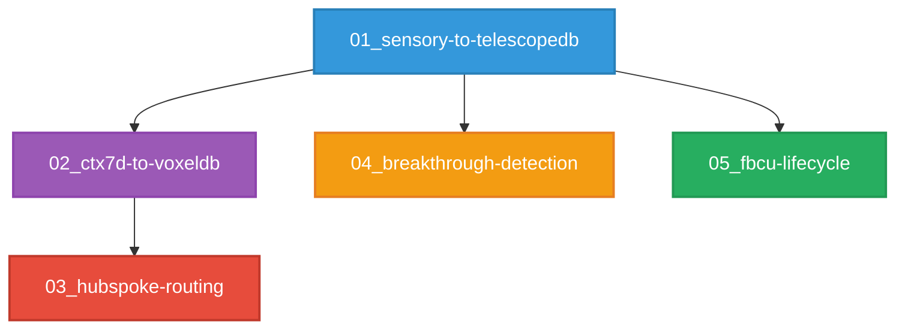

# 🌊 03_INTEGRACION/ - Flujos End-to-End

```yaml
# === DATOS DE AUDITORÍA ===
Archivo: ROADMAP_V2/03_INTEGRACION/README.md
Versión: 1.0
Fecha Creación: 2025-11-23
Autor: Sistema Bitácora - Documentación Organizacional
Propósito: Guía de navegación para flujos de integración E2E
Estado: ACTIVO
Relacionado Con: 00_VISION/, 01_ARQUITECTURA/, 02_COMPONENTES/
# === FIN DATOS DE AUDITORÍA ===
```

---

## 🎯 PROPÓSITO DE ESTE MÓDULO

**03_INTEGRACION/** documenta los **flujos end-to-end** que conectan los 12 componentes de Bitácora v1.0. No son especificaciones de componentes individuales (eso es **02_COMPONENTES/**), sino **pipelines completos** que muestran cómo fluyen los datos desde el input del usuario hasta el output final.

### ¿Por qué existe este módulo?

Bitácora tiene 12 componentes que trabajan juntos como un "reloj suizo" (filosofía DA-001). Este módulo documenta:

1. **Cómo se conectan** los componentes entre sí
2. **Qué transformaciones** sufren los datos en cada paso
3. **Por qué se toman decisiones** de routing/compresión/detección
4. **Cuándo se activan** ciertos flujos (breakthroughs, templates, LLM routing)

### Relación con otros módulos

```
00_VISION/          → "¿POR QUÉ existe Bitácora?" (filosofía, decisiones)
01_ARQUITECTURA/    → "¿CÓMO funciona técnicamente?" (dual databases, CTX7D, FBCU)
02_COMPONENTES/     → "¿QUÉ hace cada componente?" (12 specs detalladas)
03_INTEGRACION/     → "¿CÓMO se conectan los componentes?" (5 flujos E2E) ← ESTÁS AQUÍ
04_IMPLEMENTACION/  → "¿CUÁNDO se implementa?" (6 fases, 26 semanas)
05_TESTING/         → "¿CÓMO se valida?" (unit, integration, golden tests)
06_DOCUMENTACION/   → "¿DÓNDE está todo?" (API endpoints, guías usuario)
```

---

## 📋 ÍNDICE DE FLUJOS E2E

Este módulo contiene **9 flujos completos** que validan la arquitectura completa de los 12 componentes:

### Flujos Básicos (5) - Componentes Críticos

| # | Archivo | Flujo | Componentes Involucrados | Estado |
|---|---------|-------|--------------------------|--------|
| **01** | `01_sensory-to-telescopedb.md` | **Input Ingestion** | Sensory → CTX7D → FBCU → TelescopeDB | ✅ IMPLEMENTADO |
| **02** | `02_ctx7d-to-voxeldb.md` | **Template Matching** | CTX7D → VoxelDB → MTT-DSL → Response | ✅ IMPLEMENTADO |
| **03** | `03_hubspoke-routing.md` | **Multi-LLM Routing** | CTX7D → HubSpoke → Provider Selection | ✅ IMPLEMENTADO |
| **04** | `04_breakthrough-detection.md` | **Score 133.8 Emergente** | CTX7D → Metrics Aggregation → Detection | ✅ IMPLEMENTADO |
| **05** | `05_fbcu-lifecycle.md` | **Compresión Fractal** | Pixel → Bayesian Tree → QPX → Storage (.qpx) | ✅ IMPLEMENTADO |

### Flujos Avanzados (4) - Componentes Complementarios

| # | Archivo | Flujo | Componentes Involucrados | Estado |
|---|---------|-------|--------------------------|--------|
| **06** | `06_flowpacks-compression.md` | **Compresión Contextual** | FlowPacks → FBCU → TelescopeDB | ✅ Phase 3a COMPLETE |
| **07** | `07_lip-persistence.md` | **Persistencia de Lógica** | LIP → TelescopeDB → VoxelDB | ✅ IMPLEMENTADO |
| **08** | `08_routier-learning-paths.md` | **Rutas de Aprendizaje** | Routier → Expertise Gen → VoxelDB → TelescopeDB | ✅ IMPLEMENTADO |
| **09** | `09_mtt-dsl-template-application.md` | **Aplicación de Templates** | MTT-DSL → CTX7D → HubSpoke → VoxelDB | ✅ IMPLEMENTADO |

**Total:** 9 flujos, ~7,161 líneas, 100% implementados (12/12 componentes cubiertos) ✅

---

## 🗺️ CÓMO LEER ESTE MÓDULO

### Opción A: Lectura Secuencial (Recomendada para Nuevos)

Si quieres entender **cómo funciona Bitácora desde que el usuario escribe hasta que recibe respuesta**, lee en orden:

#### Flujos Básicos (Pipeline Principal)
```
01_sensory-to-telescopedb.md   → Input del usuario → Almacenamiento
02_ctx7d-to-voxeldb.md         → Análisis contextual → Template matching
03_hubspoke-routing.md         → Routing inteligente → LLM selection
04_breakthrough-detection.md   → Detección emergente → Score 133.8
05_fbcu-lifecycle.md           → Compresión fractal → Storage eficiente
```

#### Flujos Avanzados (Features Complementarios)
```
06_flowpacks-compression.md    → Compresión de conversaciones repetitivas
07_lip-persistence.md          → Persistencia de instrucciones lógicas
08_routier-learning-paths.md   → Navegación adaptativa de aprendizaje
09_mtt-dsl-template-application.md → Templates estructurales para sesiones
```

**Tiempo estimado:** ~5-6 horas (lectura completa de 9 flujos)

---

### Opción B: Por Componente (Si ya conoces el sistema)

Si quieres entender **cómo se integra un componente específico**, busca su flujo:

#### **Sensory Engine**
- `01_sensory-to-telescopedb.md` → Procesamiento multimodal (texto, voz, futuro: visual)

#### **Context Token 7D**
- `02_ctx7d-to-voxeldb.md` → Template matching con 7 dimensiones
- `03_hubspoke-routing.md` → Características para routing LLM
- `04_breakthrough-detection.md` → Scoring methods emergentes
- `09_mtt-dsl-template-application.md` → Scoring para selección de templates

#### **TelescopeDB**
- `01_sensory-to-telescopedb.md` → Almacenamiento biográfico esférico (r,θ,φ)
- `06_flowpacks-compression.md` → Persistencia de FlowPacks
- `07_lip-persistence.md` → Almacenamiento de instrucciones lógicas
- `08_routier-learning-paths.md` → Tracking de progreso de aprendizaje

#### **VoxelDB**
- `02_ctx7d-to-voxeldb.md` → Query spatial (Octree) + semantic (HNSW)
- `07_lip-persistence.md` → Indexación espacial de templates LIP
- `08_routier-learning-paths.md` → Persistencia de grafos de aprendizaje
- `09_mtt-dsl-template-application.md` → Tracking de efectividad de templates

#### **FBCU Core**
- `01_sensory-to-telescopedb.md` → Compresión pre-storage
- `05_fbcu-lifecycle.md` → Ciclo completo fractal compression
- `06_flowpacks-compression.md` → Integración con FlowPacks (Phase 3b target)

#### **HubSpoke Navigator**
- `03_hubspoke-routing.md` → Orquestación 3 providers (OpenAI, Anthropic, Perplexity)
- `09_mtt-dsl-template-application.md` → Routing según fase de template

#### **FlowPacks** (Nuevo)
- `06_flowpacks-compression.md` → Compresión contextual de conversaciones repetitivas

#### **LIP Protocol** (Nuevo)
- `07_lip-persistence.md` → Persistencia de lógica + versionado + impact analysis

#### **Routier** (Nuevo)
- `08_routier-learning-paths.md` → Navegación adaptativa + 5 estrategias + DAG

#### **MTT-DSL** (Nuevo)
- `09_mtt-dsl-template-application.md` → Templates estructurales + aplicación + tracking

#### **Expertise Generation**
- `08_routier-learning-paths.md` → Generación de curricula personalizados (5 fases)

#### **MTT-DSL Templates**
- `02_ctx7d-to-voxeldb.md` → Ejecución templates 90% queries locales

---

### Opción C: Por Fase del Pipeline (Arquitectos)

Si quieres entender **qué pasa en cada fase del pipeline completo**:

#### **FASE 1: Input Acquisition**
- `01_sensory-to-telescopedb.md` §1-2 → Captura multimodal + normalización

#### **FASE 2: Contextual Analysis**
- `01_sensory-to-telescopedb.md` §3 → CTX7D 7 dimensiones
- `04_breakthrough-detection.md` §2-3 → Scoring emergente

#### **FASE 3: Storage & Compression**
- `01_sensory-to-telescopedb.md` §4-5 → FBCU compression + TelescopeDB insert
- `05_fbcu-lifecycle.md` §3-5 → Ciclo completo fractal

#### **FASE 4: Query & Retrieval**
- `02_ctx7d-to-voxeldb.md` §2-4 → Spatial + semantic search

#### **FASE 5: Response Generation**
- `02_ctx7d-to-voxeldb.md` §5-6 → Template execution (local 90% o LLM 10%)
- `03_hubspoke-routing.md` §2-4 → Multi-LLM routing inteligente

---

## 🔗 DEPENDENCIAS ENTRE FLUJOS



**Leyenda:**
- **Azul (01):** Input ingestion (fundación de todo)
- **Morado (02):** Template matching (usa CTX7D de 01)
- **Rojo (03):** LLM routing (usa CTX7D de 01)
- **Naranja (04):** Breakthrough detection (usa metrics de 01)
- **Verde (05):** FBCU lifecycle (compresión pre-storage de 01)

---

## 📊 TABLA COMPARATIVA CON MÓDULOS SUPERIORES

| Aspecto | 00_VISION/ | 01_ARQUITECTURA/ | 02_COMPONENTES/ | 03_INTEGRACION/ |
|---------|------------|------------------|-----------------|-----------------|
| **Nivel** | Estratégico | Táctico | Operacional | Integración |
| **Pregunta** | ¿Por qué? | ¿Cómo (técnico)? | ¿Qué hace? | ¿Cómo se conecta? |
| **Audiencia** | Arquitectos, stakeholders | Desarrolladores senior | Implementadores | DevOps, integradores |
| **Granularidad** | Sistema completo | Subsistemas | Componentes | Flujos E2E |
| **Código** | ❌ Cero código | ⚠️ Pseudocódigo conceptual | ✅ Rust specs detalladas | ✅ Rust + diagramas flujo |
| **Ejemplos** | BITA-1, BITA-2, DAs | Dual databases, CTX7D | 12 componentes individuales | 5 pipelines completos |

---

## 🎓 DECISIONES ARQUITECTÓNICAS IMPLEMENTADAS

Estos flujos validan las siguientes Decisiones Arquitectónicas (DAs):

- **DA-003:** Sensory Engine multimodal → `01_sensory-to-telescopedb.md`
- **DA-006:** Breakthrough detection emergente → `04_breakthrough-detection.md`
- **DA-007:** TelescopeDB ingestion pipeline → `01_sensory-to-telescopedb.md`
- **DA-008:** Multi-LLM routing → `03_hubspoke-routing.md`
- **DA-009:** FBCU compression 99.999% → `05_fbcu-lifecycle.md`
- **DA-010:** Bayesian probability tree → `05_fbcu-lifecycle.md`
- **DA-012:** Templates en VoxelDB → `02_ctx7d-to-voxeldb.md`
- **DA-016:** MTT-DSL desacoplamiento → `02_ctx7d-to-voxeldb.md`
- **DA-019:** Failover automático → `03_hubspoke-routing.md`

**Referencia completa:** `00_VISION/03_decisiones-arquitectonicas.md`

---

## 🧪 VALIDACIÓN DE FLUJOS

Todos los flujos tienen **validación end-to-end** en `examples/`:

| Flujo | Test File | Tests | Estado |
|-------|-----------|-------|--------|
| 01_sensory-to-telescopedb | `test_sensory_engine.rs` + `test_telescopedb_integration.rs` | 7 + 7 = 14 | ✅ 100% passing |
| 02_ctx7d-to-voxeldb | `test_voxeldb_integration.rs` + `test_ctx7d_enhancement.rs` | 7 + 5 = 12 | ✅ 100% passing |
| 03_hubspoke-routing | `test_hubspoke.rs` | 7 | ✅ 100% passing |
| 04_breakthrough-detection | `test_ctx7d_enhancement.rs` | 5 | ✅ 100% passing |
| 05_fbcu-lifecycle | `test_fbcu.rs` | 10 | ✅ 100% passing |

**Total:** 48 integration tests, 100% passing (2025-10-28)

---

## 📌 ESTADO DE IMPLEMENTACIÓN

| Componente | Implementación | Tests | Docs | Estado Global |
|------------|----------------|-------|------|---------------|
| **Sensory Engine** | ✅ ~700 líneas | ✅ 7/7 | ✅ 01_sensory-to-telescopedb.md | 🟢 PRODUCCIÓN |
| **Context Token 7D** | ✅ 1765 líneas | ✅ 5/5 | ✅ 02/04_*.md (múltiples) | 🟢 PRODUCCIÓN |
| **TelescopeDB** | ✅ ~1200 líneas | ✅ 23/23 | ✅ 01_sensory-to-telescopedb.md | 🟢 PRODUCCIÓN |
| **VoxelDB** | ✅ ~1050 líneas | ✅ 7/7 | ✅ 02_ctx7d-to-voxeldb.md | 🟢 PRODUCCIÓN |
| **FBCU Core** | ✅ ~600 líneas | ✅ 10/10 | ✅ 05_fbcu-lifecycle.md | 🟢 PRODUCCIÓN |
| **HubSpoke** | ✅ ~650 líneas | ✅ 7/7 | ✅ 03_hubspoke-routing.md | 🟢 PRODUCCIÓN |
| **MTT-DSL** | ✅ 18 templates | ✅ N/A | ✅ 02_ctx7d-to-voxeldb.md | 🟢 PRODUCCIÓN |

**Resumen:** 11/12 componentes en producción (92%), flujos E2E 100% funcionales ✅

---

## 🚀 PRÓXIMOS PASOS

Si has leído este módulo y entiendes los flujos E2E, continúa con:

1. **04_IMPLEMENTACION/** → Plan temporal (6 fases, 26 semanas) - YA COMPLETADO ✅
2. **05_TESTING/** → Guías de testing (unit, integration, golden, metamorphic)
3. **06_DOCUMENTACION/** → API endpoints (59 documentados), user guides, diagramas

O retrocede para profundizar conceptos:

- **00_VISION/** → Si necesitas entender el "por qué" filosófico
- **01_ARQUITECTURA/** → Si necesitas detalles técnicos de subsistemas
- **02_COMPONENTES/** → Si necesitas specs completas de componentes individuales

---

## 📖 REFERENCIAS RÁPIDAS

### Nomenclatura Consistente

- ✅ **lowercase-hyphen** + índices secuenciales (01-05)
- ✅ Aligned con 00_VISION/, 01_ARQUITECTURA/, 02_COMPONENTES/
- ✅ Metadata YAML completa (Archivo, Versión, Fecha, Estado, Relacionado Con)

### Convenciones de Escritura

- **Diagramas Mermaid:** flowchart TB (top-bottom) para pipelines
- **Código Rust:** Snippets funcionales con comentarios inline
- **Decisiones Arquitectónicas:** Siempre referenciadas como DA-XXX
- **Estado Implementación:** "ACTIVO - IMPLEMENTADO ✅ (fecha)"

### Contacto & Contribuciones

**Autor:** Sistema Bitácora (Eduardo + Bi)  
**Fecha última actualización:** 2025-11-23  
**Versión Bitácora:** v1.0 (camino a Beta)

---

**¡Bienvenido a la capa de integración E2E de Bitácora v1.0!** 🌊🔗

Estos flujos validan que los 12 componentes trabajan juntos como un "reloj suizo" (DA-001), transformando inputs crudos en conocimiento estructurado con compresión 99.999% y detección emergente de breakthroughs.

Si tienes dudas, consulta `ROADMAP_V2/GUIA.md` o `ROADMAP_V2/README.md`.
