# 🏆 Golden Tests: Validación con Outputs de Referencia

**Archivo:** `ROADMAP_V2/05_TESTING/GOLDEN_TESTS.md`  
**Versión:** 1.0  
**Fecha:** 2025-10-26  
**Propósito:** Tests basados en comparación con outputs "dorados" pre-aprobados

---

## 🎯 PROPÓSITO

Los **golden tests** (snapshot tests) comparan el output actual de una función con un output de referencia previamente aprobado. Son ideales para:

- **Detección de regresiones** inesperadas
- **Validación de formatos** (JSON, CBOR, texto)
- **Garantizar consistencia** en serialización

---

## 📊 CONCEPTO

```mermaid
graph LR
    subgraph "PRIMER RUN"
        A[Run Function] --> B[Generate Output]
        B --> C[Save as Golden]
        C --> D[✓ APPROVED]
    end
    
    subgraph "RUNS SUBSECUENTES"
        E[Run Function] --> F[Generate Output]
        F --> G{Compare vs Golden}
        G -->|Match| H[✓ PASS]
        G -->|Differ| I[❌ FAIL]
        I --> J[Review Diff]
        J --> K{Regression?}
        K -->|Yes| L[Fix Code]
        K -->|No| M[Update Golden]
    end
    
    style D fill:#27ae60,stroke:#229954,stroke-width:2px,color:#fff
    style H fill:#27ae60,stroke:#229954,stroke-width:2px,color:#fff
    style I fill:#e74c3c,stroke:#c0392b,stroke-width:2px,color:#fff
```



---

## 🏗️ SETUP

### **Cargo.toml**

```toml
[dev-dependencies]
insta = "1.34"  # Snapshot testing library
```

### **Estructura de Archivos**

```
tests/
├── golden/
│   ├── mod.rs
│   ├── ctx7d_golden.rs
│   ├── fbcu_golden.rs
│   └── serialization_golden.rs
└── snapshots/
    ├── golden__test_ctx7d_generation.snap
    ├── golden__test_fbcu_serialization.snap
    └── ... (auto-generados por insta)
```

---

## 🧪 GOLDEN TEST 1: CTX7D Generation

```rust
// tests/golden/ctx7d_golden.rs

use bitacora::ContextToken7D;
use insta::assert_debug_snapshot;

#[test]
fn test_ctx7d_generation_rust_query() {
    let text = "How do I fix a lifetime error in Rust?";
    let ctx7d = ContextToken7D::from_text(text).unwrap();
    
    // Serialize a formato reproducible
    let snapshot = serde_json::to_string_pretty(&ctx7d).unwrap();
    
    // Comparar con golden
    assert_debug_snapshot!(snapshot);
}

#[test]
fn test_ctx7d_generation_creative_query() {
    let text = "Write a poem about quantum entanglement";
    let ctx7d = ContextToken7D::from_text(text).unwrap();
    
    let snapshot = serde_json::to_string_pretty(&ctx7d).unwrap();
    
    assert_debug_snapshot!(snapshot);
}

#[test]
fn test_ctx7d_normalization() {
    let mut tensor = Tensor7D {
        semantic: 150.0,  // Fuera de rango
        temporal: -0.5,
        spatial: 0.5,
        harmonic: 0.8,
        resonant: 0.3,
        emergent: 0.9,
        void_potential: 0.1,
    };
    
    tensor.normalize();
    
    assert_debug_snapshot!(tensor);
}
```

**Snapshot generado automáticamente:**

```
// tests/snapshots/golden__test_ctx7d_generation_rust_query.snap

---
source: tests/golden/ctx7d_golden.rs
expression: snapshot
---
{
  "tensor": {
    "semantic": 0.8523,
    "temporal": 0.7234,
    "spatial": 0.3012,
    "harmonic": 0.4156,
    "resonant": 0.5234,
    "emergent": 0.6123,
    "void_potential": 0.1987
  },
  "metadata": {
    "original_text": "How do I fix a lifetime error in Rust?",
    "timestamp": 1698345600,
    "modality": "Text",
    "embedding_model": "text-embedding-ada-002"
  }
}
```

---

## 🧪 GOLDEN TEST 2: FBCU Serialization

```rust
// tests/golden/fbcu_golden.rs

use bitacora::{FBCUTree, PixelBlock, QuantizationConfig};
use insta::assert_debug_snapshot;

#[test]
fn test_fbcu_serialization_gradient_block() {
    let block = create_gradient_block_8x8();
    let config = QuantizationConfig { quality: 0.95 };
    
    let tree = FBCUTree::build_from_block(&block);
    let serialized = tree.serialize(&config);
    
    // Convertir bytes a hex string para snapshot
    let hex_string = hex::encode(&serialized);
    
    assert_debug_snapshot!(hex_string);
}

#[test]
fn test_fbcu_serialization_solid_block() {
    let block = create_solid_block(LAB { l: 50.0, a: 10.0, b: -5.0 });
    let config = QuantizationConfig { quality: 0.95 };
    
    let tree = FBCUTree::build_from_block(&block);
    let serialized = tree.serialize(&config);
    
    let hex_string = hex::encode(&serialized);
    
    assert_debug_snapshot!(hex_string);
}

#[test]
fn test_fbcu_tree_structure() {
    let block = create_gradient_block_8x8();
    let tree = FBCUTree::build_from_block(&block);
    
    // Snapshot de la estructura del árbol (sin datos comprimidos)
    let structure = TreeStructure {
        num_levels: tree.levels.len(),
        level_resolutions: tree.levels.iter().map(|l| l.resolution).collect(),
        residual_counts: tree.residuals.iter().map(|r| r.len()).collect(),
    };
    
    assert_debug_snapshot!(structure);
}
```

---

## 🧪 GOLDEN TEST 3: Template Rendering

```rust
// tests/golden/template_golden.rs

use bitacora::{MTTTemplate, NormalizedInput};
use insta::assert_snapshot;

#[test]
fn test_template_rendering_rust_lifetime() {
    let template = MTTTemplate {
        id: "rust_debug_lifetime".to_string(),
        pattern: "lifetime error|borrow checker".to_string(),
        response_template: r#"
Let's analyze the lifetime requirements:

1. **Problem:** {problem_description}
2. **Context:** {code_snippet}

**Common causes:**
- Returning references to local variables
- Conflicting mutable/immutable borrows
- Insufficient lifetime annotations

**Solution approach:**
- Review ownership transfer
- Consider using `clone()` if performance allows
- Add explicit lifetime parameters if needed
        "#.to_string(),
        ctx7d_signature: create_mock_ctx7d(),
    };
    
    let input = NormalizedInput {
        tokens: vec!["lifetime", "error", "Rust"].into_iter().map(String::from).collect(),
        metadata: hashmap! {
            "problem_description" => "Cannot return reference to local string",
            "code_snippet" => "fn get_name() -> &str { &\"Alice\".to_string() }",
        },
        ..Default::default()
    };
    
    let rendered = template.render(&input);
    
    // Snapshot del template renderizado
    assert_snapshot!(rendered);
}

#[test]
fn test_template_rendering_multiline_code() {
    let template = load_template("python_async");
    let input = create_test_input_async_python();
    
    let rendered = template.render(&input);
    
    assert_snapshot!(rendered);
}
```

---

## 🧪 GOLDEN TEST 4: API Responses

```rust
// tests/golden/api_golden.rs

use bitacora::{api_server, QueryRequest, QueryResponse};
use insta::assert_json_snapshot;

#[tokio::test]
async fn test_api_query_response_format() {
    let request = QueryRequest {
        query: "Explain Rust ownership".to_string(),
        mode: QueryMode::Local,
        max_results: 5,
    };
    
    let response = api_server::handle_query(request).await.unwrap();
    
    // Snapshot del JSON de respuesta
    assert_json_snapshot!(response, {
        // Ignorar campos volátiles
        ".timestamp" => "[timestamp]",
        ".execution_time_ms" => "[execution_time]",
    });
}

#[tokio::test]
async fn test_api_error_response_format() {
    let request = QueryRequest {
        query: "".to_string(), // Query vacío → error
        mode: QueryMode::Local,
        max_results: 5,
    };
    
    let response = api_server::handle_query(request).await;
    
    assert!(response.is_err());
    
    let error = response.unwrap_err();
    
    assert_json_snapshot!(error, {
        ".timestamp" => "[timestamp]",
    });
}
```

**Snapshot esperado:**

```json
// tests/snapshots/api_golden__test_api_query_response_format.snap

{
  "status": "success",
  "query": "Explain Rust ownership",
  "results": [
    {
      "template_id": "rust_ownership_basics",
      "similarity": 0.94,
      "response": "Rust's ownership system is based on three rules:\n1. Each value has an owner\n2. There can only be one owner at a time\n3. When the owner goes out of scope, the value is dropped"
    }
  ],
  "execution_time_ms": "[execution_time]",
  "timestamp": "[timestamp]",
  "mode": "local"
}
```

---

## 🧪 GOLDEN TEST 5: Serialization Formats

```rust
// tests/golden/serialization_golden.rs

use bitacora::{Pixel, PixelCoord, LAB};
use insta::assert_debug_snapshot;

#[test]
fn test_pixel_cbor_serialization() {
    let pixel = Pixel {
        position: PixelCoord { x: 100, y: 200 },
        color: LAB { l: 50.0, a: 10.0, b: -5.0 },
        timestamp: 1234567890,
    };
    
    let cbor_bytes = serde_cbor::to_vec(&pixel).unwrap();
    let hex_string = hex::encode(&cbor_bytes);
    
    assert_debug_snapshot!(hex_string);
}

#[test]
fn test_pixel_json_serialization() {
    let pixel = Pixel {
        position: PixelCoord { x: 100, y: 200 },
        color: LAB { l: 50.0, a: 10.0, b: -5.0 },
        timestamp: 1234567890,
    };
    
    let json_string = serde_json::to_string_pretty(&pixel).unwrap();
    
    assert_snapshot!(json_string);
}

#[test]
fn test_octree_coord_serialization() {
    let coord = OctreeCoord { x: 128, y: 64, z: 32 };
    
    let cbor_bytes = serde_cbor::to_vec(&coord).unwrap();
    let hex_string = hex::encode(&cbor_bytes);
    
    assert_debug_snapshot!(hex_string);
}
```

---

## 🔄 WORKFLOW DE GOLDEN TESTS

### **1. Crear Nuevo Test**

```bash
# Escribir test
vim tests/golden/new_feature_golden.rs

# Ejecutar (generará snapshot)
cargo test new_feature_golden

# Review snapshot generado
cat tests/snapshots/golden__test_new_feature.snap
```

### **2. Aprobar Snapshot**

Si el output es correcto:

```bash
# Commit snapshot junto con código
git add tests/snapshots/golden__test_new_feature.snap
git commit -m "Add golden test for new feature"
```

### **3. Detectar Regresión**

Si el output cambia:

```bash
cargo test new_feature_golden

# Output:
# ---- golden::new_feature_golden::test_new_feature stdout ----
# thread 'golden::new_feature_golden::test_new_feature' panicked at 
# snapshot assertion failed:
#
# Differences:
# -  "semantic": 0.8523,
# +  "semantic": 0.7234,
#
# To update snapshots run: cargo insta review
```

### **4. Review Cambios**

```bash
# Interactive review
cargo insta review

# Opciones:
# [y] Accept change (update golden)
# [n] Reject (keep current golden)
# [s] Skip
# [q] Quit
```

---

## 📊 INTEGRACIÓN CON CI/CD

```yaml
# .github/workflows/golden_tests.yml

name: Golden Tests

on: [push, pull_request]

jobs:
  test:
    runs-on: ubuntu-latest
    steps:
      - uses: actions/checkout@v3
      
      - name: Install Rust
        uses: actions-rs/toolchain@v1
        with:
          toolchain: stable
      
      - name: Run golden tests
        run: cargo test --test golden
      
      - name: Check for snapshot changes
        run: |
          if git diff --exit-code tests/snapshots/; then
            echo "✅ No snapshot changes"
          else
            echo "❌ Snapshots changed! Run 'cargo insta review' locally"
            exit 1
          fi
```

---

## 🎯 BEST PRACTICES

### **✅ DO:**

- Usar golden tests para **formatos de output** (JSON, CBOR, texto)
- Snapshot de **estructuras de datos complejas**
- Validar **consistencia de serialización**
- Ignorar campos volátiles (timestamps, IDs aleatorios)

### **❌ DON'T:**

- Snapshot de outputs **no determinísticos** (randoms, UUIDs)
- Snapshot de **datos muy grandes** (> 1 KB)
- Usar para **lógica de negocio** (usar unit tests)
- Snapshot de **valores numéricos con floating point** (usar asserts con epsilon)

---

## 🧮 FLOATING POINT COMPARISONS

Para valores con decimales, usar comparación aproximada:

```rust
use approx::assert_relative_eq;

#[test]
fn test_ctx7d_semantic_value() {
    let ctx7d = ContextToken7D::from_text("test").unwrap();
    
    // ❌ BAD: Snapshot de float exacto
    // assert_debug_snapshot!(ctx7d.tensor.semantic);
    
    // ✅ GOOD: Assert con epsilon
    assert_relative_eq!(ctx7d.tensor.semantic, 0.8523, epsilon = 0.01);
}
```

---

## 📚 REFERENCIAS

- **insta crate:** https://insta.rs/
- **UNIT_TESTS_GUIDE.md:** Tests unitarios complementarios
- **INTEGRATION_TESTS.md:** Tests de flujos completos
- **DA-024:** Testing requirements (golden tests para serialización)

---

**Estado:** 📋 Especificación completa  
**Criticidad:** 🟡 MEDIA - Complementa unit tests  
**Próxima implementación:** Semana 5-6 (junto con integration tests)

---

*Generado: 2025-10-26*  
*Sistema Bitácora v1.0 - Golden Tests*  
*"Trust, but verify with snapshots"* 🏆
