# 🔗 Integration Tests: Testing de Flujos Completos

**Archivo:** `ROADMAP_V2/05_TESTING/INTEGRATION_TESTS.md`  
**Versión:** 1.0  
**Fecha:** 2025-10-26  
**Propósito:** Tests de integración entre componentes (E2E internos)

---

## 🎯 PROPÓSITO

Los **integration tests** validan que múltiples componentes trabajen correctamente juntos. A diferencia de unit tests (aislados), estos tests verifican **flujos reales** de datos entre subsistemas.

---

## 📊 ARQUITECTURA DE INTEGRATION TESTS

```mermaid
graph TB
    subgraph "TESTS UNITARIOS"
        A[TelescopeDB Unit] --> B[✓]
        C[VoxelDB Unit] --> D[✓]
        E[FBCU Unit] --> F[✓]
    end
    
    subgraph "INTEGRATION TESTS"
        G[Sensory → Telescope] --> H[Pipeline completo]
        I[CTX7D → VoxelDB] --> J[Template matching]
        K[FBCU → Storage] --> L[Compress + retrieve]
    end
    
    subgraph "E2E TESTS"
        M[User Query] --> N[Full system]
        N --> O[Response]
    end
    
    style G fill:#3498db,stroke:#2980b9,stroke-width:2px,color:#fff
    style I fill:#e74c3c,stroke:#c0392b,stroke-width:2px,color:#fff
    style K fill:#27ae60,stroke:#229954,stroke-width:2px,color:#fff
```



---

## 🏗️ ESTRUCTURA DE TESTS

```
tests/
├── integration/
│   ├── mod.rs
│   ├── sensory_to_telescope.rs
│   ├── ctx7d_to_voxeldb.rs
│   ├── fbcu_lifecycle.rs
│   ├── hubspoke_routing.rs
│   └── breakthrough_detection.rs
├── fixtures/
│   ├── test_data.json
│   ├── sample_audio.wav
│   └── sample_image.png
└── common/
    └── mod.rs  # Test helpers compartidos
```

---

## 🧪 TEST 1: Sensory Engine → TelescopeDB

**Objetivo:** Validar pipeline completo de ingesta multimodal

```rust
// tests/integration/sensory_to_telescope.rs

use bitacora::{SensoryEngine, TelescopeDB, ContextToken7D};
use tempfile::TempDir;

#[tokio::test]
async fn test_text_input_full_pipeline() {
    // Setup
    let temp_dir = TempDir::new().unwrap();
    let db_path = temp_dir.path().join("telescope.db");
    
    let sensory = SensoryEngine::new();
    let telescope = TelescopeDB::new(&db_path).await.unwrap();
    
    // Input usuario
    let user_text = "I need help debugging a lifetime error in my Rust code";
    
    // FASE 1: Procesamiento sensorial
    let normalized = sensory.process_text(user_text).await.unwrap();
    
    assert_eq!(normalized.modality, Modality::Text);
    assert!(normalized.tokens.len() > 0);
    
    // FASE 2: Generar CTX7D
    let ctx7d = ContextToken7D::from_normalized(&normalized).await.unwrap();
    
    assert!(ctx7d.tensor.semantic > 0.5); // Query técnico
    assert!(ctx7d.tensor.temporal > 0.7); // Urgencia implícita
    
    // FASE 3: Almacenar en TelescopeDB
    let entry_id = telescope.insert_entry(
        user_text.to_string(),
        ctx7d.clone(),
        normalized.clone(),
    ).await.unwrap();
    
    // FASE 4: Verificar persistencia
    let retrieved = telescope.get_entry(entry_id).await.unwrap();
    
    assert_eq!(retrieved.original_text, user_text);
    assert_eq!(retrieved.ctx7d.tensor.semantic, ctx7d.tensor.semantic);
    
    // FASE 5: Query por similitud
    let similar_entries = telescope.query_similar(&ctx7d, 5).await.unwrap();
    
    assert!(similar_entries.len() > 0);
    assert_eq!(similar_entries[0].id, entry_id); // Debe encontrarse a sí mismo
}

#[tokio::test]
async fn test_audio_transcription_pipeline() {
    let temp_dir = TempDir::new().unwrap();
    let db_path = temp_dir.path().join("telescope.db");
    
    let sensory = SensoryEngine::new();
    let telescope = TelescopeDB::new(&db_path).await.unwrap();
    
    // Cargar audio de prueba (WAV)
    let audio_bytes = std::fs::read("tests/fixtures/sample_audio.wav").unwrap();
    
    // FASE 1: Transcripción
    let normalized = sensory.process_audio(&audio_bytes).await.unwrap();
    
    assert_eq!(normalized.modality, Modality::Audio);
    assert!(normalized.transcription.is_some());
    
    let transcription = normalized.transcription.as_ref().unwrap();
    
    // FASE 2: CTX7D del audio transcrito
    let ctx7d = ContextToken7D::from_normalized(&normalized).await.unwrap();
    
    // FASE 3: Almacenar
    let entry_id = telescope.insert_entry(
        transcription.clone(),
        ctx7d,
        normalized,
    ).await.unwrap();
    
    // Verificar que se puede recuperar
    let retrieved = telescope.get_entry(entry_id).await.unwrap();
    assert_eq!(retrieved.original_text, *transcription);
}

#[tokio::test]
async fn test_concurrent_insertions() {
    use std::sync::Arc;
    use tokio::task;
    
    let temp_dir = TempDir::new().unwrap();
    let db_path = temp_dir.path().join("telescope.db");
    
    let sensory = Arc::new(SensoryEngine::new());
    let telescope = Arc::new(TelescopeDB::new(&db_path).await.unwrap());
    
    let mut handles = vec![];
    
    for i in 0..10 {
        let sensory = Arc::clone(&sensory);
        let telescope = Arc::clone(&telescope);
        
        let handle = task::spawn(async move {
            for j in 0..10 {
                let text = format!("Test entry {} - {}", i, j);
                
                let normalized = sensory.process_text(&text).await.unwrap();
                let ctx7d = ContextToken7D::from_normalized(&normalized).await.unwrap();
                
                telescope.insert_entry(text, ctx7d, normalized).await.unwrap();
            }
        });
        
        handles.push(handle);
    }
    
    for handle in handles {
        handle.await.unwrap();
    }
    
    // Verificar que todas las 100 entradas están
    assert_eq!(telescope.count_entries().await.unwrap(), 100);
}
```

---

## 🧪 TEST 2: CTX7D → VoxelDB (Template Matching)

**Objetivo:** Validar sistema de templates y búsqueda vectorial

```rust
// tests/integration/ctx7d_to_voxeldb.rs

use bitacora::{ContextToken7D, VoxelDB, MTTTemplate};

#[tokio::test]
async fn test_template_storage_and_retrieval() {
    let voxeldb = VoxelDB::new_in_memory().await.unwrap();
    
    // Crear templates de ejemplo
    let templates = vec![
        MTTTemplate {
            id: "rust_debug_lifetime".to_string(),
            pattern: "lifetime error|borrow checker|'a|'static".to_string(),
            response_template: "Let's analyze the lifetime requirements...".to_string(),
            ctx7d_signature: ContextToken7D {
                tensor: Tensor7D {
                    semantic: 0.85,
                    temporal: 0.70,
                    spatial: 0.30,
                    harmonic: 0.40,
                    resonant: 0.50,
                    emergent: 0.60,
                    void_potential: 0.20,
                },
                metadata: Default::default(),
            },
        },
        MTTTemplate {
            id: "python_async".to_string(),
            pattern: "asyncio|async def|await|coroutine".to_string(),
            response_template: "For async Python patterns...".to_string(),
            ctx7d_signature: ContextToken7D {
                tensor: Tensor7D {
                    semantic: 0.80,
                    temporal: 0.60,
                    spatial: 0.40,
                    harmonic: 0.50,
                    resonant: 0.55,
                    emergent: 0.65,
                    void_potential: 0.25,
                },
                metadata: Default::default(),
            },
        },
    ];
    
    // Insertar templates en VoxelDB
    for template in &templates {
        voxeldb.insert_template(template).await.unwrap();
    }
    
    // Query con CTX7D similar a Rust
    let query_ctx7d = ContextToken7D {
        tensor: Tensor7D {
            semantic: 0.83,
            temporal: 0.72,
            spatial: 0.32,
            harmonic: 0.38,
            resonant: 0.48,
            emergent: 0.58,
            void_potential: 0.22,
        },
        metadata: Default::default(),
    };
    
    let matches = voxeldb.search_templates(&query_ctx7d, 1).await.unwrap();
    
    assert_eq!(matches.len(), 1);
    assert_eq!(matches[0].template.id, "rust_debug_lifetime");
    assert!(matches[0].similarity > 0.90); // Muy similar
}

#[tokio::test]
async fn test_90_10_split_local_vs_llm() {
    let voxeldb = VoxelDB::new_in_memory().await.unwrap();
    
    // Insertar 100 templates variados
    seed_voxeldb_with_templates(&voxeldb, 100).await;
    
    let mut local_hits = 0;
    let mut llm_required = 0;
    
    // Simular 1000 queries
    for _ in 0..1000 {
        let query_ctx7d = generate_random_ctx7d();
        
        let matches = voxeldb.search_templates(&query_ctx7d, 1).await.unwrap();
        
        if matches.len() > 0 && matches[0].similarity > 0.85 {
            local_hits += 1; // Puede responder localmente
        } else {
            llm_required += 1; // Requiere LLM
        }
    }
    
    let local_ratio = local_hits as f64 / 1000.0;
    
    println!("Local: {:.1}%, LLM: {:.1}%", local_ratio * 100.0, (1.0 - local_ratio) * 100.0);
    
    // Target: 90% local, 10% LLM
    assert!(local_ratio >= 0.85); // Al menos 85% local
}
```

---

## 🧪 TEST 3: FBCU Lifecycle Completo

**Objetivo:** Validar compresión → storage → retrieval → reconstrucción

```rust
// tests/integration/fbcu_lifecycle.rs

use bitacora::{FBCUTree, VoxelDB, TelescopeDB, PixelBlock};

#[tokio::test]
async fn test_fbcu_full_lifecycle() {
    let temp_dir = TempDir::new().unwrap();
    let telescope_path = temp_dir.path().join("telescope.db");
    
    let telescope = TelescopeDB::new(&telescope_path).await.unwrap();
    let voxeldb = VoxelDB::new_in_memory().await.unwrap();
    
    // FASE 1: Crear frame original
    let original_pixels = create_test_frame_1920x1080();
    
    // Almacenar original en TelescopeDB (referencia)
    let frame_id = telescope.store_frame(&original_pixels).await.unwrap();
    
    // FASE 2: Extraer bloques 8x8
    let blocks = extract_blocks_8x8(&original_pixels);
    
    assert_eq!(blocks.len(), (1920 / 8) * (1080 / 8)); // 240 × 135 = 32,400 bloques
    
    // FASE 3: Comprimir cada bloque con FBCU
    let mut fbcu_ids = Vec::new();
    
    for block in &blocks {
        let stats = block.compute_statistics();
        
        if should_compress_block(&stats) {
            // Comprimir
            let tree = FBCUTree::build_from_block(block);
            let config = QuantizationConfig { quality: 0.95 };
            let serialized = tree.serialize(&config);
            
            // Almacenar en VoxelDB
            let fbcu_id = voxeldb.insert_fbcu(
                block.origin,
                frame_id,
                serialized,
            ).await.unwrap();
            
            fbcu_ids.push(fbcu_id);
        } else {
            // Bloque homogéneo → solo centroide
            let centroid = stats.mean_color;
            voxeldb.insert_centroid(
                block.origin,
                frame_id,
                centroid,
            ).await.unwrap();
        }
    }
    
    tracing::info!("Compressed {} blocks", fbcu_ids.len());
    
    // FASE 4: Reconstruir frame completo
    let mut reconstructed_pixels = Vec::new();
    
    for block_origin in block_origins_1920x1080() {
        let retrieved = voxeldb.get_fbcu_or_centroid(
            block_origin,
            frame_id,
        ).await.unwrap();
        
        let pixels = match retrieved {
            FBCUOrCentroid::FBCU(serialized) => {
                let deserialized = SerializedFBCU::deserialize(&serialized).unwrap();
                let decoder = HuffmanEncoder::new();
                let tree = deserialized.rebuild_tree(&decoder);
                tree.to_pixels()
            }
            FBCUOrCentroid::Centroid(color) => {
                // Expandir centroide a 64 píxeles
                vec![color; 64]
            }
        };
        
        reconstructed_pixels.extend(pixels);
    }
    
    // FASE 5: Verificar calidad
    let report = verify_reconstruction(
        &original_pixels,
        &reconstructed_pixels,
    ).await.unwrap();
    
    assert!(report.avg_delta_e < 1.0); // Imperceptible
    assert!(report.max_delta_e < 3.0); // Máximo acceptable
    
    tracing::info!("Avg Delta E: {:.3}", report.avg_delta_e);
    
    // FASE 6: Verificar ratio de compresión
    let original_size = original_pixels.len() * std::mem::size_of::<LAB>();
    let compressed_size = voxeldb.get_total_storage_size(frame_id).await.unwrap();
    
    let ratio = original_size as f64 / compressed_size as f64;
    
    tracing::info!("Compression ratio: {:.1}:1", ratio);
    assert!(ratio >= 3.0); // Mínimo 3:1 para frames reales
}
```

---

## 🧪 TEST 4: HubSpoke Routing

**Objetivo:** Validar selección de modelo y failover

```rust
// tests/integration/hubspoke_routing.rs

use bitacora::{HubSpokeNavigator, ContextToken7D, LLMModel};

#[tokio::test]
async fn test_model_selection_based_on_ctx7d() {
    let hubspoke = HubSpokeNavigator::new().await.unwrap();
    
    // Query complejo → debe seleccionar GPT-4
    let complex_query = "Explain the consensus algorithm in distributed databases";
    let complex_ctx7d = ContextToken7D::from_text(complex_query).await.unwrap();
    
    let selected = hubspoke.select_model(&complex_ctx7d);
    assert_eq!(selected, LLMModel::GPT4);
    
    // Query creativo → debe seleccionar Claude
    let creative_query = "Write a poem about quantum computing";
    let creative_ctx7d = ContextToken7D::from_text(creative_query).await.unwrap();
    
    let selected = hubspoke.select_model(&creative_ctx7d);
    assert_eq!(selected, LLMModel::Claude3Opus);
    
    // Query factual urgente → debe seleccionar Perplexity
    let factual_query = "What happened in the Bitcoin market today?";
    let factual_ctx7d = ContextToken7D::from_text(factual_query).await.unwrap();
    
    let selected = hubspoke.select_model(&factual_ctx7d);
    assert_eq!(selected, LLMModel::Perplexity);
}

#[tokio::test]
async fn test_failover_on_error() {
    let hubspoke = HubSpokeNavigator::new().await.unwrap();
    
    // Simular fallo en modelo primario
    hubspoke.mock_error(LLMModel::GPT4, Error::Timeout);
    
    let ctx7d = ContextToken7D::from_text("test query").await.unwrap();
    
    let result = hubspoke.execute_with_failover(
        &LLMModel::GPT4,
        "test query",
        &ctx7d,
    ).await.unwrap();
    
    // Debe haber usado fallback (Claude o GPT-3.5)
    assert_ne!(result.model_used, LLMModel::GPT4);
}
```

---

## 🧪 TEST 5: Breakthrough Detection

**Objetivo:** Validar cálculo del score 133.8

```rust
// tests/integration/breakthrough_detection.rs

use bitacora::{BreakthroughDetector, Project};

#[tokio::test]
async fn test_score_calculation() {
    let detector = BreakthroughDetector::new(133.8);
    
    // Mock proyecto con métricas conocidas
    let project = Project {
        implemented_features: 28,
        planned_features: 30,
        clippy_warnings: 2,
        test_coverage: 88.0,
        avg_cyclomatic_complexity: 4.5,
        public_items_documented: 95,
        total_public_items: 100,
        // ... resto de campos
    };
    
    let report = detector.check_breakthrough(&project).await.unwrap();
    
    tracing::info!("Total Score: {:.1}", report.total_score);
    tracing::info!("Base: {:.1}", report.base_breakdown.total());
    tracing::info!("Emergent: {:.1}", report.emergent_breakdown.total());
    
    // Verificar componentes
    assert!(report.base_breakdown.completeness >= 35.0); // 93% features
    assert!(report.base_breakdown.testing >= 17.0); // 88% coverage
    
    // Verificar breakthrough
    if report.total_score >= 133.8 {
        assert!(report.is_breakthrough);
    }
}
```

---

## 📊 COMANDOS DE EJECUCIÓN

```bash
# Ejecutar todos los integration tests
cargo test --test '*'

# Ejecutar test específico
cargo test --test sensory_to_telescope

# Con output verboso
cargo test --test '*' -- --nocapture

# Con coverage
cargo tarpaulin --tests --out Html
```

---

## 📚 REFERENCIAS

- **UNIT_TESTS_GUIDE.md:** Tests unitarios por componente
- **SENSORY_TO_TELESCOPEDB.md:** Flujo de integración 1
- **CTX7D_TO_VOXELDB.md:** Flujo de integración 2
- **DA-024:** Testing requirements (integration tests obligatorios)

---

**Estado:** 📋 Especificación completa  
**Criticidad:** 🔴 ALTA - Valida flujos reales  
**Próxima implementación:** Semana 5-6 (después de unit tests)

---

*Generado: 2025-10-26*  
*Sistema Bitácora v1.0 - Integration Tests*  
*"Test the connections, not just the pieces"* 🔗
