# 🔄 Metamorphic Tests: Validación de Propiedades Invariantes

**Archivo:** `ROADMAP_V2/05_TESTING/METAMORPHIC_TESTS.md`  
**Versión:** 1.0  
**Fecha:** 2025-10-26  
**Propósito:** Tests basados en transformaciones que preservan propiedades

---

## 🎯 PROPÓSITO

Los **metamorphic tests** validan que ciertas **relaciones entre inputs y outputs** se mantienen bajo transformaciones. Son ideales cuando:

- No conoces el output exacto esperado
- Hay infinitas combinaciones de inputs
- Quieres validar **propiedades matemáticas** (commutatividad, idempotencia, invarianzas)

---

## 📊 CONCEPTO

```mermaid
graph TB
    subgraph "TEST TRADICIONAL"
        A[Input Known] --> B[Function]
        B --> C[Output Known]
        C --> D{Output == Expected?}
    end
    
    subgraph "METAMORPHIC TEST"
        E[Input X] --> F[Function]
        F --> G[Output Y]
        
        H[Transform X → X'] --> I[Function]
        I --> J[Output Y']
        
        K[Transform Y → Y'expected]
        
        G --> L{Y'expected == Y'?}
        J --> L
        K --> L
    end
    
    style D fill:#3498db,stroke:#2980b9,stroke-width:2px,color:#fff
    style L fill:#e74c3c,stroke:#c0392b,stroke-width:2px,color:#fff
```



**Ejemplo:**
```
Propiedad: f(x) + f(y) = f(x + y)  (linealidad)

Test:
  f(3) + f(5) == f(8)
  
Sin conocer el valor exacto de f(3), f(5) o f(8)
```

---

## 🧪 METAMORPHIC TEST 1: CTX7D Distance Symmetry

**Propiedad:** `distance(A, B) == distance(B, A)` (simetría)

```rust
// tests/metamorphic/ctx7d_properties.rs

use bitacora::{ContextToken7D, Tensor7D};
use proptest::prelude::*;

proptest! {
    #[test]
    fn test_ctx7d_distance_symmetry(
        sem1 in 0.0f64..1.0,
        tem1 in 0.0f64..1.0,
        spa1 in 0.0f64..1.0,
        sem2 in 0.0f64..1.0,
        tem2 in 0.0f64..1.0,
        spa2 in 0.0f64..1.0,
    ) {
        let tensor1 = Tensor7D {
            semantic: sem1,
            temporal: tem1,
            spatial: spa1,
            harmonic: 0.5,
            resonant: 0.5,
            emergent: 0.5,
            void_potential: 0.5,
        };
        
        let tensor2 = Tensor7D {
            semantic: sem2,
            temporal: tem2,
            spatial: spa2,
            harmonic: 0.5,
            resonant: 0.5,
            emergent: 0.5,
            void_potential: 0.5,
        };
        
        let dist_ab = tensor1.distance_to(&tensor2);
        let dist_ba = tensor2.distance_to(&tensor1);
        
        // Simetría: d(A, B) == d(B, A)
        prop_assert!((dist_ab - dist_ba).abs() < 1e-6);
    }
    
    #[test]
    fn test_ctx7d_triangle_inequality(
        sem_a in 0.0f64..1.0,
        sem_b in 0.0f64..1.0,
        sem_c in 0.0f64..1.0,
    ) {
        let a = create_tensor(sem_a, 0.5, 0.5);
        let b = create_tensor(sem_b, 0.5, 0.5);
        let c = create_tensor(sem_c, 0.5, 0.5);
        
        let d_ab = a.distance_to(&b);
        let d_bc = b.distance_to(&c);
        let d_ac = a.distance_to(&c);
        
        // Desigualdad triangular: d(A, C) <= d(A, B) + d(B, C)
        prop_assert!(d_ac <= d_ab + d_bc + 1e-6);
    }
}

fn create_tensor(sem: f64, tem: f64, spa: f64) -> Tensor7D {
    Tensor7D {
        semantic: sem,
        temporal: tem,
        spatial: spa,
        harmonic: 0.5,
        resonant: 0.5,
        emergent: 0.5,
        void_potential: 0.5,
    }
}
```

---

## 🧪 METAMORPHIC TEST 2: FBCU Compression Idempotence

**Propiedad:** `compress(compress(X)) ≈ compress(X)` (idempotencia)

```rust
// tests/metamorphic/fbcu_properties.rs

use bitacora::{FBCUTree, PixelBlock, QuantizationConfig};

#[test]
fn test_fbcu_compression_idempotence() {
    let block = create_gradient_block_8x8();
    let config = QuantizationConfig { quality: 0.95 };
    
    // Primera compresión
    let tree1 = FBCUTree::build_from_block(&block);
    let compressed1 = tree1.serialize(&config);
    
    // Reconstruir
    let deserialized1 = SerializedFBCU::deserialize(&compressed1).unwrap();
    let decoder = HuffmanEncoder::new();
    let reconstructed1 = deserialized1.rebuild_tree(&decoder);
    
    // Segunda compresión (sobre el reconstruido)
    let pixels1 = reconstructed1.to_pixels();
    let block2 = PixelBlock::from_pixels(pixels1);
    let tree2 = FBCUTree::build_from_block(&block2);
    let compressed2 = tree2.serialize(&config);
    
    // Los tamaños comprimidos deben ser similares (± 5%)
    let size_ratio = compressed2.len() as f64 / compressed1.len() as f64;
    
    assert!(
        size_ratio > 0.95 && size_ratio < 1.05,
        "Compression not idempotent: {} vs {} bytes",
        compressed1.len(),
        compressed2.len()
    );
}

proptest! {
    #[test]
    fn test_fbcu_quality_monotonicity(
        quality in 0.80f32..1.00,
    ) {
        let block = create_gradient_block_8x8();
        
        let config_low = QuantizationConfig { quality: quality };
        let config_high = QuantizationConfig { quality: (quality + 0.05).min(1.0) };
        
        let tree = FBCUTree::build_from_block(&block);
        
        let compressed_low = tree.serialize(&config_low);
        let compressed_high = tree.serialize(&config_high);
        
        // Mayor quality → mayor tamaño comprimido (más residuales guardados)
        prop_assert!(
            compressed_high.len() >= compressed_low.len(),
            "Higher quality should not reduce compressed size"
        );
    }
}
```

---

## 🧪 METAMORPHIC TEST 3: VoxelDB Query Consistency

**Propiedad:** `search(X, k=10) ⊇ search(X, k=5)` (subconjunto)

```rust
// tests/metamorphic/voxeldb_properties.rs

use bitacora::{VoxelDB, OctreeCoord, ContextToken7D};

#[tokio::test]
async fn test_voxeldb_knn_subset_property() {
    let voxeldb = VoxelDB::new_in_memory().await.unwrap();
    
    // Insertar 100 puntos
    for i in 0..100 {
        let coord = OctreeCoord {
            x: (i * 17) % 256,
            y: (i * 31) % 256,
            z: (i * 47) % 256,
        };
        voxeldb.insert(coord, vec![i]).await.unwrap();
    }
    
    let query = OctreeCoord { x: 128, y: 128, z: 128 };
    
    // Buscar k=5 y k=10
    let neighbors_5 = voxeldb.knn_search(query, 5).await.unwrap();
    let neighbors_10 = voxeldb.knn_search(query, 10).await.unwrap();
    
    // Los primeros 5 de k=10 deben ser idénticos a k=5
    for i in 0..5 {
        assert_eq!(
            neighbors_5[i].coord,
            neighbors_10[i].coord,
            "k=10 should contain k=5 results in same order"
        );
    }
    
    // Todos los de k=5 deben estar en k=10
    let coords_5: Vec<_> = neighbors_5.iter().map(|n| n.coord).collect();
    let coords_10: Vec<_> = neighbors_10.iter().map(|n| n.coord).collect();
    
    for coord in coords_5 {
        assert!(
            coords_10.contains(&coord),
            "k=10 should contain all k=5 results"
        );
    }
}

#[tokio::test]
async fn test_voxeldb_template_search_score_ordering() {
    let voxeldb = VoxelDB::new_in_memory().await.unwrap();
    
    // Insertar 50 templates
    for i in 0..50 {
        let template = create_mock_template(i);
        voxeldb.insert_template(&template).await.unwrap();
    }
    
    let query_ctx7d = create_mock_ctx7d();
    
    let results = voxeldb.search_templates(&query_ctx7d, 20).await.unwrap();
    
    // Verificar ordenamiento: similarity[i] >= similarity[i+1]
    for i in 1..results.len() {
        assert!(
            results[i - 1].similarity >= results[i].similarity,
            "Results must be sorted by similarity (descending)"
        );
    }
}
```

---

## 🧪 METAMORPHIC TEST 4: Serialization Round-Trip

**Propiedad:** `deserialize(serialize(X)) == X` (isomorfismo)

```rust
// tests/metamorphic/serialization_properties.rs

use bitacora::{Pixel, PixelCoord, LAB, OctreeCoord};
use proptest::prelude::*;

proptest! {
    #[test]
    fn test_pixel_cbor_roundtrip(
        x in 0u32..1920,
        y in 0u32..1080,
        l in 0.0f32..100.0,
        a in -128.0f32..127.0,
        b in -128.0f32..127.0,
        timestamp in 0u64..u64::MAX,
    ) {
        let original = Pixel {
            position: PixelCoord { x, y },
            color: LAB { l, a, b },
            timestamp,
        };
        
        // Serialize
        let cbor_bytes = serde_cbor::to_vec(&original).unwrap();
        
        // Deserialize
        let deserialized: Pixel = serde_cbor::from_slice(&cbor_bytes).unwrap();
        
        // Round-trip debe preservar todos los campos
        prop_assert_eq!(deserialized.position, original.position);
        prop_assert!((deserialized.color.l - original.color.l).abs() < 0.001);
        prop_assert!((deserialized.color.a - original.color.a).abs() < 0.001);
        prop_assert!((deserialized.color.b - original.color.b).abs() < 0.001);
        prop_assert_eq!(deserialized.timestamp, original.timestamp);
    }
    
    #[test]
    fn test_octree_coord_roundtrip(
        x in 0usize..256,
        y in 0usize..256,
        z in 0usize..256,
    ) {
        let original = OctreeCoord { x, y, z };
        
        let cbor_bytes = serde_cbor::to_vec(&original).unwrap();
        let deserialized: OctreeCoord = serde_cbor::from_slice(&cbor_bytes).unwrap();
        
        prop_assert_eq!(deserialized, original);
    }
}
```

---

## 🧪 METAMORPHIC TEST 5: TelescopeDB Spherical Coordinate Invariance

**Propiedad:** `to_spherical(to_cartesian(S)) ≈ S`

```rust
// tests/metamorphic/coordinate_properties.rs

use bitacora::{PixelCoord, SphericalCoord};
use proptest::prelude::*;
use std::f64::consts::PI;

proptest! {
    #[test]
    fn test_spherical_cartesian_roundtrip(
        r in 1.0f64..1000.0,
        theta in 0.0f64..(2.0 * PI),
        phi in 0.0f64..PI,
    ) {
        let original = SphericalCoord { r, theta, phi };
        
        // Spherical → Cartesian → Spherical
        let cartesian = original.to_cartesian();
        let recovered = cartesian.to_spherical();
        
        // Debe recuperar coordenadas originales (con epsilon por floating point)
        prop_assert!((recovered.r - original.r).abs() < 1e-6);
        prop_assert!((recovered.theta - original.theta).abs() < 1e-6);
        prop_assert!((recovered.phi - original.phi).abs() < 1e-6);
    }
    
    #[test]
    fn test_cartesian_spherical_roundtrip(
        x in 0u32..1920,
        y in 0u32..1080,
    ) {
        let original = PixelCoord { x, y };
        
        // Cartesian → Spherical → Cartesian
        let spherical = original.to_spherical();
        let recovered = spherical.to_cartesian();
        
        prop_assert_eq!(recovered.x, original.x);
        prop_assert_eq!(recovered.y, original.y);
    }
}
```

---

## 🧪 METAMORPHIC TEST 6: HubSpoke Model Selection Consistency

**Propiedad:** Si `complexity(A) > complexity(B)`, entonces `model_score(GPT4, A) >= model_score(GPT4, B)`

```rust
// tests/metamorphic/hubspoke_properties.rs

use bitacora::{HubSpokeNavigator, ContextToken7D, LLMModel, QueryCharacteristics};

#[tokio::test]
async fn test_model_selection_monotonicity() {
    let hubspoke = HubSpokeNavigator::new().await.unwrap();
    
    // Query simple
    let simple_chars = QueryCharacteristics {
        complexity: 0.30,
        creativity: 0.20,
        factual_need: 0.40,
        urgency: 0.50,
        cost_tolerance: CostTolerance::Medium,
    };
    
    // Query complejo (derivado: aumentar complexity)
    let complex_chars = QueryCharacteristics {
        complexity: 0.90,
        creativity: 0.20,
        factual_need: 0.40,
        urgency: 0.50,
        cost_tolerance: CostTolerance::Medium,
    };
    
    let score_simple = hubspoke.scorer.calculate_score(&LLMModel::GPT4, &simple_chars);
    let score_complex = hubspoke.scorer.calculate_score(&LLMModel::GPT4, &complex_chars);
    
    // GPT-4 debe tener mayor score para query complejo
    assert!(
        score_complex > score_simple,
        "GPT-4 should score higher for complex queries"
    );
}

#[tokio::test]
async fn test_cost_tolerance_inverse_relationship() {
    let hubspoke = HubSpokeNavigator::new().await.unwrap();
    
    let chars_high_cost = QueryCharacteristics {
        complexity: 0.80,
        creativity: 0.50,
        factual_need: 0.40,
        urgency: 0.60,
        cost_tolerance: CostTolerance::High,
    };
    
    let chars_low_cost = QueryCharacteristics {
        complexity: 0.80,
        creativity: 0.50,
        factual_need: 0.40,
        urgency: 0.60,
        cost_tolerance: CostTolerance::Low,
    };
    
    let score_high = hubspoke.scorer.calculate_score(&LLMModel::GPT4, &chars_high_cost);
    let score_low = hubspoke.scorer.calculate_score(&LLMModel::GPT4, &chars_low_cost);
    
    // Mayor tolerancia a costo → mayor probabilidad de usar GPT-4
    assert!(score_high >= score_low);
}
```

---

## 🧪 METAMORPHIC TEST 7: Breakthrough Score Monotonicity

**Propiedad:** Mejorar cualquier métrica individual → score total no disminuye

```rust
// tests/metamorphic/breakthrough_properties.rs

use bitacora::{BreakthroughDetector, Project, calculate_breakthrough_score};

#[test]
fn test_score_monotonicity_completeness() {
    let base_project = Project {
        implemented_features: 20,
        planned_features: 30,
        clippy_warnings: 5,
        test_coverage: 70.0,
        // ... resto de campos
    };
    
    let improved_project = Project {
        implemented_features: 25, // Mejorado
        planned_features: 30,
        clippy_warnings: 5,
        test_coverage: 70.0,
        // ... mismo resto
    };
    
    let score_base = calculate_breakthrough_score(&base_project);
    let score_improved = calculate_breakthrough_score(&improved_project);
    
    assert!(
        score_improved >= score_base,
        "Improving completeness should not decrease score"
    );
}

#[test]
fn test_score_additivity() {
    // Mejorar 2 métricas debe aumentar score más que mejorar solo 1
    
    let base = create_baseline_project();
    
    let improved_1_metric = Project {
        test_coverage: 90.0, // Mejorado
        ..base.clone()
    };
    
    let improved_2_metrics = Project {
        test_coverage: 90.0,
        clippy_warnings: 0, // También mejorado
        ..base.clone()
    };
    
    let score_base = calculate_breakthrough_score(&base);
    let score_1 = calculate_breakthrough_score(&improved_1_metric);
    let score_2 = calculate_breakthrough_score(&improved_2_metrics);
    
    assert!(score_1 > score_base);
    assert!(score_2 > score_1);
}
```

---

## 📊 EJECUTAR METAMORPHIC TESTS

```bash
# Ejecutar todos los metamorphic tests
cargo test --test metamorphic

# Con más casos de proptest
PROPTEST_CASES=10000 cargo test --test metamorphic

# Ejecutar específico
cargo test --test coordinate_properties

# Ver failures con detalles
cargo test --test metamorphic -- --nocapture
```

---

## 🎯 PATRONES COMUNES

### **1. Simetría**
```rust
f(x, y) == f(y, x)
```

### **2. Idempotencia**
```rust
f(f(x)) == f(x)
```

### **3. Inversa**
```rust
f_inverse(f(x)) == x
```

### **4. Asociatividad**
```rust
f(f(x, y), z) == f(x, f(y, z))
```

### **5. Monotonicidad**
```rust
if x < y then f(x) <= f(y)
```

### **6. Invarianza bajo transformación**
```rust
f(transform(x)) == transform(f(x))
```

---

## 📚 REFERENCIAS

- **Proptest Book:** https://proptest-rs.github.io/proptest/
- **Metamorphic Testing Paper:** https://doi.org/10.1109/ICSE.2002.1007964
- **UNIT_TESTS_GUIDE.md:** Tests unitarios complementarios
- **DA-024:** Testing requirements (property-based tests obligatorios)

---

**Estado:** 📋 Especificación completa  
**Criticidad:** 🟡 MEDIA - Detecta bugs sutiles  
**Próxima implementación:** Semana 6 (avanzado - después de unit/integration)

---

*Generado: 2025-10-26*  
*Sistema Bitácora v1.0 - Metamorphic Tests*  
*"Test the relationships, not just the values"* 🔄
