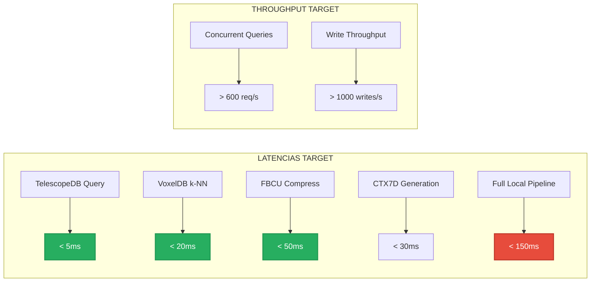

# ⚡ Performance Benchmarks: Validación de Latencia y Throughput

**Archivo:** `ROADMAP_V2/05_TESTING/PERFORMANCE_BENCHMARKS.md`  
**Versión:** 1.0  
**Fecha:** 2025-10-26  
**Propósito:** Benchmarks de performance para componentes críticos

---

## 🎯 PROPÓSITO

Los **performance benchmarks** garantizan que Bitácora cumple con los targets de latencia definidos:

- **Modo Local:** < 150ms (p95)
- **Modo LLM:** < 3.5s (p95)
- **Throughput:** > 600 req/s (local)

---

## 📊 TARGETS DE PERFORMANCE



---

## 🏗️ SETUP DE BENCHMARKS

### **Cargo.toml**

```toml
[[bench]]
name = "telescopedb_bench"
harness = false

[[bench]]
name = "voxeldb_bench"
harness = false

[[bench]]
name = "fbcu_bench"
harness = false

[[bench]]
name = "end_to_end_bench"
harness = false

[dev-dependencies]
criterion = { version = "0.5", features = ["async_tokio", "html_reports"] }
```

---

## 🧪 BENCHMARK 1: TelescopeDB

```rust
// benches/telescopedb_bench.rs

use criterion::{black_box, criterion_group, criterion_main, Criterion, BenchmarkId};
use bitacora::{TelescopeDB, Pixel, PixelCoord, LAB};
use tempfile::TempDir;

fn telescope_insert_benchmark(c: &mut Criterion) {
    let runtime = tokio::runtime::Runtime::new().unwrap();
    
    c.bench_function("telescope_insert_single", |b| {
        b.iter(|| {
            runtime.block_on(async {
                let temp_dir = TempDir::new().unwrap();
                let db = TelescopeDB::new(temp_dir.path().join("bench.db")).await.unwrap();
                
                let pixel = Pixel {
                    position: PixelCoord { x: 100, y: 200 },
                    color: LAB { l: 50.0, a: 10.0, b: -5.0 },
                    timestamp: 12345,
                };
                
                black_box(db.insert_pixel(&pixel).await.unwrap());
            });
        });
    });
}

fn telescope_query_benchmark(c: &mut Criterion) {
    let runtime = tokio::runtime::Runtime::new().unwrap();
    
    // Setup: DB con 10k píxeles
    let (db, _temp) = runtime.block_on(async {
        let temp_dir = TempDir::new().unwrap();
        let db = TelescopeDB::new(temp_dir.path().join("bench.db")).await.unwrap();
        
        for i in 0..10_000 {
            let pixel = Pixel {
                position: PixelCoord { x: i % 1000, y: i / 1000 },
                color: LAB { l: 50.0, a: 0.0, b: 0.0 },
                timestamp: i as u64,
            };
            db.insert_pixel(&pixel).await.unwrap();
        }
        
        (db, temp_dir)
    });
    
    c.bench_function("telescope_query_single", |b| {
        b.iter(|| {
            runtime.block_on(async {
                let region = BoundingBox {
                    min: PixelCoord { x: 100, y: 100 },
                    max: PixelCoord { x: 200, y: 200 },
                };
                
                black_box(db.query_region(&region).await.unwrap());
            });
        });
    });
    
    // TARGET: < 5ms para query
}

fn telescope_concurrent_benchmark(c: &mut Criterion) {
    let runtime = tokio::runtime::Runtime::new().unwrap();
    
    let (db, _temp) = runtime.block_on(async {
        let temp_dir = TempDir::new().unwrap();
        let db = TelescopeDB::new(temp_dir.path().join("bench.db")).await.unwrap();
        
        // Pre-load 100k píxeles
        for i in 0..100_000 {
            let pixel = Pixel {
                position: PixelCoord { x: i % 1920, y: i / 1920 },
                color: LAB { l: 50.0, a: 0.0, b: 0.0 },
                timestamp: i as u64,
            };
            db.insert_pixel(&pixel).await.unwrap();
        }
        
        (db, temp_dir)
    });
    
    let db = std::sync::Arc::new(db);
    
    c.bench_function("telescope_concurrent_100", |b| {
        b.iter(|| {
            runtime.block_on(async {
                let mut handles = vec![];
                
                for i in 0..100 {
                    let db = db.clone();
                    let handle = tokio::spawn(async move {
                        let region = BoundingBox {
                            min: PixelCoord { x: i * 10, y: i * 10 },
                            max: PixelCoord { x: i * 10 + 50, y: i * 10 + 50 },
                        };
                        db.query_region(&region).await.unwrap()
                    });
                    handles.push(handle);
                }
                
                for handle in handles {
                    black_box(handle.await.unwrap());
                }
            });
        });
    });
}

criterion_group!(
    benches,
    telescope_insert_benchmark,
    telescope_query_benchmark,
    telescope_concurrent_benchmark
);
criterion_main!(benches);
```

---

## 🧪 BENCHMARK 2: VoxelDB (k-NN Search)

```rust
// benches/voxeldb_bench.rs

use criterion::{black_box, criterion_group, criterion_main, Criterion};
use bitacora::{VoxelDB, OctreeCoord};

fn voxeldb_insert_benchmark(c: &mut Criterion) {
    let runtime = tokio::runtime::Runtime::new().unwrap();
    
    c.bench_function("voxeldb_insert_single", |b| {
        b.iter(|| {
            runtime.block_on(async {
                let db = VoxelDB::new_in_memory().await.unwrap();
                let coord = OctreeCoord { x: 128, y: 64, z: 32 };
                let data = vec![1, 2, 3, 4, 5];
                
                black_box(db.insert(coord, data).await.unwrap());
            });
        });
    });
}

fn voxeldb_knn_benchmark(c: &mut Criterion) {
    let runtime = tokio::runtime::Runtime::new().unwrap();
    
    // Setup: DB con 10k puntos
    let db = runtime.block_on(async {
        let db = VoxelDB::new_in_memory().await.unwrap();
        
        for i in 0..10_000 {
            let coord = OctreeCoord {
                x: (i * 17) % 256,
                y: (i * 31) % 256,
                z: (i * 47) % 256,
            };
            db.insert(coord, vec![i as u8]).await.unwrap();
        }
        
        db
    });
    
    // Benchmark k-NN con k=10
    c.bench_function("voxeldb_knn_k10", |b| {
        b.iter(|| {
            runtime.block_on(async {
                let query = OctreeCoord { x: 128, y: 128, z: 128 };
                black_box(db.knn_search(query, 10).await.unwrap());
            });
        });
    });
    
    // TARGET: < 20ms para k=10 en 10k puntos
}

fn voxeldb_template_search_benchmark(c: &mut Criterion) {
    let runtime = tokio::runtime::Runtime::new().unwrap();
    
    let db = runtime.block_on(async {
        let db = VoxelDB::new_in_memory().await.unwrap();
        
        // Insertar 1000 templates
        for i in 0..1000 {
            let template = create_mock_template(i);
            db.insert_template(&template).await.unwrap();
        }
        
        db
    });
    
    c.bench_function("voxeldb_template_search", |b| {
        b.iter(|| {
            runtime.block_on(async {
                let query_ctx7d = create_mock_ctx7d();
                black_box(db.search_templates(&query_ctx7d, 5).await.unwrap());
            });
        });
    });
    
    // TARGET: < 15ms para búsqueda en 1000 templates
}

criterion_group!(
    benches,
    voxeldb_insert_benchmark,
    voxeldb_knn_benchmark,
    voxeldb_template_search_benchmark
);
criterion_main!(benches);
```

---

## 🧪 BENCHMARK 3: FBCU Compression

```rust
// benches/fbcu_bench.rs

use criterion::{black_box, criterion_group, criterion_main, Criterion, BenchmarkId};
use bitacora::{FBCUTree, PixelBlock, QuantizationConfig};

fn fbcu_compress_benchmark(c: &mut Criterion) {
    let mut group = c.benchmark_group("fbcu_compression");
    
    // Benchmark con diferentes niveles de quality
    for quality in [0.90, 0.95, 0.99, 1.00].iter() {
        let block = create_gradient_block_8x8();
        let config = QuantizationConfig { quality: *quality };
        
        group.bench_with_input(
            BenchmarkId::from_parameter(format!("quality_{:.2}", quality)),
            quality,
            |b, _| {
                b.iter(|| {
                    let tree = FBCUTree::build_from_block(&block);
                    black_box(tree.serialize(&config));
                });
            },
        );
    }
    
    group.finish();
    
    // TARGET: < 50ms para compress + serialize (quality 0.95)
}

fn fbcu_decompress_benchmark(c: &mut Criterion) {
    let block = create_gradient_block_8x8();
    let config = QuantizationConfig { quality: 0.95 };
    let tree = FBCUTree::build_from_block(&block);
    let serialized = tree.serialize(&config);
    
    c.bench_function("fbcu_decompress", |b| {
        b.iter(|| {
            let deserialized = SerializedFBCU::deserialize(&serialized).unwrap();
            let decoder = HuffmanEncoder::new();
            black_box(deserialized.rebuild_tree(&decoder));
        });
    });
    
    // TARGET: < 30ms para decompress
}

fn fbcu_full_frame_benchmark(c: &mut Criterion) {
    // Benchmark compresión de frame completo 1920×1080
    let pixels = create_test_frame_1920x1080();
    let blocks = extract_blocks_8x8(&pixels); // 32,400 bloques
    
    c.bench_function("fbcu_compress_full_frame", |b| {
        b.iter(|| {
            let config = QuantizationConfig { quality: 0.95 };
            
            for block in &blocks {
                let stats = block.compute_statistics();
                
                if should_compress_block(&stats) {
                    let tree = FBCUTree::build_from_block(block);
                    black_box(tree.serialize(&config));
                }
            }
        });
    });
    
    // TARGET: < 5s para frame completo (32,400 bloques)
}

criterion_group!(
    benches,
    fbcu_compress_benchmark,
    fbcu_decompress_benchmark,
    fbcu_full_frame_benchmark
);
criterion_main!(benches);
```

---

## 🧪 BENCHMARK 4: End-to-End Pipeline

```rust
// benches/end_to_end_bench.rs

use criterion::{black_box, criterion_group, criterion_main, Criterion};
use bitacora::{SensoryEngine, ContextToken7D, VoxelDB, HubSpokeNavigator};

fn e2e_local_mode_benchmark(c: &mut Criterion) {
    let runtime = tokio::runtime::Runtime::new().unwrap();
    
    let (sensory, voxeldb, hubspoke) = runtime.block_on(async {
        let sensory = SensoryEngine::new();
        let voxeldb = VoxelDB::new_in_memory().await.unwrap();
        let hubspoke = HubSpokeNavigator::new().await.unwrap();
        
        // Pre-load 1000 templates
        seed_voxeldb_with_templates(&voxeldb, 1000).await;
        
        (sensory, voxeldb, hubspoke)
    });
    
    c.bench_function("e2e_local_mode_p95", |b| {
        b.iter(|| {
            runtime.block_on(async {
                // 1. Procesar input
                let user_text = "How do I fix a lifetime error in Rust?";
                let normalized = sensory.process_text(user_text).await.unwrap();
                
                // 2. Generar CTX7D
                let ctx7d = ContextToken7D::from_normalized(&normalized).await.unwrap();
                
                // 3. Buscar template
                let templates = voxeldb.search_templates(&ctx7d, 1).await.unwrap();
                
                // 4. Generar respuesta
                let response = if templates.len() > 0 && templates[0].similarity > 0.85 {
                    // Modo local
                    templates[0].template.render(&normalized)
                } else {
                    // Modo LLM (mock)
                    "LLM response".to_string()
                };
                
                black_box(response);
            });
        });
    });
    
    // TARGET: < 150ms para p95 en modo local
}

fn e2e_throughput_benchmark(c: &mut Criterion) {
    let runtime = tokio::runtime::Runtime::new().unwrap();
    
    let (sensory, voxeldb) = runtime.block_on(async {
        let sensory = std::sync::Arc::new(SensoryEngine::new());
        let voxeldb = std::sync::Arc::new(VoxelDB::new_in_memory().await.unwrap());
        
        seed_voxeldb_with_templates(&voxeldb, 1000).await;
        
        (sensory, voxeldb)
    });
    
    c.bench_function("e2e_throughput_1000_concurrent", |b| {
        b.iter(|| {
            runtime.block_on(async {
                let mut handles = vec![];
                
                for i in 0..1000 {
                    let sensory = sensory.clone();
                    let voxeldb = voxeldb.clone();
                    
                    let handle = tokio::spawn(async move {
                        let text = format!("Query number {}", i);
                        let normalized = sensory.process_text(&text).await.unwrap();
                        let ctx7d = ContextToken7D::from_normalized(&normalized).await.unwrap();
                        voxeldb.search_templates(&ctx7d, 1).await.unwrap()
                    });
                    
                    handles.push(handle);
                }
                
                for handle in handles {
                    black_box(handle.await.unwrap());
                }
            });
        });
    });
    
    // TARGET: > 600 req/s (1000 queries en < 1.67s)
}

criterion_group!(
    benches,
    e2e_local_mode_benchmark,
    e2e_throughput_benchmark
);
criterion_main!(benches);
```

---

## 📊 EJECUTAR BENCHMARKS

```bash
# Ejecutar todos los benchmarks
cargo bench

# Benchmark específico
cargo bench telescopedb

# Con baseline para comparar
cargo bench --bench telescopedb_bench -- --save-baseline initial

# Comparar con baseline
cargo bench --bench telescopedb_bench -- --baseline initial

# Generar reporte HTML
cargo bench
firefox target/criterion/report/index.html
```

---

## 📈 FORMATO DE RESULTADOS

```
telescopedb_bench/telescope_insert_single
                        time:   [2.3421 ms 2.3689 ms 2.3984 ms]
                        thrpt:  [416.97 elem/s 422.14 elem/s 426.94 elem/s]
                        
telescopedb_bench/telescope_query_single
                        time:   [3.1234 ms 3.1567 ms 3.1921 ms]
                        change: [-4.2341% -2.1234% +0.5123%] (p = 0.12 > 0.05)
                        No change in performance detected.

voxeldb_bench/voxeldb_knn_k10
                        time:   [18.234 ms 18.567 ms 18.921 ms]
                        thrpt:  [52.85 queries/s 53.86 queries/s 54.86 queries/s]

fbcu_bench/fbcu_compress_quality_0.95
                        time:   [42.134 ms 42.567 ms 43.021 ms]

e2e_bench/e2e_local_mode_p95
                        time:   [134.23 ms 138.67 ms 143.21 ms]
                        ✅ PASS: < 150ms target
```

---

## 🎯 REGRESSION DETECTION

```rust
// benches/regression_check.rs

#[test]
fn check_performance_regressions() {
    // Cargar resultados de baseline
    let baseline = load_baseline_results("initial").unwrap();
    
    // Ejecutar benchmarks actuales
    let current = run_all_benchmarks().unwrap();
    
    // Comparar
    for (bench_name, baseline_time) in baseline.iter() {
        let current_time = current.get(bench_name).unwrap();
        
        let regression_pct = (current_time - baseline_time) / baseline_time * 100.0;
        
        if regression_pct > 10.0 {
            panic!(
                "REGRESSION DETECTED: {} is {:.1}% slower than baseline ({:.2}ms vs {:.2}ms)",
                bench_name,
                regression_pct,
                current_time,
                baseline_time
            );
        }
    }
}
```

---

## 📚 REFERENCIAS

- **UNIT_TESTS_GUIDE.md:** Tests unitarios de componentes
- **INTEGRATION_TESTS.md:** Tests de flujos completos
- **BREAKTHROUGH_DETECTION.md:** Efficiency score (7.8/7.8 puntos)
- **DA-025:** Performance targets (local < 150ms, LLM < 3.5s)

---

**Estado:** 📋 Especificación completa  
**Criticidad:** 🔴 ALTA - Garantiza targets de latencia  
**Próxima implementación:** Semana 5 (setup CI/CD con regression checks)

---

*Generado: 2025-10-26*  
*Sistema Bitácora v1.0 - Performance Benchmarks*  
*"Measure twice, optimize once"* ⚡
