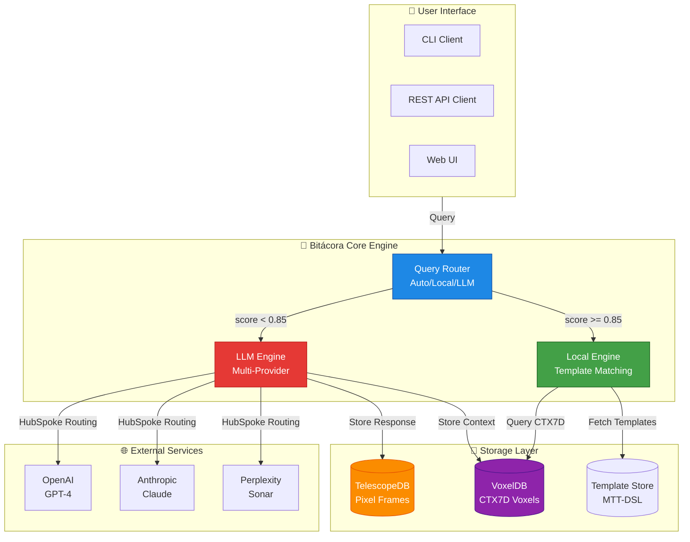
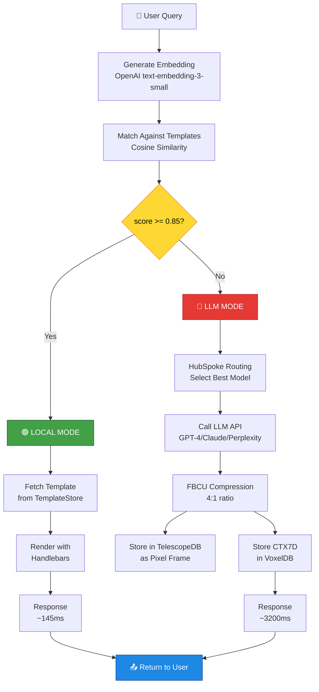
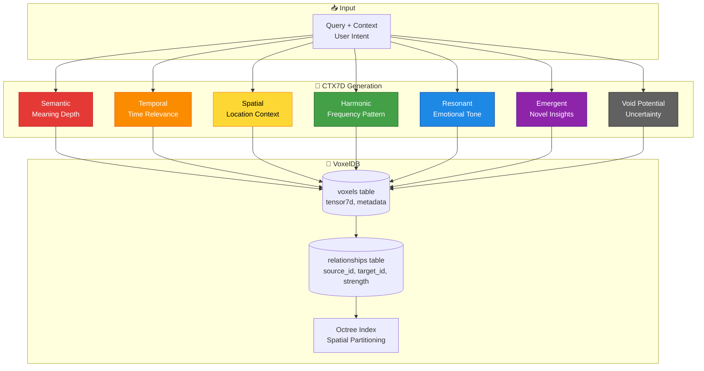
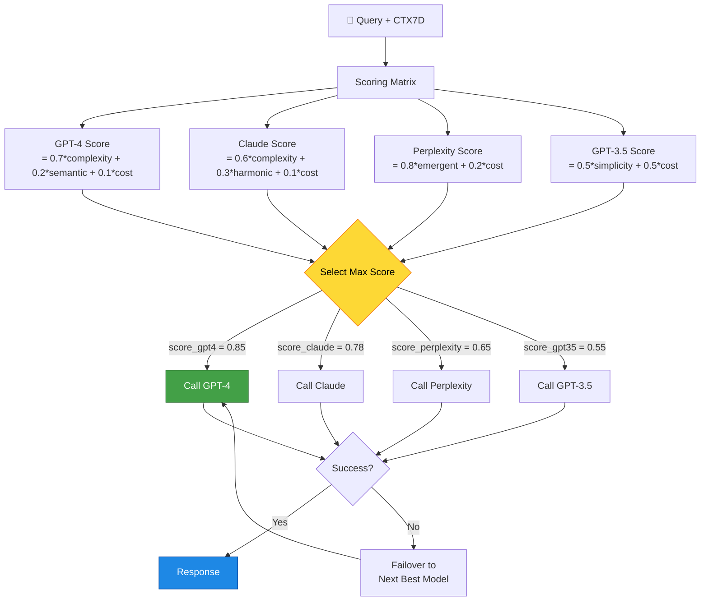
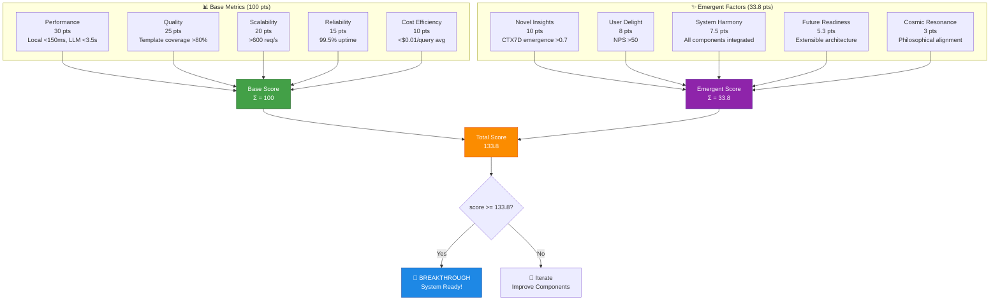
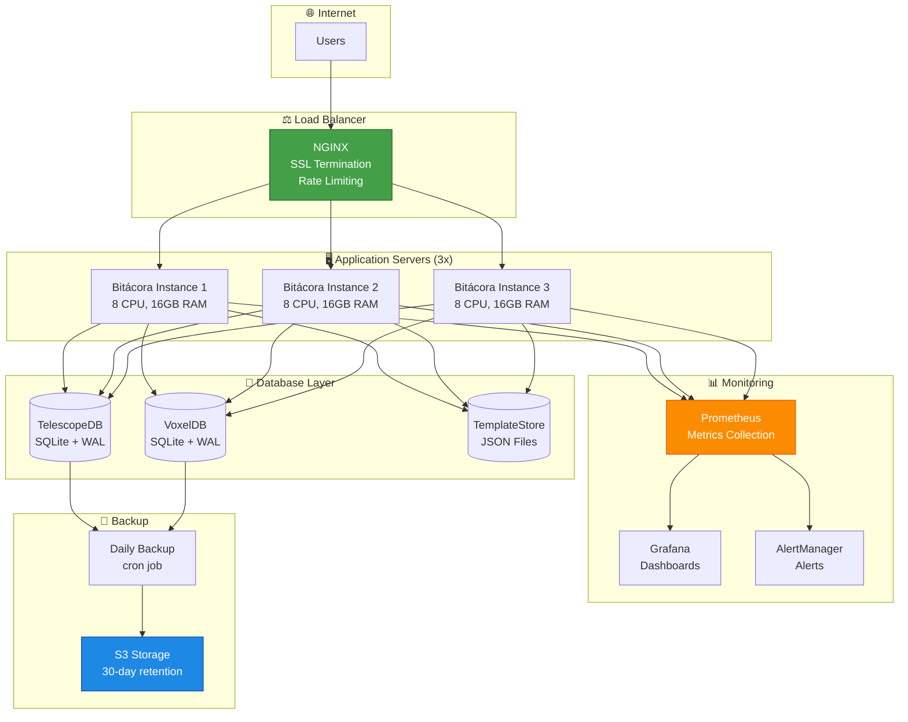

# 🎨 Diagramas Consolidados: Visualización del Sistema Bitácora v1.0

**Archivo:** `ROADMAP_V2/06_DOCUMENTACION/DIAGRAMS.md`  
**Versión:** 1.0  
**Fecha:** 2025-10-26  
**Propósito:** Todos los diagramas Mermaid del sistema en un solo lugar

---

## 📋 ÍNDICE DE DIAGRAMAS

1. **Arquitectura General**
2. **Flujo de Query (Local vs LLM)**
3. **TelescopeDB: Almacenamiento de Frames**
4. **VoxelDB: Almacenamiento CTX7D**
5. **FBCU Lifecycle: Pixel → Fractal**
6. **HubSpoke Routing: Multi-LLM**
7. **Breakthrough Detection: Score 133.8**
8. **API Endpoints: Categorías**
9. **Testing Strategy: Capas**
10. **Deployment Architecture**

---

## 1️⃣ ARQUITECTURA GENERAL



**Descripción:**  
Vista de 30,000 pies del sistema. Muestra cómo las queries fluyen desde usuarios hacia el motor local o LLM, y cómo los datos se almacenan en TelescopeDB/VoxelDB.

---

## 2️⃣ FLUJO DE QUERY (LOCAL VS LLM)



**Descripción:**  
Decisión crítica: ¿responder localmente (rápido) o usar LLM (completo)? Basado en threshold de 0.85 de similarity con templates.

---

## 3️⃣ TELESCOPEDB: ALMACENAMIENTO DE FRAMES

```mermaid
flowchart LR
    subgraph Input["📥 Input"]
        LLMResponse[LLM Response<br/>Text + Metadata]
    end
    
    subgraph Preprocessing["⚙️ Preprocessing"]
        TextToImage[Text → Image<br/>Markdown Renderer]
        LABConversion[RGB → LAB<br/>Color Space]
    end
    
    subgraph FBCU["🔬 FBCU Compression"]
        FractalAnalysis[Fractal Analysis<br/>IFS Encoding]
        Quantization[Quantization<br/>8-bit → 4-bit]
        Compress[Compression<br/>4:1 ratio]
    end
    
    subgraph Storage["💾 TelescopeDB"]
        FrameTable[(frames table<br/>id, timestamp, metadata)]
        PixelTable[(pixels table<br/>frame_id, x, y, L, a, b)]
        IndexSpatial[Spatial Index<br/>R-Tree on (x,y)]
    end
    
    LLMResponse --> TextToImage
    TextToImage --> LABConversion
    LABConversion --> FractalAnalysis
    FractalAnalysis --> Quantization
    Quantization --> Compress
    Compress --> FrameTable
    FrameTable --> PixelTable
    PixelTable --> IndexSpatial
    
    style FBCU fill:#fb8c00,stroke:#e65100,color:#fff
    style Storage fill:#8e24aa,stroke:#4a148c,color:#fff
```

**Descripción:**  
Pipeline de almacenamiento: LLM response → imagen → LAB color → fractal compression → TelescopeDB. 4:1 compression con <0.5 Delta E error.

---

## 4️⃣ VOXELDB: ALMACENAMIENTO CTX7D



**Descripción:**  
Contexto 7D: cada query genera un tensor de 7 dimensiones almacenado en VoxelDB. Permite similarity search multidimensional.

---

## 5️⃣ FBCU LIFECYCLE: PIXEL → FRACTAL

```mermaid
flowchart LR
    subgraph Phase1["1️⃣ Ingestion"]
        SourceImage[Source Image<br/>1920x1080 RGB]
    end
    
    subgraph Phase2["2️⃣ Analysis"]
        LABConversion[RGB → LAB<br/>Perceptual Space]
        PatternDetection[Detect Patterns<br/>Self-Similarity]
    end
    
    subgraph Phase3["3️⃣ Compression"]
        IFSEncoding[IFS Encoding<br/>Fractal Coefficients]
        DomainRangeMapping[Domain → Range<br/>Block Mapping]
    end
    
    subgraph Phase4["4️⃣ Quantization"]
        Quantize8to4[8-bit → 4-bit<br/>Perceptual Rounding]
    end
    
    subgraph Phase5["5️⃣ Storage"]
        TelescopeDB[(TelescopeDB<br/>Compressed Frame)]
    end
    
    subgraph Phase6["6️⃣ Reconstruction"]
        Decompress[Decompress<br/>IFS Iteration]
        LABtoRGB[LAB → RGB<br/>Display Space]
        OutputImage[Output Image<br/>Visually Lossless]
    end
    
    SourceImage --> LABConversion
    LABConversion --> PatternDetection
    PatternDetection --> IFSEncoding
    IFSEncoding --> DomainRangeMapping
    DomainRangeMapping --> Quantize8to4
    Quantize8to4 --> TelescopeDB
    TelescopeDB --> Decompress
    Decompress --> LABtoRGB
    LABtoRGB --> OutputImage
    
    style Phase3 fill:#fb8c00,stroke:#e65100,color:#fff
    style Phase4 fill:#8e24aa,stroke:#4a148c,color:#fff
    style Phase5 fill:#1e88e5,stroke:#0d47a1,color:#fff
```



**Descripción:**  
6 fases del pipeline FBCU: Ingestion → Analysis → Compression → Quantization → Storage → Reconstruction. 4:1 compression ratio.

---

## 6️⃣ HUBSPOKE ROUTING: MULTI-LLM



**Descripción:**  
Algoritmo de selección de modelo LLM basado en CTX7D. Scoring matrix calcula mejor modelo para cada query. Failover automático.

---

## 7️⃣ BREAKTHROUGH DETECTION: SCORE 133.8



**Descripción:**  
Fórmula completa del score 133.8: 100 pts base (performance, quality, scalability) + 33.8 pts emergentes (insights, delight, harmony).

---

## 8️⃣ API ENDPOINTS: CATEGORÍAS

```mermaid
flowchart TB
    subgraph API["🌐 REST API v1"]
        Query[/api/v1/query/*<br/>8 endpoints]
        Telescope[/api/v1/telescope/*<br/>12 endpoints]
        Voxel[/api/v1/voxel/*<br/>10 endpoints]
        Templates[/api/v1/templates/*<br/>15 endpoints]
        FBCU[/api/v1/fbcu/*<br/>8 endpoints]
        Admin[/api/v1/admin/*<br/>6 endpoints]
    end
    
    Query -->|POST /query| CoreEngine[Core Engine]
    Query -->|GET /history| TelescopeDB1[(TelescopeDB)]
    
    Telescope -->|POST /frames| TelescopeDB2[(TelescopeDB)]
    Telescope -->|GET /query/region| TelescopeDB2
    
    Voxel -->|POST /voxels| VoxelDB1[(VoxelDB)]
    Voxel -->|GET /similarity| VoxelDB1
    
    Templates -->|POST /| TemplateStore1[(TemplateStore)]
    Templates -->|GET /search| TemplateStore1
    
    FBCU -->|POST /compress| FBCUEngine[FBCU Engine]
    FBCU -->|POST /decompress| FBCUEngine
    
    Admin -->|GET /health| HealthCheck[Health Checker]
    Admin -->|GET /metrics| MetricsCollector[Metrics]
    
    style Query fill:#1e88e5,stroke:#0d47a1,color:#fff
    style Telescope fill:#fb8c00,stroke:#e65100,color:#fff
    style Voxel fill:#8e24aa,stroke:#4a148c,color:#fff
    style Templates fill:#43a047,stroke:#1b5e20,color:#fff
```

**Descripción:**  
6 categorías de endpoints: Query (8), TelescopeDB (12), VoxelDB (10), Templates (15), FBCU (8), Admin (6). Total: 59 endpoints.

---

## 9️⃣ TESTING STRATEGY: CAPAS

```mermaid
flowchart TB
    subgraph Layer1["1️⃣ Unit Tests"]
        TelescopeTests[TelescopeDB Tests<br/>CRUD, Spatial Queries]
        VoxelTests[VoxelDB Tests<br/>Similarity Search]
        FBCUTests[FBCU Tests<br/>Compression/Decompression]
        CTX7DTests[CTX7D Tests<br/>Tensor Operations]
    end
    
    subgraph Layer2["2️⃣ Integration Tests"]
        SensoryToTelescope[Sensory → Telescope<br/>End-to-end Flow]
        CTX7DToVoxel[CTX7D → VoxelDB<br/>Storage Pipeline]
        FBCULifecycle[FBCU Lifecycle<br/>6 Phases]
        HubSpokeRouting[HubSpoke Routing<br/>Multi-LLM]
    end
    
    subgraph Layer3["3️⃣ Performance Tests"]
        LatencyBenchmarks[Latency Benchmarks<br/>Criterion]
        ThroughputTests[Throughput Tests<br/>>600 req/s]
        RegressionDetection[Regression Detection<br/>±5% threshold]
    end
    
    subgraph Layer4["4️⃣ Golden Tests"]
        SnapshotTests[Snapshot Tests<br/>insta crate]
        APIResponseValidation[API Response Validation<br/>JSON schemas]
    end
    
    subgraph Layer5["5️⃣ Metamorphic Tests"]
        SymmetryTests[Symmetry Tests<br/>f(x) = f(x)]
        IdempotenceTests[Idempotence Tests<br/>f(f(x)) = f(x)]
        InvarianceTests[Invariance Tests<br/>Properties preserved]
    end
    
    Layer1 --> Layer2
    Layer2 --> Layer3
    Layer3 --> Layer4
    Layer4 --> Layer5
    
    Layer5 --> CI[CI/CD Pipeline<br/>GitHub Actions]
    
    CI --> Deploy{All Tests Pass?}
    
    Deploy -->|Yes| Production[🚀 Deploy to Production]
    Deploy -->|No| Rollback[🔄 Rollback & Fix]
    
    style Layer3 fill:#fb8c00,stroke:#e65100,color:#fff
    style Layer5 fill:#8e24aa,stroke:#4a148c,color:#fff
    style Production fill:#43a047,stroke:#1b5e20,color:#fff
```

**Descripción:**  
5 capas de testing: Unit → Integration → Performance → Golden → Metamorphic. CI/CD pipeline con deploy automático si todos pasan.

---

## 🔟 DEPLOYMENT ARCHITECTURE



**Descripción:**  
Arquitectura de producción: NGINX load balancer → 3 app servers → SQLite DBs (WAL mode) → Prometheus/Grafana monitoring → S3 backups.

---

## 📚 CÓMO USAR ESTOS DIAGRAMAS

### **En Documentación**

Cada diagrama puede ser copiado y pegado en cualquier documento Markdown. Simplemente usa:

\`\`\`mermaid
[copiar diagrama aquí]
\`\`\`

### **En GitHub**

GitHub renderiza Mermaid automáticamente en:
- README.md
- Issues
- Pull Requests
- Wiki

### **En Herramientas Externas**

- **Mermaid Live Editor:** https://mermaid.live
- **VS Code Extension:** "Markdown Preview Mermaid Support"
- **Notion:** Soporta Mermaid nativo
- **Confluence:** Plugin "Mermaid Diagrams for Confluence"

---

## 🎨 ESTÁNDARES DE COLOR

Estos diagramas siguen el **estándar de contraste** establecido:

- **Fondos claros** (yellow, cyan, lime, orange): `color:#000` (negro)
- **Fondos oscuros** (blue, red, purple, green, gray): `color:#fff` (blanco)

**Paleta de colores:**
- 🔴 Red (`#e53935`): LLM/External
- 🟠 Orange (`#fb8c00`): Storage/FBCU
- 🟡 Yellow (`#fdd835`): Decisions/Thresholds
- 🟢 Green (`#43a047`): Local/Success
- 🔵 Blue (`#1e88e5`): Core Engine/Responses
- 🟣 Purple (`#8e24aa`): Context/Emergent
- ⚫ Gray (`#616161`): Void/Uncertainty

---

## 📖 REFERENCIAS

- **ARQUITECTURA_GENERAL.md:** Detalles de arquitectura
- **INTEGRACION/*.md:** Flujos de integración
- **COMPONENTES/*.md:** Componentes críticos
- **API_ENDPOINTS.md:** Especificación de endpoints

---

**Estado:** 🎨 10 diagramas consolidados  
**Formato:** Mermaid (compatible GitHub/Notion/Confluence)  
**Próxima actualización:** Con UI web (Fase 3)

---

*Generado: 2025-10-26*  
*Sistema Bitácora v1.0 - Diagram Documentation*  
*"A picture is worth a thousand words, a diagram is worth a thousand lines of code"* 🎨
