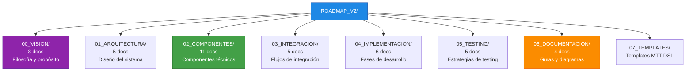
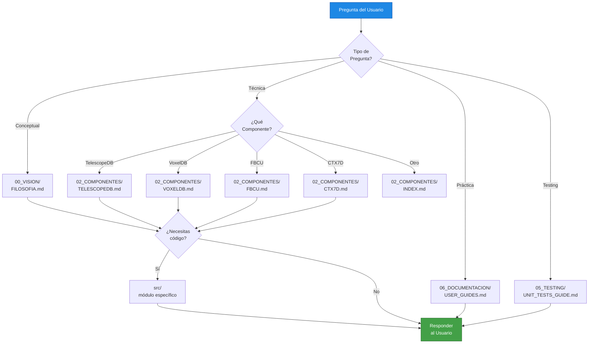

# 🧭 Navigation Guide: Guía de Navegación para LLMs y Desarrolladores

**Archivo:** `ROADMAP_V2/06_DOCUMENTACION/NAVIGATION_GUIDE.md`  
**Versión:** 1.0  
**Fecha:** 2025-10-26  
**Propósito:** Cómo navegar eficientemente el codebase y documentación de Bitácora

---

## 🎯 AUDIENCIA

Esta guía está diseñada para:

1. **LLMs (Large Language Models)** que ayudan con el desarrollo
2. **Desarrolladores nuevos** en el proyecto
3. **AI Coding Assistants** (GitHub Copilot, Cursor, etc.)

---

## 📁 ESTRUCTURA DEL PROYECTO

### **Vista de Alto Nivel**

```
bitacora_v1.0/
├── ROADMAP_V2/           ← 🧭 EMPIEZA AQUÍ (Documentación completa)
├── src/                  ← 💻 Código fuente Rust
├── SANDBOX/              ← 🧪 Pruebas y experimentos
├── tests/                ← ✅ Tests unitarios e integración
├── examples/             ← 📚 Ejemplos de uso
├── FUSION_BAYESIANA/     ← 🔬 Análisis arquitectónico previo
└── scripts/              ← 🛠️ Scripts de utilidad
```

### **Prioridad de Lectura para Nuevos Usuarios**

1. **ROADMAP_V2/README.md** (5 min) - Overview del proyecto
2. **ROADMAP_V2/00_VISION/FILOSOFIA.md** (10 min) - Entender la filosofía
3. **ROADMAP_V2/01_ARQUITECTURA/ARQUITECTURA_GENERAL.md** (15 min) - Arquitectura del sistema
4. **ROADMAP_V2/06_DOCUMENTACION/API_ENDPOINTS.md** (10 min) - API reference
5. **ROADMAP_V2/06_DOCUMENTACION/USER_GUIDES.md** (20 min) - Ejemplos prácticos

**Total:** ~1 hora para contexto básico

---

## 🗺️ MAPA DE DOCUMENTACIÓN (ROADMAP_V2/)

### **Jerarquía de Carpetas**



---

## 🔍 BÚSQUEDA RÁPIDA: "¿DÓNDE ENCUENTRO...?"

### **Conceptos Filosóficos**

| Concepto | Documento | Sección |
|----------|-----------|---------|
| ¿Qué es CTX7D? | `00_VISION/FILOSOFIA.md` | "Context Token 7D" |
| ¿Por qué 133.8? | `00_VISION/METRICAS_EXITO.md` | "Score 133.8" |
| Equipaje Primordial | `00_VISION/EQUIPAJE_PRIMORDIAL.md` | Todo el doc |
| Harmonious Intelligence | `00_VISION/HARMONIOUS_INTELLIGENCE.md` | "Principles" |

### **Componentes Técnicos**

| Componente | Documento | Código |
|------------|-----------|--------|
| TelescopeDB | `02_COMPONENTES/CRITICOS/TELESCOPEDB.md` | `src/storage/telescope.rs` |
| VoxelDB | `02_COMPONENTES/CRITICOS/VOXELDB.md` | `src/storage/voxel.rs` |
| FBCU | `02_COMPONENTES/CRITICOS/FBCU.md` | `src/compression/fbcu.rs` |
| CTX7D | `02_COMPONENTES/CRITICOS/CTX7D.md` | `src/context/ctx7d.rs` |
| Sensory | `02_COMPONENTES/CRITICOS/SENSORY.md` | `src/sensory/mod.rs` |
| HubSpoke Router | `03_INTEGRACION/HUBSPOKE_ROUTING.md` | `src/routing/hubspoke.rs` |

### **Flujos de Integración**

| Flujo | Documento | Diagrama |
|-------|-----------|----------|
| Sensory → TelescopeDB | `03_INTEGRACION/SENSORY_TO_TELESCOPEDB.md` | Sección 3 |
| CTX7D → VoxelDB | `03_INTEGRACION/CTX7D_TO_VOXELDB.md` | Sección 3 |
| FBCU Lifecycle | `03_INTEGRACION/FBCU_LIFECYCLE.md` | Sección 4 |
| HubSpoke Routing | `03_INTEGRACION/HUBSPOKE_ROUTING.md` | Sección 5 |
| Breakthrough Detection | `03_INTEGRACION/BREAKTHROUGH_DETECTION.md` | Sección 6 |

### **API y Desarrollo**

| Tarea | Documento | Ejemplo |
|-------|-----------|---------|
| Hacer un query | `06_DOCUMENTACION/USER_GUIDES.md` | "Quickstart" |
| Ver todos los endpoints | `06_DOCUMENTACION/API_ENDPOINTS.md` | Sección 2-7 |
| Escribir tests | `05_TESTING/UNIT_TESTS_GUIDE.md` | Sección 4-10 |
| Benchmarks | `05_TESTING/PERFORMANCE_BENCHMARKS.md` | Sección 5 |
| Deployment | `06_DOCUMENTACION/USER_GUIDES.md` | "Guía para Admins" |

### **Implementación**

| Fase | Documento | Status |
|------|-----------|--------|
| Fase 1: Fundación | `04_IMPLEMENTACION/PHASE_1_FOUNDATIONS.md` | ✅ Completo |
| Fase 2: Arquitectura Cognitiva | `04_IMPLEMENTACION/PHASE_2_COGNITIVE_ARCH.md` | ⏸️ Pendiente |
| Fase 3: Enhancements | `04_IMPLEMENTACION/PHASE_3_ENHANCEMENTS.md` | ⏸️ Pendiente |
| Fase 4: Optimization | `04_IMPLEMENTACION/PHASE_4_OPTIMIZATION.md` | ⏸️ Pendiente |
| Fase 5: Testing | `04_IMPLEMENTACION/PHASE_5_TESTING.md` | ⏸️ Pendiente |
| Fase 6: Production | `04_IMPLEMENTACION/PHASE_6_PRODUCTION.md` | ⏸️ Pendiente |

---

## 🤖 GUÍA PARA LLMs: PATRONES DE NAVEGACIÓN

### **Patrón 1: "Entender un Concepto"**

```
Query: "¿Qué es CTX7D?"

Secuencia de lectura:
1. 00_VISION/FILOSOFIA.md (contexto filosófico)
2. 02_COMPONENTES/CRITICOS/CTX7D.md (detalles técnicos)
3. 03_INTEGRACION/CTX7D_TO_VOXELDB.md (cómo se usa)
4. src/context/ctx7d.rs (implementación)
```

### **Patrón 2: "Implementar una Feature"**

```
Query: "Agregar soporte para nuevo LLM provider"

Secuencia de lectura:
1. 01_ARQUITECTURA/ARQUITECTURA_GENERAL.md (arquitectura)
2. 03_INTEGRACION/HUBSPOKE_ROUTING.md (routing actual)
3. src/routing/hubspoke.rs (código actual)
4. 05_TESTING/INTEGRATION_TESTS.md (tests necesarios)
5. examples/multi_agent_demo.rs (ejemplos)
```

### **Patrón 3: "Debuggear un Problema"**

```
Query: "TelescopeDB query lenta"

Secuencia de lectura:
1. 02_COMPONENTES/CRITICOS/TELESCOPEDB.md (diseño)
2. 05_TESTING/PERFORMANCE_BENCHMARKS.md (targets esperados)
3. src/storage/telescope.rs (implementación)
4. 06_DOCUMENTACION/USER_GUIDES.md (troubleshooting)
```

### **Patrón 4: "Escribir Tests"**

```
Query: "Test para FBCU compression"

Secuencia de lectura:
1. 02_COMPONENTES/CRITICOS/FBCU.md (qué testear)
2. 03_INTEGRACION/FBCU_LIFECYCLE.md (flujo completo)
3. 05_TESTING/UNIT_TESTS_GUIDE.md (estructura de tests)
4. tests/fbcu_tests.rs (tests existentes)
```

---

## 📊 ÍNDICE DE TÉRMINOS TÉCNICOS

### **A-D**

- **Astillero:** Sistema de backups automáticos
- **Breakthrough Detection:** Algoritmo que detecta cuando el sistema alcanza score 133.8
- **CTX7D (Context Token 7D):** Tensor de 7 dimensiones (semantic, temporal, spatial, harmonic, resonant, emergent, void)
- **Delta E:** Métrica de diferencia perceptual de color en espacio LAB

### **E-H**

- **Equipaje Primordial:** Conjunto de conocimientos base del sistema
- **FBCU (Fractal-Based Compression Unit):** Algoritmo de compresión fractal para pixel frames
- **Harmonious Intelligence:** Principio de AI colaborativa (no competitiva)
- **HubSpoke Routing:** Algoritmo de selección de modelo LLM basado en CTX7D

### **I-M**

- **IFS (Iterated Function System):** Base matemática de compresión fractal
- **LAB Color Space:** Espacio de color perceptual (L=lightness, a=green-red, b=blue-yellow)
- **Local Mode:** Modo de ejecución usando templates locales (<150ms)
- **LLM Mode:** Modo de ejecución usando modelos externos (GPT-4, Claude, etc.)
- **MTT-DSL:** Meta-Template Template Domain Specific Language

### **N-S**

- **Pixel Frame:** Representación de LLM response como imagen 1920x1080
- **Sensory:** Módulo de entrada/salida del sistema
- **Score 133.8:** Métrica de "breakthrough" (100 base + 33.8 emergent)

### **T-Z**

- **TelescopeDB:** Base de datos para almacenar pixel frames comprimidos
- **Tensor7D:** Estructura de datos para CTX7D (7 dimensiones float)
- **Template:** Respuesta pre-generada para queries comunes
- **VoxelDB:** Base de datos para almacenar voxels CTX7D
- **Void Potential:** Dimensión 7 de CTX7D (potencial de incertidumbre)

---

## 🛠️ HERRAMIENTAS DE NAVEGACIÓN

### **Búsqueda por Contenido**

```bash
# Buscar un término en toda la documentación
grep -r "CTX7D" ROADMAP_V2/

# Buscar en código Rust
grep -r "struct.*CTX7D" src/

# Buscar imports de un módulo
grep -r "use.*telescope" src/
```

### **Validación de Referencias Cruzadas**

```bash
# Verificar que todos los links internos existan
find ROADMAP_V2/ -name "*.md" -exec grep -H "\[.*\](.*\.md)" {} \; | \
  while IFS=: read file link; do
    target=$(echo $link | sed 's/.*(\(.*\))/\1/')
    [ -f "$target" ] || echo "Broken link in $file: $target"
  done
```

### **Generación de Índice**

```bash
# Generar índice de todos los documentos
find ROADMAP_V2/ -name "*.md" -type f | sort | \
  sed 's|ROADMAP_V2/||' | \
  awk '{print "- " $0}'
```

---

## 📋 CHECKLIST DE NAVEGACIÓN PARA LLMs

Cuando un LLM está ayudando con Bitácora, debe:

### **Fase 1: Contexto Inicial (Primera Interacción)**

- [ ] Leer `ROADMAP_V2/README.md` para overview
- [ ] Leer `ROADMAP_V2/00_VISION/FILOSOFIA.md` para entender principios
- [ ] Leer `ROADMAP_V2/GUIA.md` para metodología de trabajo
- [ ] Identificar qué carpeta de ROADMAP_V2 es relevante para la query

### **Fase 2: Profundización (Según Necesidad)**

- [ ] Leer documento específico de componente/integración/testing
- [ ] Revisar código fuente en `src/` si es necesario
- [ ] Buscar tests existentes en `tests/`
- [ ] Revisar ejemplos en `examples/`

### **Fase 3: Validación (Antes de Responder)**

- [ ] Verificar que la solución sigue la filosofía de Harmonious Intelligence
- [ ] Confirmar que usa componentes existentes (TelescopeDB, VoxelDB, etc.)
- [ ] Asegurar que hay tests para la nueva funcionalidad
- [ ] Validar que la documentación será actualizada

### **Fase 4: Actualización (Después de Cambios)**

- [ ] Actualizar documento relevante en ROADMAP_V2/
- [ ] Actualizar `CHECKLIST_V2.md` si aplica
- [ ] Agregar entry en `JARDIN_DE_REFLEXIONES.md` si hay insights
- [ ] Documentar decisiones importantes

---

## 🎯 ESTRATEGIAS DE BÚSQUEDA EFICIENTE

### **Por Tipo de Pregunta**

| Tipo | Estrategia |
|------|-----------|
| **"¿Qué es X?"** | 1. FILOSOFIA.md → 2. Componente específico → 3. Código |
| **"¿Cómo hacer Y?"** | 1. USER_GUIDES.md → 2. API_ENDPOINTS.md → 3. Examples |
| **"¿Por qué Z?"** | 1. FILOSOFIA.md → 2. ARQUITECTURA_GENERAL.md → 3. ADRs |
| **"¿Dónde está W?"** | 1. Este doc (NAVIGATION_GUIDE) → 2. grep → 3. Código |

### **Por Rol del Usuario**

| Rol | Punto de Entrada |
|-----|------------------|
| **Nuevo Desarrollador** | README → USER_GUIDES → Ejemplos |
| **Arquitecto** | ARQUITECTURA_GENERAL → Componentes → Integración |
| **Tester** | TESTING/* → tests/ → Benchmarks |
| **DevOps** | USER_GUIDES (Admin) → scripts/ → Deployment |
| **LLM Assistant** | Este doc → FILOSOFIA → Componente específico |

---

## 🌳 ÁRBOL DE DECISIÓN: "¿QUÉ DOCUMENTO LEER?"



---

## 📖 REFERENCIAS EXTERNAS

### **Documentación Técnica**

- **Rust Book:** https://doc.rust-lang.org/book/
- **Tokio Docs:** https://docs.rs/tokio/
- **SQLite Docs:** https://www.sqlite.org/docs.html
- **Mermaid Docs:** https://mermaid.js.org/

### **Papers Académicos**

- **Fractal Compression:** Barnsley, M. (1988) "Fractals Everywhere"
- **LAB Color Space:** CIE 1976 L*a*b* color space
- **Context Embeddings:** Attention Is All You Need (Vaswani et al.)

### **Proyectos Relacionados**

- **LangChain:** Framework para LLM applications
- **ChromaDB:** Vector database (similar a VoxelDB)
- **Qdrant:** Otro vector DB de referencia

---

## 🔄 ACTUALIZACIÓN DE ESTE DOCUMENTO

Este documento debe actualizarse cuando:

1. Se agrega una nueva carpeta a ROADMAP_V2/
2. Se renombra o mueve un documento importante
3. Se descubre un patrón de navegación nuevo
4. Se agregan nuevos términos técnicos
5. Se detectan links rotos

**Última actualización:** 2025-10-26  
**Próxima revisión:** Al completar Fase 2 de implementación

---

## 💡 TIPS PARA NAVEGACIÓN EFICIENTE

### **Para LLMs**

1. **No asumas:** Siempre lee el documento antes de responder
2. **Contexto primero:** Empieza por FILOSOFIA.md y ARQUITECTURA_GENERAL.md
3. **Valida referencias:** Verifica que los archivos mencionados existan
4. **Sigue la jerarquía:** Vision → Arquitectura → Componentes → Código
5. **Actualiza documentación:** Si haces cambios, actualiza los docs

### **Para Desarrolladores**

1. **Empieza por ejemplos:** `examples/` tiene código funcional
2. **Lee tests:** `tests/` muestra cómo usar cada componente
3. **Usa grep:** Busca por término antes de preguntar
4. **Consulta diagramas:** `06_DOCUMENTACION/DIAGRAMS.md` tiene visualizaciones
5. **Sigue GUIA.md:** Metodología de trabajo del proyecto

---

**Estado:** 🧭 Guía completa de navegación  
**Cobertura:** LLMs, Developers, Search patterns  
**Próxima actualización:** Con nuevas secciones en ROADMAP_V2

---

*Generado: 2025-10-26*  
*Sistema Bitácora v1.0 - Navigation Documentation*  
*"Lost in code? Follow the map."* 🗺️
