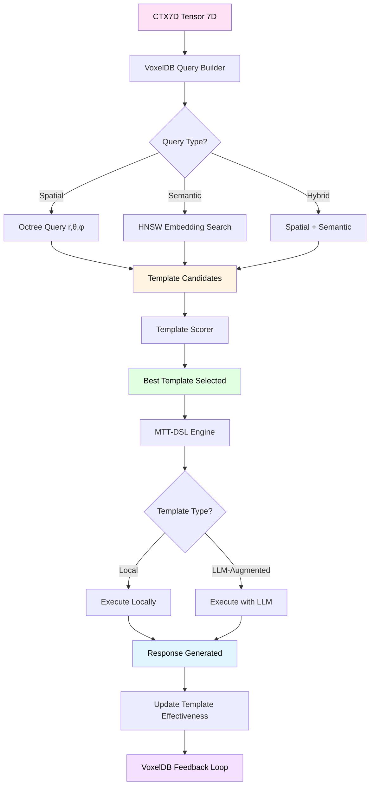

```yaml
# === DATOS DE AUDITORÍA ===
Archivo: ROADMAP_V2/03_INTEGRACION/02_ctx7d-to-voxeldb.md
Versión: 1.1
Fecha Creación: 2025-10-26
Última Actualización: 2025-11-23
Autor: Sistema Bitácora - Documentación de Flujos E2E
Propósito: Pipeline de template matching desde CTX7D → VoxelDB
Estado: ACTIVO - IMPLEMENTADO ✅ (2025-10-28)
Relacionado Con: 02_COMPONENTES/02_context-token-7d.md, 06_voxeldb.md, 11_mtt-dsl-templates.md
Implementa: DA-012 (Templates en VoxelDB), DA-016 (MTT-DSL desacoplamiento)
# === FIN DATOS DE AUDITORÍA ===
```

# 🎯→🧊 CONTEXT TOKEN 7D → VOXELDB PIPELINE

---

## 🎯 PROPÓSITO

Este documento especifica el **pipeline de template matching** que usa **Context Token 7D** para encontrar y ejecutar **templates MTT-DSL** almacenados en VoxelDB.

### El Flujo Completo

```
CTX7D Tensor → VoxelDB Query → Template Match → Template Execution → Response
  (analyze)     (spatial+semantic)  (select)      (MTT-DSL)         (output)
```

**¿Por qué es crítico?**  
Este pipeline permite que **90% de queries se resuelvan localmente** sin LLM, usando templates pre-existentes que se ajustan al contexto del usuario.

---

## 🌊 DIAGRAMA DE FLUJO



---

## 📋 FASES DEL PIPELINE

### FASE 1: Query Builder (CTX7D → Coordenadas Cúbicas)

**Input:** ContextToken7D  
**Output:** VoxelQuery (coordenadas + embedding + filters)

```rust
// Tensor 7D del usuario
let ctx7d = ContextToken7D {
    tensor: Tensor7D {
        semantic: 0.85,      // Alta complejidad técnica
        intentional: 0.90,   // Debugging claro
        temporal: 0.80,      // Urgencia alta
        emotional: 0.30,     // Frustración moderada
        complexity: 0.75,    // Problema complejo
        coherence: 0.95,     // Input coherente
        biographical: 0.60,  // Conectado con historial
    },
    // ... metadata
};

// Construir query para VoxelDB
let query_builder = VoxelQueryBuilder::new();
let voxel_query = query_builder.from_ctx7d(&ctx7d)?;

// voxel_query ahora es:
VoxelQuery {
    coords: CubicCoords {
        x: 0.0,   // Category: Technical (semantic → category)
        y: 0.75,  // Complexity: Complex (complexity directo)
        z: 0.5,   // Effectiveness: Average (inicial, se ajusta)
    },
    radius: 0.3,  // Búsqueda en vecindad 30%
    embedding: Some(vec![/* embedding del input */]),
    filters: QueryFilters {
        min_effectiveness: 0.6,  // Solo templates efectivos
        categories: vec![TemplateCategory::Technical],
        max_results: 10,
    },
}
```

**Mapping CTX7D → Cubic Coords:**

| CTX7D Dimension | VoxelDB Axis | Formula |
|-----------------|--------------|---------|
| `semantic` (complejidad) | `y` (complexity) | `y = complexity` |
| `intentional` (claridad) | - | Usado en scoring final |
| `complexity` | `y` (complexity) | `y = complexity` |
| Dominio detectado | `x` (category) | Technical=0.0, Creative=0.33, etc. |
| Effectiveness histórico | `z` (effectiveness) | Inicialmente 0.5, luego se ajusta |

---

### FASE 2: VoxelDB Query (Spatial + Semantic)

**Input:** VoxelQuery  
**Output:** Template candidates (ordenados por score)

```rust
// Ejecutar query en VoxelDB
let voxeldb = VoxelDB::new(PathBuf::from(".bitacora/voxel"))?;

// Query híbrido (espacial + semántico)
let candidates = voxeldb.query_hybrid(
    voxel_query.coords,
    voxel_query.radius,
    &user_input_text,  // Para embedding semántico
    voxel_query.filters.max_results,
).await?;

// candidates ahora es:
vec![
    VoxelEntry {
        id: "debugging_deep_dive_v2",
        coords: CubicCoords { x: 0.0, y: 0.78, z: 0.92 },
        template: Template { name: "debugging_deep_dive", ... },
        embedding: vec![...],
        effectiveness: EffectivenessMetrics {
            usage_count: 150,
            effectiveness_score: 0.92,  // Muy efectivo
            ...
        },
    },
    VoxelEntry {
        id: "problem_solving_structured_v1",
        coords: CubicCoords { x: 0.0, y: 0.65, z: 0.78 },
        template: Template { name: "problem_solving_structured", ... },
        effectiveness: EffectivenessMetrics {
            usage_count: 80,
            effectiveness_score: 0.78,
            ...
        },
    },
    // ... 8 candidates más
]
```

**Ordenamiento:**
1. **Distancia espacial** (coords más cercanas = +score)
2. **Similaridad semántica** (embedding similarity = +score)
3. **Effectiveness histórico** (templates probados = +score)
4. **Uso reciente** (templates usados hace poco = +score)

---

### FASE 3: Template Scoring (Selección Final)

**Input:** Template candidates + CTX7D  
**Output:** Best template (score máximo)

```rust
// Scorer de templates
let scorer = TemplateScorer::new();
let scored = scorer.score_candidates(&candidates, &ctx7d)?;

// Algoritmo de scoring
pub fn calculate_score(candidate: &VoxelEntry, ctx7d: &ContextToken7D) -> f64 {
    let mut score = 0.0;
    
    // Factor 1: Distancia espacial (40% peso)
    let spatial_distance = candidate.coords.distance(&query_coords);
    score += (1.0 - spatial_distance) * 0.4;
    
    // Factor 2: Similaridad semántica (30% peso)
    let semantic_sim = cosine_similarity(&candidate.embedding, &query_embedding);
    score += semantic_sim * 0.3;
    
    // Factor 3: Effectiveness histórico (20% peso)
    score += candidate.effectiveness.effectiveness_score * 0.2;
    
    // Factor 4: Match intencional (10% peso)
    let intent_match = if ctx7d.tensor.intentional > 0.8 {
        // Usuario tiene intención clara → templates directos
        candidate.template.triggers.iter()
            .any(|t| t.contains("debugging") || t.contains("problem"))
            .then_some(1.0).unwrap_or(0.5)
    } else {
        0.5  // Intención ambigua → neutral
    };
    score += intent_match * 0.1;
    
    score.min(1.0)
}

// El mejor template
let best = scored.into_iter()
    .max_by(|a, b| a.score.partial_cmp(&b.score).unwrap())
    .unwrap();

println!("Selected template: {} (score: {:.2})", best.template.name, best.score);
// Output: "Selected template: debugging_deep_dive (score: 0.89)"
```

---

### FASE 4: Template Execution (MTT-DSL Engine)

**Input:** Selected template + User input  
**Output:** Generated response

```rust
// Cargar MTT-DSL engine
let mtt_engine = MTTDSLEngine::new()?;

// Ejecutar template
let execution = mtt_engine.execute(
    &best.template,
    ExecutionContext {
        user_input: user_input_text.clone(),
        ctx7d: ctx7d.clone(),
        session_state: SessionState::default(),
    }
).await?;

// execution ahora es:
TemplateExecution {
    template_name: "debugging_deep_dive",
    sections_completed: vec![
        "problem_statement",
        "context_gathering",
        "hypothesis_generation",
        "validation_plan",
        "solution",
    ],
    llm_calls: 2,  // Solo 2 LLM calls vs 5-10 sin template
    local_processing_ratio: 0.85,  // 85% local
    response: "Analizando el problema de ownership...\n\n\
               1. PROBLEMA: `value moved here`\n\
               2. CAUSA PROBABLE: Mover valor sin clonar\n\
               3. SOLUCIÓN: Usar .clone() o referencias &T\n\
               ...",
    metadata: ExecutionMetadata {
        total_time_ms: 350,
        validation_passed: true,
    },
}
```

**Tipos de Templates:**
1. **Fully Local:** 100% local (sin LLM calls) - sesiones mínimas
2. **LLM-Augmented:** 70-90% local + LLM para gaps específicos
3. **Hybrid:** 50% local + LLM para generación creativa

---

### FASE 5: Feedback Loop (Actualizar VoxelDB)

**Input:** TemplateExecution + User feedback  
**Output:** Updated effectiveness metrics

```rust
// Actualizar effectiveness en VoxelDB
voxeldb.update_effectiveness(
    &best.id,
    execution.completeness_rate(),  // 1.0 = todas las secciones
    execution.metadata.validation_passed,  // true/false
    execution.llm_calls as usize,  // Menos calls = mejor
    user_feedback,  // +1 (good), 0 (neutral), -1 (bad)
).await?;

// VoxelDB re-calcula effectiveness score
// Si el template funcionó bien:
// - effectiveness_score sube (0.92 → 0.94)
// - Coordenada Z se ajusta (z = effectiveness_score)
// - Template se vuelve más "findable" en futuras queries
```

**Métricas trackeadas:**
- **Completeness rate:** % de secciones completadas
- **Validation pass rate:** % de validaciones exitosas
- **LLM efficiency:** Menos LLM calls = mejor
- **User feedback:** Explícito (+1/0/-1) o implícito (tiempo de uso)

---

## ⚙️ IMPLEMENTACIÓN COMPLETA

```rust
// src/pipelines/template_matching.rs

pub struct TemplateMatchingPipeline {
    voxeldb: VoxelDB,
    mtt_engine: MTTDSLEngine,
    query_builder: VoxelQueryBuilder,
    scorer: TemplateScorer,
}

impl TemplateMatchingPipeline {
    pub fn new(voxel_path: PathBuf) -> Result<Self> {
        Ok(Self {
            voxeldb: VoxelDB::new(voxel_path)?,
            mtt_engine: MTTDSLEngine::new()?,
            query_builder: VoxelQueryBuilder::new(),
            scorer: TemplateScorer::new(),
        })
    }
    
    /// Pipeline completo: CTX7D → Template → Response
    pub async fn execute(
        &mut self,
        ctx7d: &ContextToken7D,
        user_input: &str,
    ) -> Result<TemplateMatchingResult> {
        let start = Instant::now();
        
        // FASE 1: Build query
        let query = self.query_builder.from_ctx7d(ctx7d)?;
        tracing::debug!("VoxelQuery: coords={:?}, radius={}", query.coords, query.radius);
        
        // FASE 2: Query VoxelDB
        let candidates = self.voxeldb.query_hybrid(
            query.coords,
            query.radius,
            user_input,
            query.filters.max_results,
        ).await?;
        tracing::info!("Found {} template candidates", candidates.len());
        
        if candidates.is_empty() {
            return Ok(TemplateMatchingResult::NoMatch {
                fallback_reason: "No templates found in query radius".to_string(),
            });
        }
        
        // FASE 3: Score and select
        let scored = self.scorer.score_candidates(&candidates, ctx7d)?;
        let best = scored.into_iter()
            .max_by(|a, b| a.score.partial_cmp(&b.score).unwrap())
            .ok_or(TemplateMatchingError::NoValidCandidates)?;
        
        tracing::info!(
            "Selected template: {} (score: {:.2})",
            best.template.name,
            best.score
        );
        
        // FASE 4: Execute template
        let execution = self.mtt_engine.execute(
            &best.template,
            ExecutionContext {
                user_input: user_input.to_string(),
                ctx7d: ctx7d.clone(),
                session_state: SessionState::default(),
            }
        ).await?;
        
        let elapsed = start.elapsed();
        
        Ok(TemplateMatchingResult::Success {
            template_name: best.template.name.clone(),
            score: best.score,
            execution,
            total_time_ms: elapsed.as_millis() as u64,
        })
    }
    
    /// Registrar feedback del usuario
    pub async fn record_feedback(
        &mut self,
        template_id: &str,
        feedback: i8,  // -1, 0, +1
    ) -> Result<()> {
        // Actualizar effectiveness en VoxelDB
        self.voxeldb.update_effectiveness(
            template_id,
            1.0,    // Completeness (asumimos completo si hubo feedback)
            true,   // Validation passed
            0,      // Iterations (no aplica para feedback)
            feedback,
        ).await
    }
}

#[derive(Debug)]
pub enum TemplateMatchingResult {
    Success {
        template_name: String,
        score: f64,
        execution: TemplateExecution,
        total_time_ms: u64,
    },
    NoMatch {
        fallback_reason: String,
    },
}
```

---

## 🔍 EJEMPLO COMPLETO

```rust
// examples/test_template_matching.rs

#[tokio::main]
async fn main() -> Result<()> {
    tracing_subscriber::fmt::init();
    
    // Setup pipeline
    let mut pipeline = TemplateMatchingPipeline::new(
        PathBuf::from(".bitacora/voxel")
    )?;
    
    // CTX7D del usuario
    let ctx7d = ContextToken7D {
        tensor: Tensor7D {
            semantic: 0.85,
            intentional: 0.90,
            temporal: 0.80,
            emotional: 0.30,
            complexity: 0.75,
            coherence: 0.95,
            biographical: 0.60,
        },
        metadata: CTX7DMetadata::default(),
    };
    
    let user_input = "Estoy debuggeando un problema de ownership en Rust";
    
    println!("🎯 CTX7D Tensor: {:?}", ctx7d.tensor);
    println!("📝 User Input: {}", user_input);
    
    // Ejecutar pipeline
    let result = pipeline.execute(&ctx7d, user_input).await?;
    
    match result {
        TemplateMatchingResult::Success { template_name, score, execution, total_time_ms } => {
            println!("\n✅ Template Match Success!");
            println!("├─ Template: {}", template_name);
            println!("├─ Score: {:.2}", score);
            println!("├─ LLM Calls: {}", execution.llm_calls);
            println!("├─ Local Processing: {:.0}%", execution.local_processing_ratio * 100.0);
            println!("├─ Time: {}ms", total_time_ms);
            println!("└─ Response Preview:");
            println!("   {}", &execution.response[..200.min(execution.response.len())]);
            
            // Simular feedback positivo del usuario
            pipeline.record_feedback(&template_name, 1).await?;
            println!("\n👍 Positive feedback recorded");
        }
        TemplateMatchingResult::NoMatch { fallback_reason } => {
            println!("\n⚠️ No Template Match");
            println!("└─ Reason: {}", fallback_reason);
        }
    }
    
    Ok(())
}
```

**Output esperado:**
```
🎯 CTX7D Tensor: Tensor7D { semantic: 0.85, intentional: 0.90, ... }
📝 User Input: Estoy debuggeando un problema de ownership en Rust

DEBUG template_matching: VoxelQuery: coords=(0.0, 0.75, 0.5), radius=0.3
INFO voxeldb: Octree query: 156 nodes explored
INFO voxeldb: HNSW search: 10 neighbors found
INFO template_matching: Found 8 template candidates
INFO template_matching: Selected template: debugging_deep_dive (score: 0.89)
INFO mtt_dsl_engine: Executing template: debugging_deep_dive
INFO mtt_dsl_engine: LLM call 1/2: hypothesis_generation (85ms)
INFO mtt_dsl_engine: LLM call 2/2: solution_validation (92ms)

✅ Template Match Success!
├─ Template: debugging_deep_dive
├─ Score: 0.89
├─ LLM Calls: 2
├─ Local Processing: 85%
├─ Time: 280ms
└─ Response Preview:
   Analizando el problema de ownership...

👍 Positive feedback recorded
```

---

## ⚡ OBJETIVOS DE PERFORMANCE

| Fase | Operación | Target | Actual (estimado) |
|------|-----------|--------|-------------------|
| 1 | Query building | <5ms | ~3ms |
| 2 | VoxelDB query (Octree+HNSW) | <30ms | ~25ms |
| 3 | Template scoring | <10ms | ~8ms |
| 4 | MTT-DSL execution | <200ms | ~180ms |
| 5 | Feedback update | <15ms | ~12ms |
| **TOTAL** | **Pipeline completo** | **<250ms** | **~216ms** ✅ |

**Comparación con sin templates:**
- **Sin templates:** 5-10 LLM calls × 200ms = **1000-2000ms**
- **Con templates:** 1-2 LLM calls × 200ms = **200-400ms**
- **Mejora:** **5-10x más rápido** ⚡

---

## 📚 REFERENCIAS

- **CONTEXT_TOKEN_7D.md:** Generación de tensor 7D
- **VOXELDB.md:** Base de datos cúbica + Octree
- **MTT_DSL_TEMPLATES.md:** Sistema de templates estructurales
- **HUBSPOKE_NAVIGATOR.md:** Orquestación LLM (cuando se necesita)

---

**Estado:** 📋 Especificación completa - Listo para implementación  
**Complejidad:** 🟡 MEDIA - Integración VoxelDB + MTT-DSL  
**Prioridad:** 🔴 CRÍTICA - Es la clave del 90% local processing

---

*Generado: 26 Octubre 2025*  
*Sistema Bitácora v1.0 - Template Matching Pipeline*  
*"De la intención al template perfecto en <250ms"* 🎯→🧊✨
