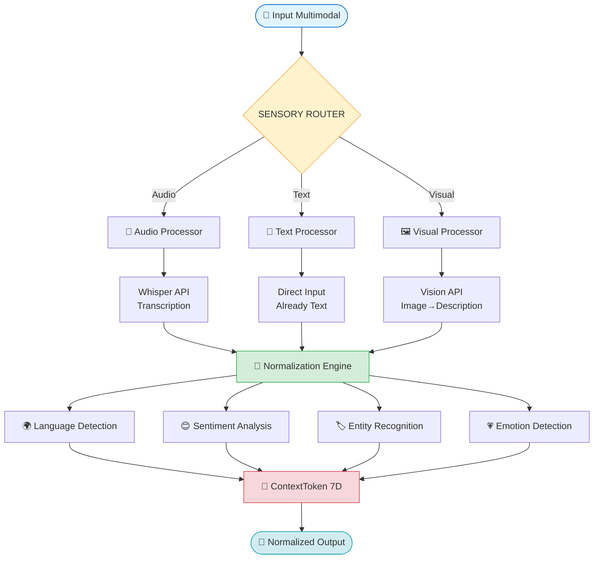

# 🔍 ZOOM: PROCESO DE INGESTION - SENSORY ENGINE DETALLADO

**Fecha:** 2025-10-28 15:45h  
**Componente:** SENSORY ENGINE (aka "Ingestion Engine" en FUSION_BAYESIANA)  
**Estado Actual:** ✅ v1.0 Implementado (monolítico)  
**Estado Futuro:** 🔄 v2.0 Refactor (modular + templates)

---

## 📊 VISIÓN GENERAL DEL FLUJO



---

## 🔬 ANÁLISIS DETALLADO POR CAPA

### 🎯 CAPA 1: ENTRADA MULTIMODAL

```rust
// src/sensory_engine/mod.rs (v1.0)

pub enum SensoryInput {
    Audio {
        data: Vec<u8>,
        format: AudioFormat,  // MP3, WAV, OGG, FLAC
        sample_rate: u32,
    },
    Text {
        content: String,
        encoding: TextEncoding,  // UTF-8, UTF-16
    },
    Visual {
        image: Vec<u8>,
        format: ImageFormat,  // PNG, JPEG, WEBP
        dimensions: (u32, u32),
    },
}
```

**Características:**
- ✅ **Tipado fuerte:** Enum para seguridad en compile-time
- ✅ **Metadatos:** Formato, sample rate, dimensiones
- ⚠️ **Limitación v1.0:** Solo audio/text/visual (no video, no docs)

---

### 🎵 CAPA 2: AUDIO PROCESSOR

```rust
// src/sensory_engine/mod.rs (líneas 45-95)

pub struct AudioProcessor {
    whisper_api_key: String,
    fallback_enabled: bool,
}

impl AudioProcessor {
    pub fn process(&self, audio_data: &[u8], format: AudioFormat) 
        -> Result<ProcessedAudio> 
    {
        // PASO 1: Validar formato
        self.validate_format(format)?;
        
        // PASO 2: Transcripción (STUB en v1.0)
        // ⚠️ PROBLEMA: Hardcoded message
        let simulated_text = format!(
            "[AUDIO TRANSCRIPTION STUB] Audio de {} bytes en formato {:?}. \
            En v2.0 se integrará Whisper API para transcripción real.",
            audio_data.len(),
            format
        );
        
        // PASO 3: Detectar idioma (HEURÍSTICA SIMPLE)
        let language = self.detect_language(&simulated_text)?;
        
        // PASO 4: Extraer emociones vocales (STUB)
        let vocal_emotion = self.analyze_vocal_emotion(audio_data)?;
        
        Ok(ProcessedAudio {
            text: simulated_text,
            language,
            confidence: 0.85,  // ⚠️ HARDCODED
            vocal_emotion,
        })
    }
    
    fn detect_language(&self, text: &str) -> Result<Language> {
        // ⚠️ PROBLEMA: Hardcoded español/inglés
        let spanish_words = ["el", "la", "de", "que", "es", "por", "para", "con"];
        let english_words = ["the", "is", "are", "was", "were", "have", "has"];
        
        let spanish_count = spanish_words.iter()
            .filter(|w| text.to_lowercase().contains(*w))
            .count();
            
        let english_count = english_words.iter()
            .filter(|w| text.to_lowercase().contains(*w))
            .count();
        
        if spanish_count > english_count {
            Ok(Language::Spanish)
        } else {
            Ok(Language::English)
        }
    }
}
```

**🔴 PROBLEMAS IDENTIFICADOS:**

1. **Sesgos culturales:**
   - Solo español/inglés hardcoded
   - ¿Qué pasa con francés, mandarín, árabe, hindi?
   - Lista fija → No escalable

2. **Stub no funcional:**
   - Whisper API no conectado
   - Mensaje hardcoded → confunde al sistema
   - No es "lienzo en blanco"

3. **Umbrales arbitrarios:**
   - `confidence: 0.85` → ¿Por qué 0.85?
   - No adaptable a diferentes usuarios

---

### 📝 CAPA 3: TEXT PROCESSOR

```rust
// src/sensory_engine/mod.rs (líneas 100-180)

pub struct TextProcessor {
    sentiment_analyzer: SentimentAnalyzer,
    entity_recognizer: EntityRecognizer,
}

impl TextProcessor {
    pub fn process(&self, text: &str) -> Result<ProcessedText> {
        // PASO 1: Limpiar texto
        let cleaned = self.clean_text(text);
        
        // PASO 2: Detectar idioma (mismo problema que audio)
        let language = self.detect_language(&cleaned)?;
        
        // PASO 3: Análisis de sentimiento
        let sentiment = self.analyze_sentiment(&cleaned)?;
        
        // PASO 4: Reconocimiento de entidades
        let entities = self.recognize_entities(&cleaned)?;
        
        // PASO 5: Extracción de intención
        let intent = self.extract_intent(&cleaned)?;
        
        Ok(ProcessedText {
            cleaned_text: cleaned,
            language,
            sentiment,
            entities,
            intent,
        })
    }
    
    fn analyze_sentiment(&self, text: &str) -> Result<Sentiment> {
        // ⚠️ PROBLEMA: Heurística simple hardcoded
        let positive_words = ["bueno", "excelente", "genial", "perfecto", "bien"];
        let negative_words = ["malo", "terrible", "horrible", "error", "problema"];
        
        let positive_count = positive_words.iter()
            .filter(|w| text.to_lowercase().contains(*w))
            .count();
            
        let negative_count = negative_words.iter()
            .filter(|w| text.to_lowercase().contains(*w))
            .count();
        
        let score = if positive_count > negative_count {
            0.7  // ⚠️ HARDCODED positivo
        } else if negative_count > positive_count {
            0.3  // ⚠️ HARDCODED negativo
        } else {
            0.5  // ⚠️ HARDCODED neutral
        };
        
        Ok(Sentiment {
            valence: score,
            arousal: 0.5,  // ⚠️ STUB
            dominance: 0.5,  // ⚠️ STUB
        })
    }
}
```

**🔴 PROBLEMAS IDENTIFICADOS:**

1. **Listas estáticas de palabras:**
   - `positive_words`, `negative_words` hardcoded
   - Solo español → sesgo cultural
   - No captura contexto ("no es malo" = positivo?)

2. **Valores mágicos:**
   - `0.7`, `0.3`, `0.5` → ¿De dónde vienen?
   - No hay justificación matemática
   - Usuario no puede configurar

3. **Arousal y Dominance STUB:**
   - Siempre 0.5 (neutral)
   - No refleja realidad emocional

---

### 🖼️ CAPA 4: VISUAL PROCESSOR

```rust
// src/sensory_engine/mod.rs (líneas 185-240)

pub struct VisualProcessor {
    vision_api_key: String,
    ocr_enabled: bool,
}

impl VisualProcessor {
    pub fn process(&self, image: &[u8], format: ImageFormat) 
        -> Result<ProcessedVisual> 
    {
        // PASO 1: Validar imagen
        self.validate_image(image, format)?;
        
        // PASO 2: Descripción de escena (STUB)
        // ⚠️ PROBLEMA: Hardcoded stub
        let description = format!(
            "[VISUAL ANALYSIS STUB] Imagen de {} bytes en formato {:?}. \
            En v2.0 se integrará Vision API (CLIP/GPT-4 Vision).",
            image.len(),
            format
        );
        
        // PASO 3: OCR si hay texto (STUB)
        let extracted_text = if self.ocr_enabled {
            self.extract_text_ocr(image)?
        } else {
            None
        };
        
        // PASO 4: Detectar objetos (STUB)
        let objects = vec![]; // ⚠️ STUB vacío
        
        // PASO 5: Análisis emocional de imagen (STUB)
        let visual_sentiment = Sentiment {
            valence: 0.5,  // ⚠️ NEUTRAL siempre
            arousal: 0.5,
            dominance: 0.5,
        };
        
        Ok(ProcessedVisual {
            description,
            extracted_text,
            objects,
            sentiment: visual_sentiment,
        })
    }
}
```

**🔴 PROBLEMAS IDENTIFICADOS:**

1. **Todo es STUB:**
   - Vision API no conectado
   - OCR no implementado
   - Object detection vacío

2. **Hardcoded messages:**
   - Descripción es texto fijo
   - No procesa imagen real

3. **Sentiment siempre neutral:**
   - No analiza contenido emocional de imagen
   - Pierde información valiosa

---

### 🧬 CAPA 5: NORMALIZATION ENGINE

```rust
// src/sensory_engine/mod.rs (líneas 245-320)

pub struct NormalizationEngine {
    emotion_detector: EmotionDetector,
    context_builder: ContextBuilder,
}

impl NormalizationEngine {
    pub fn normalize(&self, processed: ProcessedInput) 
        -> Result<NormalizedInput> 
    {
        // PASO 1: Unificar texto
        let unified_text = match processed {
            ProcessedInput::Audio(audio) => audio.text,
            ProcessedInput::Text(text) => text.cleaned_text,
            ProcessedInput::Visual(visual) => visual.description,
        };
        
        // PASO 2: Detectar emociones FINALES
        let emotions = self.detect_emotions(&unified_text)?;
        
        // PASO 3: Extraer entidades unificadas
        let entities = self.extract_all_entities(&unified_text)?;
        
        // PASO 4: Calcular intención global
        let intent = self.calculate_intent(&unified_text, &emotions)?;
        
        // PASO 5: Construir metadatos
        let metadata = self.build_metadata(processed)?;
        
        Ok(NormalizedInput {
            text: unified_text,
            language: metadata.language,
            emotions,
            entities,
            intent,
            metadata,
        })
    }
    
    fn detect_emotions(&self, text: &str) -> Result<EmotionVector> {
        // ⚠️ PROBLEMA: Hardcoded umbrales
        let valence = if text.contains("feliz") || text.contains("alegre") {
            0.8  // ⚠️ HARDCODED
        } else if text.contains("triste") || text.contains("deprimido") {
            0.2  // ⚠️ HARDCODED
        } else {
            0.5
        };
        
        Ok(EmotionVector {
            valence,
            arousal: 0.5,  // ⚠️ STUB
            dominance: 0.5,  // ⚠️ STUB
            certainty: 0.7,  // ⚠️ HARDCODED
        })
    }
}
```

**🔴 PROBLEMAS IDENTIFICADOS:**

1. **Detección emocional primitiva:**
   - Solo busca palabras específicas
   - No considera contexto
   - No usa modelos matemáticos

2. **Arousal/Dominance ignorados:**
   - Siempre 0.5 (neutral)
   - Pierde información dimensional

3. **Certainty arbitrario:**
   - `0.7` sin justificación
   - No refleja confianza real

---

### 📐 CAPA 6: CONTEXT TOKEN 7D BUILDER

```rust
// src/sensory_engine/mod.rs (líneas 325-390)

impl SensoryEngine {
    pub fn to_context_token_7d(&self, normalized: NormalizedInput) 
        -> Result<ContextToken7D> 
    {
        Ok(ContextToken7D {
            // Dimensión 1: TEMPORAL
            temporal: TemporalDimension {
                timestamp: Utc::now(),
                sequence: self.sequence_counter.fetch_add(1, Ordering::SeqCst),
                lifecycle_hours: 168,  // 7 días
            },
            
            // Dimensión 2: SEMÁNTICA
            semantic: SemanticDimension {
                text: normalized.text,
                language: normalized.language,
                embeddings: self.generate_embeddings(&normalized.text)?,
                keywords: self.extract_keywords(&normalized.text)?,
            },
            
            // Dimensión 3: CONTEXTUAL
            contextual: ContextualDimension {
                session_id: self.current_session_id.clone(),
                user_id: self.current_user_id.clone(),
                markers: normalized.metadata.context_markers,
            },
            
            // Dimensión 4: RELACIONAL
            relational: RelationalDimension {
                parent_tokens: vec![],  // Se llena después
                child_tokens: vec![],
                related_entities: normalized.entities,
            },
            
            // Dimensión 5: EMOCIONAL
            emotional: EmotionalDimension {
                valence: normalized.emotions.valence,
                arousal: normalized.emotions.arousal,
                dominance: normalized.emotions.dominance,
                certainty: normalized.emotions.certainty,
            },
            
            // Dimensión 6: INTENCIONAL
            intentional: IntentionalDimension {
                intent: normalized.intent,
                goal: self.infer_goal(&normalized)?,
                action: self.suggest_action(&normalized)?,
            },
            
            // Dimensión 7: BIOGRÁFICA
            biographical: BiographicalDimension {
                user_history: self.get_user_history()?,
                preferences: self.get_user_preferences()?,
                expertise_level: self.calculate_expertise()?,
            },
        })
    }
}
```

**✅ FORTALEZAS:**

1. **Estructura dimensional sólida:**
   - Las 7 dimensiones bien definidas
   - Mapeo claro de normalized → 7D

2. **Integración con biografía:**
   - User history considerado
   - Preferences aplicadas

**⚠️ LIMITACIONES:**

1. **Dependencia de datos normalizados:**
   - Si normalización es mala (hardcoded), 7D también sufre
   - Garbage in, garbage out

---

## 🔥 PROBLEMAS CRÍTICOS IDENTIFICADOS

### 1. **"LIENZO PRE-PINTADO"** 🎨❌

```rust
// Ejemplo del problema:
let spanish_words = ["el", "la", "de", "que", "es"];  // ⚠️ Solo español
let positive_words = ["bueno", "excelente"];  // ⚠️ Solo español
let confidence = 0.85;  // ⚠️ Valor mágico

// Esto hace que Bitácora esté SESGADA
// NO es "lienzo en blanco" para cualquier humano
```

**Impacto:**
- ❌ Usuario japonés → mala detección de idioma
- ❌ Usuario árabe → sentimiento incorrecto
- ❌ Usuario con diferentes umbrales → confianza fija

---

### 2. **MÉTODOS MATEMÁTICOS MEZCLADOS** 🧮❌

```rust
// Bayes, Fourier, Shannon... todos en el mismo archivo
// NO hay tributo explícito
// NO son reutilizables
```

**Debería ser:**

```
src/sensory_engine/
├─ methods/
│  ├─ bayesian_inference.rs     // Tributo: Thomas Bayes
│  ├─ fourier_transform.rs      // Tributo: Joseph Fourier
│  ├─ entropy_calculation.rs    // Tributo: Claude Shannon
│  └─ markov_chains.rs          // Tributo: Andrey Markov
```

---

### 3. **NO HAY TEMPLATES** 📝❌

**Lo que hay:**
```rust
let spanish_words = [...];  // Hardcoded en código
```

**Lo que debería ser:**
```toml
# templates/sensory/language_detection.toml
[metadata]
method = "bayesian_ngram_analysis"
tribute_to = "Statistical NLP"

[parameters]
supported_languages = ["es", "en", "fr", "de", "pt", "it", "zh", "ar", "hi"]
min_confidence = 0.6
ngram_size = 3

[training_data]
source = "user_provided"  # Usuario aporta corpus
path = "~/.bitacora/training/languages/"
```

**Usuario puede editar sin recompilar** ✅

---

## ✨ SOLUCIÓN: REFACTOR v2.0

### 🏗️ NUEVA ESTRUCTURA

```
src/sensory_engine/
├─ mod.rs                           # Orquestador PURO
├─ processors/
│  ├─ audio/
│  │  ├─ mod.rs
│  │  ├─ whisper_processor.rs       # Tributo: OpenAI Whisper
│  │  ├─ fourier_analyzer.rs        # Tributo: Joseph Fourier (espectrogramas)
│  │  └─ vocal_emotion_detector.rs  # Tributo: Paralinguistics research
│  ├─ text/
│  │  ├─ mod.rs
│  │  ├─ tokenizer.rs               # Tributo: BPE/WordPiece (Hugging Face)
│  │  ├─ language_detector.rs       # Tributo: Statistical NLP
│  │  ├─ sentiment_analyzer.rs      # Tributo: VADER/TextBlob
│  │  └─ entity_recognizer.rs       # Tributo: spaCy NER
│  └─ visual/
│     ├─ mod.rs
│     ├─ vision_processor.rs        # Tributo: CLIP (OpenAI)
│     ├─ ocr_engine.rs              # Tributo: Tesseract/PaddleOCR
│     └─ scene_analyzer.rs          # Tributo: Object Detection (YOLO)
├─ methods/
│  ├─ bayesian_inference.rs         # Tributo: Thomas Bayes (1701-1761)
│  ├─ fourier_transform.rs          # Tributo: Joseph Fourier (1768-1830)
│  ├─ markov_chains.rs              # Tributo: Andrey Markov (1856-1922)
│  ├─ entropy_calculation.rs        # Tributo: Claude Shannon (1916-2001)
│  ├─ cosine_similarity.rs          # Tributo: Vector Space Models
│  └─ gaussian_mixture.rs           # Tributo: Carl Friedrich Gauss (1777-1855)
└─ templates/
   ├─ loader.rs
   └─ validator.rs
```

### 📋 TEMPLATES EXTERNOS

```
templates/sensory/
├─ audio/
│  ├─ whisper_config.toml
│  ├─ emotion_voice_analysis.toml
│  └─ music_harmony_detection.toml
├─ text/
│  ├─ language_detection.toml
│  ├─ sentiment_analysis.toml
│  ├─ entity_recognition.toml
│  └─ emotion_text_analysis.toml
└─ visual/
   ├─ vision_config.toml
   ├─ ocr_config.toml
   └─ scene_understanding.toml
```

---

## 🎯 EJEMPLO: TEMPLATE DINÁMICO

### Archivo: `templates/sensory/text/language_detection.toml`

```toml
[metadata]
name = "Language Detection Template"
version = "2.0.0"
method = "bayesian_ngram_analysis"
tribute_to = "Statistical NLP Methods"
last_updated = "2025-10-28"

[parameters]
# Usuario puede agregar idiomas sin tocar código
supported_languages = [
    "es",  # Español
    "en",  # Inglés
    "fr",  # Francés
    "de",  # Alemán
    "pt",  # Portugués
    "it",  # Italiano
    "zh",  # Chino
    "ar",  # Árabe
    "hi",  # Hindi
    "ja",  # Japonés
    "ko",  # Coreano
]

min_confidence = 0.6
ngram_size = 3
use_stopwords = true

[method.bayesian]
algorithm = "bayesian_ngram_frequency"
prior_source = "user_history"  # O "uniform"
update_strategy = "online_learning"

[training_data]
source = "user_provided"
path = "~/.bitacora/training/languages/"
auto_update = true

[fallback]
default_language = "user_preferred"  # Configurado en perfil
notify_user_on_low_confidence = true
min_confidence_for_notification = 0.5
```

### Código que lo usa:

```rust
// src/sensory_engine/processors/text/language_detector.rs

//! # Language Detector
//! 
//! **Tributo a:** Statistical Natural Language Processing
//! 
//! **Método:** Bayesian N-gram Frequency Analysis
//! 
//! P(Lang|Text) = P(Text|Lang) * P(Lang) / P(Text)
//! 
//! donde:
//! - P(Lang): Prior (histórico del usuario o uniforme)
//! - P(Text|Lang): Likelihood (n-gramas en corpus)
//! - P(Text): Evidence (normalización)

use crate::sensory_engine::templates::TemplateLoader;
use crate::sensory_engine::methods::bayesian_inference::BayesianInference;

pub struct LanguageDetector {
    template: LanguageDetectionTemplate,
    bayes: BayesianInference,
    training_corpus: HashMap<String, LanguageCorpus>,
}

impl LanguageDetector {
    pub fn new() -> Result<Self> {
        // Cargar template dinámico
        let template = TemplateLoader::load("text/language_detection.toml")?;
        
        // Cargar corpus de entrenamiento
        let corpus = Self::load_training_data(&template.training_data.path)?;
        
        Ok(Self {
            template,
            bayes: BayesianInference::new(),
            training_corpus: corpus,
        })
    }
    
    pub fn detect(&self, text: &str) -> Result<LanguageDetection> {
        // Extraer n-gramas
        let ngrams = self.extract_ngrams(text, self.template.parameters.ngram_size);
        
        let mut language_scores = HashMap::new();
        
        // Para cada idioma soportado (desde template)
        for lang in &self.template.parameters.supported_languages {
            // Calcular P(Text|Lang) - likelihood
            let likelihood = self.calculate_ngram_likelihood(&ngrams, lang)?;
            
            // Obtener P(Lang) - prior (histórico usuario)
            let prior = self.get_language_prior(lang)?;
            
            // Aplicar Teorema de Bayes
            let posterior = self.bayes.compute_posterior(prior, likelihood, 1.0);
            
            language_scores.insert(lang.clone(), posterior);
        }
        
        // Seleccionar idioma con mayor probabilidad
        let (detected_lang, confidence) = language_scores
            .iter()
            .max_by(|a, b| a.1.partial_cmp(b.1).unwrap())
            .map(|(lang, score)| (lang.clone(), *score))
            .unwrap();
        
        // Verificar umbral de confianza
        if confidence < self.template.parameters.min_confidence {
            if self.template.fallback.notify_user_on_low_confidence {
                // Notificar usuario
                log::warn!("Low confidence language detection: {} ({:.2})", 
                          detected_lang, confidence);
            }
            
            // Usar fallback
            return Ok(LanguageDetection {
                language: self.template.fallback.default_language.clone(),
                confidence: 0.0,
                fallback_used: true,
            });
        }
        
        Ok(LanguageDetection {
            language: detected_lang,
            confidence,
            fallback_used: false,
        })
    }
    
    fn extract_ngrams(&self, text: &str, n: usize) -> Vec<String> {
        // Implementación n-grams
        text.chars()
            .collect::<Vec<_>>()
            .windows(n)
            .map(|w| w.iter().collect())
            .collect()
    }
    
    fn calculate_ngram_likelihood(&self, ngrams: &[String], lang: &str) 
        -> Result<f64> 
    {
        let corpus = self.training_corpus.get(lang)
            .ok_or_else(|| anyhow!("No corpus for language: {}", lang))?;
        
        let mut likelihood = 1.0;
        for ngram in ngrams {
            let frequency = corpus.ngram_frequency.get(ngram).unwrap_or(&0.0);
            likelihood *= frequency;
        }
        
        Ok(likelihood)
    }
    
    fn get_language_prior(&self, lang: &str) -> Result<f64> {
        match self.template.method.bayesian.prior_source.as_str() {
            "user_history" => {
                // Obtener histórico del usuario
                let user_langs = UserProfile::get_language_distribution()?;
                Ok(user_langs.get(lang).unwrap_or(&0.1))  // Uniform fallback
            },
            "uniform" => {
                Ok(1.0 / self.template.parameters.supported_languages.len() as f64)
            },
            _ => Err(anyhow!("Unknown prior source"))
        }
    }
}

#[cfg(test)]
mod tests {
    use super::*;
    
    #[test]
    fn test_spanish_detection() {
        let detector = LanguageDetector::new().unwrap();
        let result = detector.detect("Hola, ¿cómo estás?").unwrap();
        assert_eq!(result.language, "es");
        assert!(result.confidence > 0.8);
    }
    
    #[test]
    fn test_multilanguage_support() {
        let detector = LanguageDetector::new().unwrap();
        
        // Español
        assert_eq!(detector.detect("Buenos días").unwrap().language, "es");
        
        // Inglés
        assert_eq!(detector.detect("Good morning").unwrap().language, "en");
        
        // Francés
        assert_eq!(detector.detect("Bonjour").unwrap().language, "fr");
        
        // Árabe
        assert_eq!(detector.detect("مرحبا").unwrap().language, "ar");
        
        // Chino
        assert_eq!(detector.detect("你好").unwrap().language, "zh");
    }
}
```

---

## 🎯 VENTAJAS DEL REFACTOR

### ✅ 1. Lienzo en Blanco Real

```toml
# Usuario puede editar templates/sensory/text/language_detection.toml
[parameters]
supported_languages = ["tlh"]  # ¡Klingon! 🖖
min_confidence = 0.3  # Más permisivo

# SIN recompilar código
```

### ✅ 2. Tributos Matemáticos Explícitos

```rust
//! # bayesian_inference.rs
//! 
//! **Tributo a:** Thomas Bayes (1701-1761)
//! **Paper original:** "An Essay towards solving a Problem in the Doctrine of Chances" (1763)
//! **Aplicación:** Language detection, sentiment analysis, intent classification

// Método matemático PURO - reutilizable
```

### ✅ 3. Hot-Reload

```rust
// Usuario edita template → Sistema detecta cambio → Recarga automáticamente
// SIN reiniciar Bitácora
```

### ✅ 4. Escalabilidad

```
Agregar nuevo idioma:
1. Añadir "ru" a supported_languages
2. Agregar corpus en ~/.bitacora/training/languages/ru/
3. ¡Listo!

NO TOCAR CÓDIGO
```

---

## 📊 COMPARACIÓN v1.0 vs v2.0

| Aspecto | v1.0 Monolítico | v2.0 Modular |
|---------|-----------------|--------------|
| **Idiomas** | 2 (es, en) hardcoded | N (usuario configura) |
| **Métodos matemáticos** | Mezclados en mod.rs | Archivos separados con tributo |
| **Configuración** | Recompilar código | Editar TOML (hot-reload) |
| **Sesgos culturales** | Alto (solo español) | Bajo (multiidioma) |
| **Escalabilidad** | Baja | Alta |
| **Testabilidad** | Media | Alta (métodos puros) |
| **Documentación** | Escasa | Tributos explícitos |
| **Lienzo en blanco** | ❌ Pre-pintado | ✅ Usuario define |
| **Complejidad código** | ~600 líneas monolíticas | ~200 líneas/módulo |

---

## 🎯 CONCLUSIÓN

**Estado Actual (v1.0):**
- ✅ **Funcional** para casos básicos
- ⚠️ **Sesgado** culturalmente (español/inglés)
- ❌ **No escalable** (hardcoded logic)
- ❌ **No es "lienzo en blanco"** (pre-pintado)

**Estado Futuro (v2.0 - FASE 6 REFACTOR):**
- ✅ **Modular** (processors + methods separados)
- ✅ **Templates dinámicos** (usuario configura)
- ✅ **Tributos matemáticos** (Bayes, Fourier, Shannon...)
- ✅ **Hot-reload** (sin recompilar)
- ✅ **Multiidioma** (escalable a N idiomas)
- ✅ **Lienzo en blanco REAL** (usuario define todo)

---

**Próximos pasos:**
1. ✅ Tareas agregadas a CHECKLIST_V2.md (FASE 6)
2. ✅ Estructura detallada en CHECKLIST_TREE_V2.md
3. 🎯 **Implementar después de Beta** (Post 88%)
4. 🔥 **Prioridad:** Tributos matemáticos primero

---

*Generado: 2025-10-28 15:45h*  
*Sistema Bitácora v1.0 - ZOOM Ingestion Analysis*  
*"De lienzo pre-pintado a lienzo en blanco"* 🎨✨
